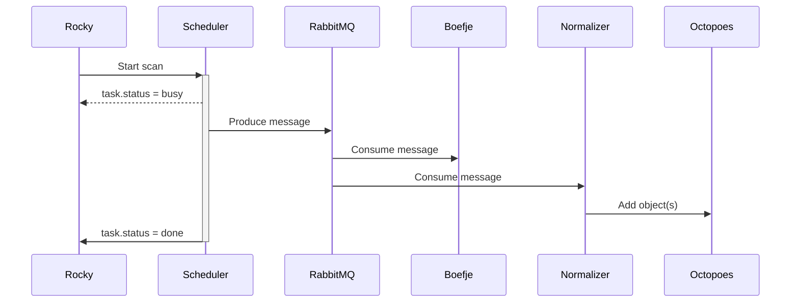

## Rocky (nl-kat)

Rocky is part of the openKAT project, made with Django.
See [nl-kat-coordination](https://github.com/minvws/nl-kat-coordination) for more details about openKAT.

## Stack

As said, Django is the framework for this project.
To comply to government standards, use [Manon](https://github.com/minvws/nl-rdo-manon) for style and accessibility.
Yarn is used as package manager and ParcelJS is used as bundler to compile the frontend (CSS and Javascript).
For browsertests we are using [Cypress](https://www.cypress.io/).
You can find the Manon repository here: [https://github.com/minvws/nl-rdo-manon](https://github.com/minvws/nl-rdo-manon)

## Running Rocky

### Containerized

To run rocky from the docker container, from the parent directory `nl-kat-coordination`, just run:

```bash
$ make kat
```

and continue reading this document at "First run".

### Locally

To run rocky locally, follow these steps.

### Installation

Yarn is used to bundle CSS and Javascript.
You can build Rocky locally using:

```bash
$ make build
```

This will set up Django and compile the frontend.

### Running

You can run Rocky using:

```bash
$ make run
```

## First run

After running the first time, visit [localhost:8000](http://localhost:8000) in your browser.
Log in with credentials: admin / admin

You will be prompted to create secure your account with a One Time Password, so get your authenticator ready.

## Testing

To run all tests, run:

```bash
$ make test
```

But first you will need to setup Cypress.

### Setting up Cypress

Cypress is installed in a separate directory `roeltje`.
You will need to run the django command `setup_test_users` to create users and credentials used in cypress
see: [cypress.json](https://github.com/minvws/nl-kat-rocky/blob/develop/roeltje/cypress.json).

```bash
$ python manage.py setup_test_users
$ yarn --cwd roeltje
$ yarn --cwd roeltje cypress open
```

add to 1Password:

```json
otpauth://totp/localhost%3A8000%3A%20admin?secret=TAAVFPQD3C3NLRSZQBD3CJ7ZUVDJXDS5&digits=6&issuer=localhost%3A8000
```

So eventually your `cypress.json` shapes like this:

```json
{
  "viewportWidth": 1280,
  "viewportHeight": 1024,
  "env": {
    "base_url": "http://localhost:8000/",
    "client_user": "admin",
    "client_pass": "admin",
    "client_otp_secret": "TAAVFPQD3C3NLRSZQBD3CJ7ZUVDJXDS5"
  }
}
```

!! WARNING !! DON'T DO THIS IN ANY PUBLIC FACING INSTALL!

## Database

To connect to the PostgreSQL database, set the following environment variables (e.g. "localhost", "5432" etc.):

```
ROCKY_DB_HOST=
ROCKY_DB_PORT=
ROCKY_DB=
ROCKY_DB_USER=
ROCKY_DB_PASSWORD=
```

## So... How does it flow?

### Perform scan (run boefje)



## Fonts license

All fonts used within Rocky remain under their own license. For example: Fredoka One, Open Sans & Tabler icons.

For more information check their respective folders for extra/ more specific license (if available) or visit:

### Fredoka One
https://fonts.google.com/specimen/Fredoka+One/about

### Open Sans
https://fonts.google.com/specimen/Open+Sans/about

### Tabler icons
https://tabler-icons.io/
