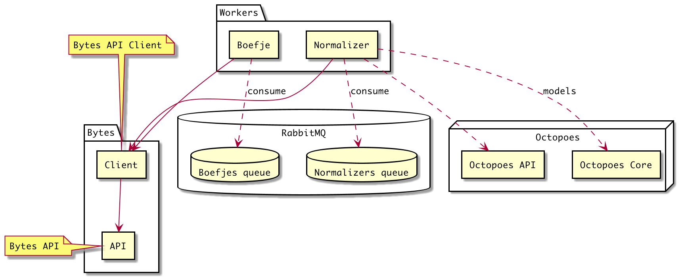

# Boefjes

This module has several entry points discussed below, but let us first consider the prerequisites and scope.
If you already have running setup and want to learn where each bit of functionality goes, read the following page:

[Developing Openkat Plugins](README.md#your-first-boefje)

## Prerequisites

To run a development environment you need to have:

- A running RabbitMQ service
- A running Bytes API service
- A copy of `./.env-dist` in `./env` containing the environment variables explained below
- Everything in `requirements.txt` installed

Optionally, you could have an instance of the octopoes api listening on a port that receives the normalized data from
the normalizers.

## KATalogus

See the openAPI reference at http://localhost:8003/docs.
The KATalogus has CRUD endpoints for several objects such as:
- `Organisation`
- `Repository`
- `Plugin`
- `Setting`

### Organisations
Supported HTTP methods (for CRUD): `POST`, `GET`, `DELETE`.
Includes an endpoint that lists all objects.
All subsequent objects in the API are namespaced on the `organisation_id`.

### Repositories
Supported HTTP methods (for CRUD): `POST`, `GET`, `DELETE`.
Includes an endpoint that lists all objects.

### Plugins
Supported HTTP methods (for CRUD): `GET`, `PATCH`.
Note: there are endpoints namespaced on the `repository_id` included.


### Settings

Supported HTTP methods (for CRUD): `POST`, `GET`, `DELETE`, `PUT`.
Includes an endpoint that lists all objects.

The KATalogus stores environment settings for the different organisations and plugins, accessible through the API.
These can be encrypted by setting the `ENCRYPTION_MIDDLEWARE=NACL_SEALBOX`, and the public and private key env vars.
More info about the encryption scheme can be found here: https://pynacl.readthedocs.io/en/latest/public/.
Currently, the settings are encrypted when stored, and returned decrypted.
This could be changed in the future when the boefje-runner/plugin-code can decrypt the secrets itself,
although this would be more complicated.

## Environment variables

| Environment variable       | Value                        | Description                                       |
|----------------------------|------------------------------|---------------------------------------------------|
| QUEUE_NAME_BOEFJES         | "boefjes"                    | Queue name for boefjes                            |
| QUEUE_NAME_NORMALIZERS     | "normalizers"                | Queue name for normalizers                        |
| QUEUE_HOST                 | "rabbitmq"                   | The RabbitMQ host                                 |
| OCTOPOES_API               | "http://octopoes_api:80"     | URI for the Octopoes API                          |
| BYTES_API                  | "http://bytes:8000"          | URI for the Bytes API                             |
| KATALOGUS_API              | "http://katalogus:8000"      | URI for the Katalogus API                         |
| KATALOGUS_DB_URI           | "postgresql:// ..."          | URI for the Postgresql DB                     |
| WP_SCAN_API                | "...DpfBZmnsq6..."           | A token needed by WP Scan boefje                  |
| ENCRYPTION_MIDDLEWARE      | "IDENTITY" or "NACL_SEALBOX" | Encryption to use for the katalogus settings      |
| KATALOGUS_PRIVATE_KEY_B_64 | "..."                        | KATalogus NaCl Sealbox base-64 private key string |
| KATALOGUS_PUBLIC_KEY_B_64  | "..."                        | KATalogus NaCl Sealbox base-64 public key string  |

## Design

Boefjes will run as containerized workers pulling jobs from a centralized job queue:



Connections to other components, represented by the yellow squares, are abstracted by the modules inside them. The red
components live outside the boefjes module. The green core files however is what can be focussed on and can be
developed/refactored further to support boefjes of all different kinds.

### Running as a Docker container

To run a boefje and normalizer worker as a docker container, you can run

```bash
docker build . -t boefje
docker run --rm -d --name boefje boefje python -m boefjes boefje
docker run --rm -d --name normalizer boefje python -m boefjes normalizer
```

Note: the worker needs a running Bytes API and RabbitMQ. The service locations can be specified with environment variables
(see the Docker documentation to use a `.env` file with the `--env-file` flag, for instance).

### Running the worker directly

To start the worker process listening on the job queue, use the `python -m boefjes` module.
```bash
$ python -m boefjes --help
Usage: python -m boefjes [OPTIONS] {boefje|normalizer}

Options:
  --log-level [DEBUG|INFO|WARNING|ERROR]
                                  Log level
  --help                          Show this message and exit.
```

So to start either a `boefje` worker or `normalizer` worker, run:

- `python -m boefjes boefje`
- `python -m boefjes normalizer`

Again, service locations can be specified with environment variables.

### Example job
The job file for a DNS scan might look like this:

```json
{
  "id": "b445dc20-c030-4bc3-b779-4ed9069a8ca2",
  "organization": "_dev",
  "boefje": {
    "id": "ssl-scan-job",
    "version": null
  },
  "input_ooi": "Hostname|internet|www.example.nl."
}
```

If the tool runs smoothly, the data can be accessed using the Bytes API (see Bytes documentation).

### Running a tool or normalizer directly using a job file

It's also possible to run the job runner for a json file containing a job:
- `python -m run --job tests/examples/my-boefje-job.json boefje` or
- `python -m run --job tests/examples/my-normalizer-job.json normalizer`


### Boefje and normalizer structure

Each boefje and normalizer module is placed in `boefjes/<module>`. A module's main script is usually called `main.py`,
and a normalizer is usually called `normalize.py`, but it also may contain one or more normalizers.
A definition file with metadata about the boefje is called `boefje.py`.
Here a `Boefje` object that wraps this metadata is defined, as well as `Normalizer` objects that can parse this Boefje's output.
Each module may also have its own `requirements.txt` file that lists dependencies not included in the base requirements.
Furthermore, you can add static data such as a cover and a description (markdown) to show up in Rocky's KATalogus.

Example structure:

```shell
$ tree boefjes/kat_dns
├── boefje.py
├── cover.jpg
├── description.md
├── __init__.py
├── main.py
├── normalize.py
└── requirements.txt
```

### Running the test suite

To run the test suite, run:

```shell
$ python -m pytest
```

To lint the code using black, run:
```shell
$ python -m black .
```

## Your first Boefje
On designing the functionality of your first Boefje addon for KAT, and writing it.

KAT allows developers to add logic to it on various levels. Part of this logic is what we call “Boefjes”, its usually the code that goes out into the world, and looks for new input. This input is then handed to “Normalizers” which take the gathered raw information and try to make sense of it. By making sense, we mean creating new Objects of Interest or “OOI’s” which match the modeling that KAT provides.


##  Observe, Create, Check

### Observe

Due to the nature of KAT, your boefje only needs to do a very small part of what you might think it needs to do.
The main goal for a Boefje is to allow KAT to give it an OOI (from the type(s) that you specified), and go out and collect output.
This output in its raw form should be annotated to what mime-type the content is.
For Command-line boefjes this might just be plain/text or similar, byt maybe you are outputting something more readable as xml or json instead.
Obviously complexer formats like documents and pdf are also allowed. You just need to hint the next programs in line what to expect.
Some Boefjes might have dynamic output based on what the encounter,
for example a boefje that downloads web-urls might be able to recognize the difference between an image, and a html page and hint about to this.

A good start for a boefje is to look for existing software, and try to encapsulate it in some code that performs the needed steps to go from an input OOI to raw output.
Most command-line programs are relatively easily called from for example Python and will easily return their output to you.
Complexer software might need a bit more code to allow for gui’s to be used, or asynchronous output to be stored.

By now you should understand that minimizing the work your Boefje does is a good plan.
Doing multiple steps at once instead of in separate boefjes while tempting from a user perspective
(you just click this one boefje, and we get all ip’s hostnames, mailservers etc for your domain) just makes your boefje larger,
and more complex to maintain. It also makes the following steps more complex, and makes it harder to limit the scope of what and when various parts of the targeted infrastructure is being scanned.
Separated smaller boefjes will automatically be scheduled by KAT based on their expected return value and will also allow for more fine-grained control of when rescans will occur.
(E.g. nameservers almost never change. IP-addresses change more often for webservers than nameservers),
the scheduler will try to make sense of this by keeping track of historical results.

### Create

Once your boefje has returned its output to the runner it will be stored, saved and signed for forensic safe-keeping complete with the network traffic that your boefje might have needed to produce the output.
The next step is to Create new Objects from this output. This job is done by the normalizers.
A normalizer’s job is to take raw input and go search for things that It thinks fit the already present Models in KAT.
This might be done in a few ways. As the normalizer is given the raw output from a boefje, its also given the mime-type (as far as the boefje could tell), and the name of the originating boefje and its version.
This might allow the normalizer to make an informed decision on how to parse the input.
E.g., parsing json or xml output as text gives you far less power compared to first ingesting it as such.
Or, if you know how to parse the output for a given tool, the normalizer might just need to look up each third column to select the data you are looking for.
Obviously, if your normalizer accepts a wider range of data looking for the hidden Gems might be something a regex will be able to help you with.
Linking the output of your normalizer to the input OOI, and the job and boefje that provided the raw file is automatically done by KAT, but your output OOI’s might need to contain some relational information based on the input. An freshly outputted IP-address in the network ‘Tnternet’ needs a reference to that object, whereas an IP-address in a local network should reference that network instead.
Running a normalizer is something KAT does for you automatically. It will take the config of the normalizer, look at what it consumes and will schedule it to be ran on raw files that make sense.
In a testing environment you will probably do this step manually, but on production everything should be started automatically based on the available workload and the expectations the scheduler has about what each piece of work will add to the graph.
Objects that have been added by a normalizer run for a given input will also automatically be removed when the new run of that same normalizer no longer produces them.

### Check

By now we have mostly just gathered datapoints, and stored them in the graph. We have not yet ‘decided’ what they mean yet.
For example, a scanned IP-address might reveal a list of open Ports.
Those ports and the IP now exists in the database, but we have not applied any business rules yet.
A business rule or “bit” might be very straighforward. “If port X is open, add a finding.”
Or, a bit more complex:
“if there’s an ipv6 and an ipv4 address linked to a hostname, both should carry the same website content, of not, add finding.”
Building these rules comes down to looking at the graph, and deciding which objects, lack of objects or combinations of objects does not fit the check you are building.
The result for a check would most of the time be that you add a new finding, but it might also be that you can create new other OOI’s from the logic that you applied to the graph.
Just like normalizers might run on the output of various Boefjes, Bits can also apply to anything already present in the graph.
Combined with local and remote data-sources, Bits are a powerful tool to check for example the current situation in the graph against an agreed on list of allowed software.
Bits will be automatically applied when the output set of their input queries changes, and should take effect almost immediately.
Objects that have been added by a Bit run at some point will also automatically be removed when the new run of that Bit no longer produces them.

### Settings

If your boefje has configurable settings next to the input OOI, these need to be read from the Environment, and obviously documented.
This might include api-keys or other credentials it might need to access remote api’s, (think shodan’s api-keys).
But might also be settings that allow rate-limiting or more specific application level stuff.
For example our Nmap boefje has an environment setting which allows the KAT admin to set the max number of popular of ports to be scanned.
This allows the end-user to select the same boefje for more than 1 job.
A quick top 100 scan when activated manually, or a full-scan when done automatically.

### Having multiple Normalizers for your boefje

Since the raw output of your boefje might contain loads of information, and not all of the contained information has the same “value”,
(eg, some info might be directly linked to a security issue, while other info might be more benign”),
it is a good idea to separate various bits of logic into separate normalizers.
Each normalizer will tell KAT what is can process based on two settings. First a list of known Boefjes it knows it can process,
(you can use this to couple your normalizer to your boefje and others) and a list of content-types or mime-types it can read.
Using the latter, you might just create a normalizer and skip the data-gathering altogether instead relying on other unspecified boefjes to do that for you.
Since you can couple more normalizers to boefjes, it allows you to keep each normalizer focusses on one specific job.
For example a normalizer which extracts new url’s from text/html output, and another that reads that same output and instead looks for forms.

