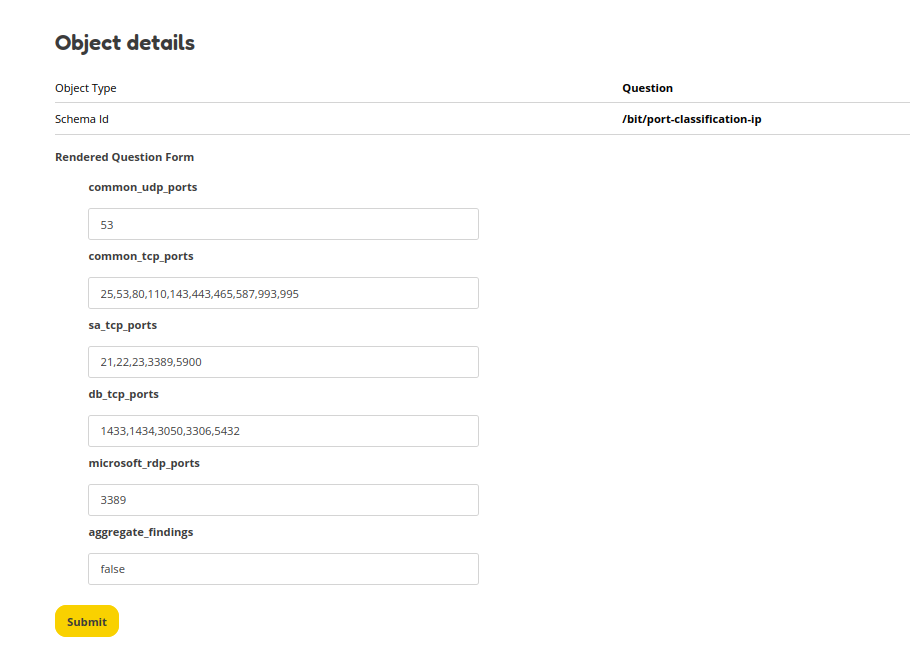

Questions & Configs
===================
OpenKAT can be used to customise OpenKAT to your own company policies and industry standards. This will allow you to set your security more or less strict depending on your needs and wishes. This can be done using the Question objects on the Objects page. By default no policies are applied. In order to set an policy you have to answer the policy questions and apply these. After applying the questions a Config is created which contains all the answers to your Questions. OpenKAT reads the applied Config files and ensures that all observations are measured against your applied policy.

To summarize: your personal policy is stored in Configs. In order to create a Config you have to answer the Questions. After answering all questions the Config is automatically generated and applied. Questions consist of a JSON schema, which is rendered as a form in the web interface.

Currently the following pre-defined policies are available:

- Disallowed hostnames in the CSP header
- Objects in the HTTP headers
- Port classification

Disallowed CSP hostnames
------------------------

**Why is this question introduced?**
Websites often load scripts and content from external servers (e.g. jQuery from a Content Delivery Network (CDN) like Cloudflare). This can be dangerous as you have limited control over the content that is inside the scripts that these external servers are serving. This Question allows you to check if the hostname in the CSP is allowed by your policy.

**What are the risks?**
Loading external content from websites you do not have control over could result in supply chain attacks. Attackers could serve malicious code (scripts) on CDN networks that is then automatically loaded into the browser of each website visitor.

**Limitations**
This question looks only for bad hostnames that are provided by the user (denylist). This means that findings for bad hostnames in the CSP header are only shown for those domains that are added to the list.

**Examples**
Provide hostnames which are unwanted, separate each hostname by a comma. You can specify the main domain (`bad.com`), subdomains are automatically taken into account (`script.bad.com`).

.. code-block:: RST

   E.g. evil.com, bad.evil.com, attacker.com.

OOIs in headers
---------------

**Why is this question introduced?**
Some websites like SSO portals result in new objects on the Objects page for each time a boefje visited the website with a new session token. By specifying which session parameters are used the number of objects will be limited to only the paths on the server.

**What are the risks?**
There is no direct impact. This question helps reduce the number of duplicate items in the Objects list and thus helps in getting a better overview.

**Limitations**
It only checks for parameters in the URL, headers are ignored. There is currently no way to specify the parameters per hostname.

**Examples**
Provide the URL parameter that is to be ignored, separate each parameter by a comma. URL parameters can be found in the URL bar after the `?` sign. They are the values after the `&` and before the `=` signs.

The URL is: `https://example.com/index.php?session_id=12346&search=meow <dontredirect>`_ . This URL has two parameters:`session_id` and `search`, which both have a value (`123456` and `meow`). The parameter and value for `session_id=123456` are expected to clutter the Objects list, as for each new session the value `123456` is different. The next time you visit the website this might be `session_id=43215` and the next time `session_id=958367`. You can reduce the object clutter by adding the parameter `session_id` to the list as this will be the same for each session. Adding the value `123456` will not work, as this will be different each time.

Port mapping
------------

**Why is this question introduced?**
Maps open ports into specific categories based on the services in your environment. You can specify common TCP and UDP ports which will not trigger a finding (such as e-mail server ports). By adding ports to the database (db) and system administrator (sa) lists you tell OpenKAT which ports are likely used in your network. Depending on your port mapping OpenKAT will show different findings if the port is detected. The `aggregate_findings` functionality allows you to group findings by IP address rather than treating them as separate ports.

**What are the risks?**
There is no direct impact. This question helps to tune findings to your own demands. Having good insights in your network helps with risk mitigation.

**Limitations**
If a port is added to multiple lists the finding for the first list is shown. If a port is added to both sa_tcp_ports and db_tcp_ports, then the finding relating to the system administrator ports is shown, as this is the first in the list.

**Examples**
Enter ports separated by a comma. Such as: 21,22,3389.

