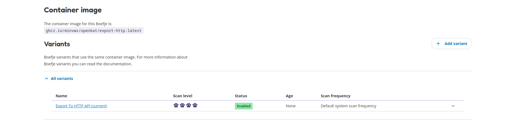
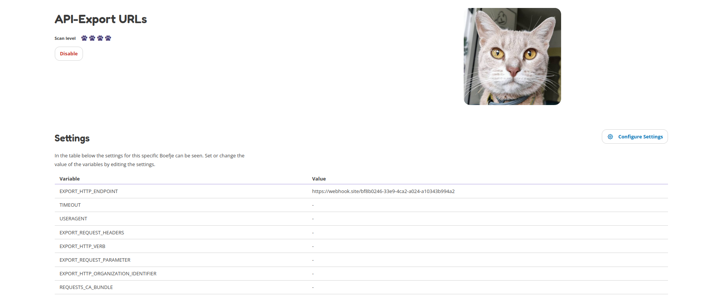
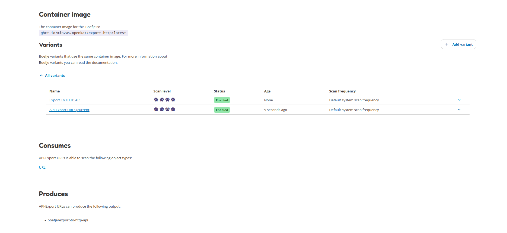

=========
KATalogus
=========
The KATalogus contains all boefjes and normalizers that are used in OpenKAT. These can be enabled and disabled. Some boefjes or normalizers require more explanation how they can be used.

Boefjes
=======

Export to HTTP API
------------------
The Export to HTTP API boefje allows the user to export all chosen objects to be sent to an external API endpoint (e.g. webhook). This boefje requires extra settings to be configured.

The clearance level for this boefje indicates that only those objects that are equivalent to the set clearance level, or higher, are shared with the API endpoint.

The clearance level of this boefje only shares those objects that were chosen that have the clearance level of this boefje or higher. Example: if the boefje has clearance level 3 and your chosen objects (e.g. Hostnames) are level 2, these will not be sent to the API end
point. If the boefje clearance level is lowered to level 2, the chosen objects are forwarded to the API endpoint. Giving this boefje a clearance level of 0 will sent all chosen objects to the API endpoint, this includes the objects that have clearance level 0.

Steps to use this boefje:

#. Go to the KATalogus and open the 'Export to HTTP API' boefje.

#. Scroll down to the Container image and Variants section.

#. Click on the button 'Add variant'.

#. Fill out the form for creating a Boefje variant. You can find more information HERE. #TODO: Add link to information page boefje variant. The sub-items below are the minimum required items to be added/changed in this form.

    #. Name: Use a descriptive name, like "API export all URLs L4" to quickly see from the KATalogus page what this boefje exports.

    #. Input object type: The Input Object types are the objects that you want to export to the API endpoint. Use the SHIFT + mouseclick to select one or more objects.

    #. Clearance level: set the clearance level required before the chosen input objects types can be exported.

#. Click the 'Create variant' button.

#. Go to the Katalogus and click on your newly created Boefje variant.

#. Click the 'Configure settings' button.

#. Add the HTTP endpoint where the data should be sent to. More information on the rest of the options is described below.

The following settings are available for this boefje:  

- Export HTTP endpoint: this is the URL endpoint where all the objects are sent to. An example URL could be: `https://mispo.es/bf8b0246-33e9-4ca2-a024-a10343b994a2` (required).
- Time-out: provide a HTTP time-out (optional).
- User Agent: allows you to specify your own User Agent that is sent with each request. The default value is 'OpenKAT' (optional).
- Export Request Headers: this allows you to specify what HTTP headers should be added to your request. By default no extra HTTP headers are added (optional).
- HTTP verb: This allows you to specify if the data should be sent in a GET or POST request. The recommended setting is to use POST requests to sent the data, as the data could be retrieved from logs if you are using GET requests. This in not possible when using POST requests. The default setting is POST requests (optional).
- Request parameter: specify which parameter is used to sent the data in. As example, if you specify `export_ooi` as request parameter, the URL to your HTTP endopint would look like: `https://mispo.es/bf8b0246-33e9-4ca2-a024-a10343b994a2?export_ooi=json-blob-for-ooi` (for GET-requests). The request parameter can be used as a label to retrieve the data. If you use POST requests (recommended) the `export_ooi` parameter is used in the HTTP body (optional).  
- Organization identifier: the organization identifier can be used to specify which of the organizations in your OpenKAT database sent the data. This can be used as a label to organise your data (optional).  
- CA bundle: allows you to specify the CA bundle if this is required for your setup (optional).

The image below shows which section can be used to create the Boefje variant.

The image below shows under 'Consumes' that URLs are forwarded and that it is a Boefje variant.

The image below show the configuration settings that can be added to the Export HTTP API boefje.

