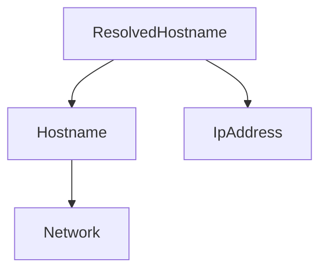
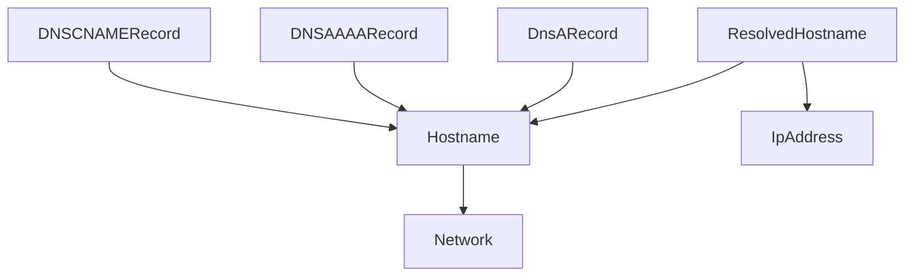

# nibbles

## Introduction

This document provides an overview of the design and functionality of nibbles, along with guidance on how to work with them effectively.
nibbles are a replacement for bits, offering a different and improved approach. While this document touches on the differences between bits and nibbles, the primary focus is on understanding and using nibbles.

## Table of Contents

1. **What Are Nibbles?**

   - Description
   - Main idea and flow

2. **Why Nibbles?**

   - Advantages Over Bits

3. **Nibble Design**

   - Architecture
   - Structure of a Nibble
   - Exceptions

4. **Creating a Nibble**

   - Process
   - Nibble Query Template
   - Common Operations and Examples

5. **Performance**

   - What did we already do?
   - What can be done to improve?

6. **Troubleshooting and Debugging**

   - Common Issues
   - Tips for Debugging nibble-Related Problems

7. **Examples and Use Cases**
   - Sample Code

## 1. What Are Nibbles?

### 1.1 Description

### 1.2 Main Idea and Flow

#### Flow (without cache)

The main flow looks something like this:

1. New OOI is created
2. Search for all nibbles that match the OOI type in its signature.
3. For each nibble that is found:
   1. Run a query using the primary key of the new OOI.
   2. Extract all objects in the nibble's signature from the query results using JMESPath.
   3. Create a cross-product of all extracted objects.
   4. Start nibble runs for each combination in the cross-product.
   5. Add all new OOIs to a list
4. When all nibble runs are complete, write the OOIs in the list to the database.

Now this is already a very performant way of running inferences, since we only write to the database once. However, we can do (and do) better.

#### Flow (with cache)

Nibbles use caching to improve performance. The flow with cache looks like this:

1. New OOI is created
2. Search for all nibbles that match the OOI type in its signature.
3. For each nibble that is found:
   1. Run a query using the primary key of the new OOI.
   2. Extract all objects in the nibble's signature from the query results using JMESPath.
   3. Create a cross-product of all extracted objects.
   4. Start nibble runs for each combination in the cross-product.
   5. Add all new OOIs to a list
4. **When done, recursively search for all nibbles that match the new OOIs in their signature.**
5. **Go to step 3 for all OOIs.**
6. When all nibble runs are complete, write the results to the database.

Currently, this caching step only works for nibbles that have only one nibbleParameter. We want to upgrade nibbles in the future to cache all other nibbles as well.

#### OOI updates

Some (very few) OOIs can be updated, which means that an attribute that is not part of the primary key changes.
For this case, the nibble flow is same but since the origins of the updated OOI has all the primary keys needed for the nibble run, all primary keys for the nibble query are known and should be filled in.

## 2. Why Nibbles?

### 2.1 Advantages Over Bits

#### Bits superiority 1: Complex Queries

Although bits were powerful and performant, they had some limitations. nibbles are designed to overcome these limitations and provide a more flexible and powerful tool for generating OOIs.
One of the main drawbacks of bits were that they relied on a single object type (the `consumes`). That `consumes` object had to point to all parameters. This example was handled very well by bits, since `ResolvedHostname` could be the `consumes` that pointed to all other objects:



However, let us consider a nibble that also needs all DNSRecords of the Hostname in the context to run:



Bits could not handle such a situation since neither `Hostname` nor `ResolvedHostname` point to all objects.
nibbles are designed differently, where the `signature` consists of object types, to trigger a query, which decide the input.
Therefore, nibbles can handle indefinitely complex inputs.

#### Bits superiority 2: Unnecessary Runs

Another drawback of bits was that there were a lot of unnecessary runs. For example, consider a bit that would create a finding on all `Hostnames` with `Websites` with an `IPService` with a `Service` connected to it with `name` being `http`.
In other words, consider a bit that creates findings on `Hostnames` with http `Websites`.
The bit would `consume` `Hostname` objects, run, check for all `Websites` and return when the `names` would not `http`. That is a lot unnecessary steps.
nibbles use a query to decide that input, and when there is no `http` service, the input set would be empty! Also, bits would run on every update/create event of all `IPServices`/`Websites`/`Hostnames` which is not needed when you know from the start that the new `Service` is not `http`.
nibbles handle that better.

#### Bits superiority 2: Unconnected objects

Let us consider a hypothetical nibble that created a finding when two `Hostnames` are very similar. Bits were not able to run on objects that are not connected.
Since nibbles use a query to decide the input, we can either use the query language to find similar objects, or fetch all objects in a certain part of the graph and find similarity in Python time.

## 3. Nibble Technical Design

### 3.1 Architecture

### 3.2 Structure of a Nibble

#### Nibble file structure

The file structure of a nibble is as follows:

```
<nibble-id>/
├── __init__.py
├── nibble.py
├── <nibble_id>.py
```

- **`nibble.py`**: This file contains the nibble definition, which includes:
  - The nibble ID
  - The signature which contains a list of the selected objects for the nibble (nibbleParameters)
  - The nibble query that retrieves all the data needed for the parsers
- **`<nibble-id>.py`**: This file contains the nibble code, which processes the extracted objects and generates new OOIs.

#### Nibble Parameter

A `nibbleParameter` specifies:

- **Object Type (`object_type`)**: Identifies the type of object included in the signature, such as a `list(Finding)`.
- **Parser (`parser`)**: Describes how to extract the required data from the query output using Jmespath.
- **Optionality (`optional`)**: Indicates whether the nibble code can execute without this parameter (can be `None`).
- **Additional OOIs (`additional`)**: Lists other OOIs that can trigger the nibble relevant for the `object_type`.

For example, if the `object_type` is `list(Finding)`, the `additional` attribute should include `Finding`.

#### Jmespath query

The Jmespath query is used to extract the relevant objects from the query results. It is a JSON query language that allows you to extract data from JSON documents. The query must be defined for all nibbleParameters in the signature. Typically, the query resembles:

```
[*][?object_type == '<OOI Type>'][]
```

It can also be used to count, create lists, etc.

#### Nibble query

The nibble query is the XTDB query that retrieves all the data required for the nibble. As an example, we have written a nibble query template that should work for most use cases in the next chapter, but any XTDB query can be used.
It is recommended to embed as much logic as possible within the query itself, as database queries tend to be more performant than processing data in memory.

#### Nibble code

After Jmespath has extracted the appropriate objects and cross-products have been created, the nibble code executes for each result of the cross-product. This code handles the final layer of logic, yielding new OOIs based on the processed data.

### 3.3 Exceptions

For now nibbles that have only one nibbleParameter that is also a OOI, are special cased nibbles. These nibbles are more performant, can be run in cache, do not need querying and do not need a Jmespath query. The whole definition of such a nibble is:

```python
from nibbles.definitions import nibbleDefinition, nibbleParameter
from octopoes.models.ooi import <Object Type>

nibble = nibbleDefinition(id="<nibble_id>", signature=[nibbleParameter(object_type=<Object Type>)])
```

## 4. Creating a Nibble

### 4.1 Process

The process of creating a nibble involves the following steps:

1. **Step 1**: Identifying the goal
2. **Step 2**: Choosing the right objects
3. **Step 3**: Defining the nibble
4. **Step 4**: Writing the nibble query
5. **Step 5**: Writing the Jmespath query
6. **Step 6**: Writing the nibble code

### 4.2 Nibble Query Template

Most of the times, the hardest part of writing a nibble is creating the appropriate nibble query.
This part will become easier when Octopoes allows SQL queries but for now, we have to use datalog.
We will not dive deeply into creating datalog queries, but we will try to give some tools to use.

The general query template for most trivial nibbles is as follows. The template will become clearer with some examples!

```clojure
{
    :query {
        :find [(pull ?var [*])] :where [

            ; Add all required objects with their relation here
            ; For example:
            [?required_object1 :object_type_of_required_object1/primary_key {{primary_key}}]
            [?required_object2 :object_type_of_required_object2/attribute_of_required_object2 ?required_object1]

            (or-join [?var ?required_object1 ?required_object2 ?etc]

                ; Add all optional objects with their relation to one of the required objects here
                ; For example:
                (and
                  ?var :ResolvedHostname/hostname ?hostname
                  ?hostname :Hostname/network ?required_object1
                )

               ; Also add all required objects here in the following manner
               [?var :object_type_of_required_object1/primary_key ?required_object1]
               [?var :object_type_of_required_object2/primary_key ?required_object2]

            )
        ]
    }
}
```

This template assumes that the primary key of one of the required objects is known. The primary key can usually be found in the `:primary_key` attribute of the object.
