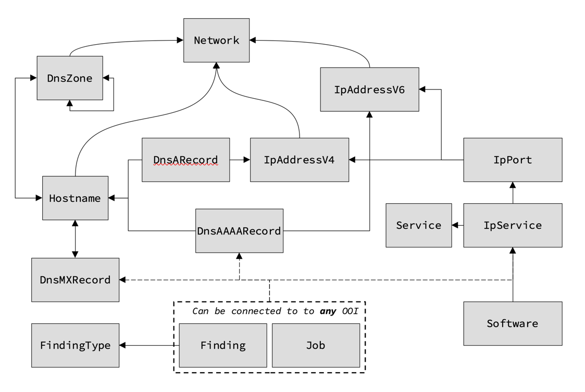
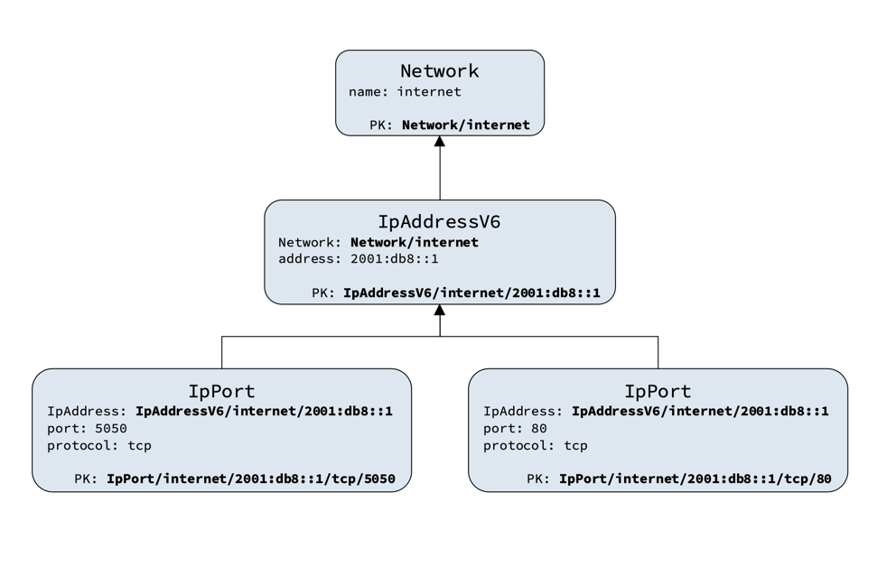
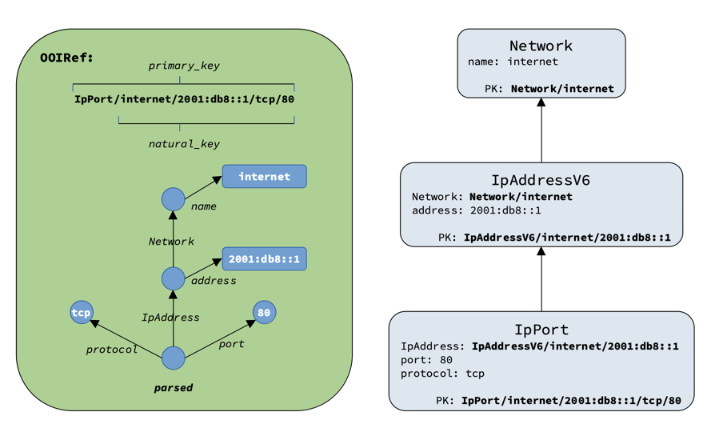
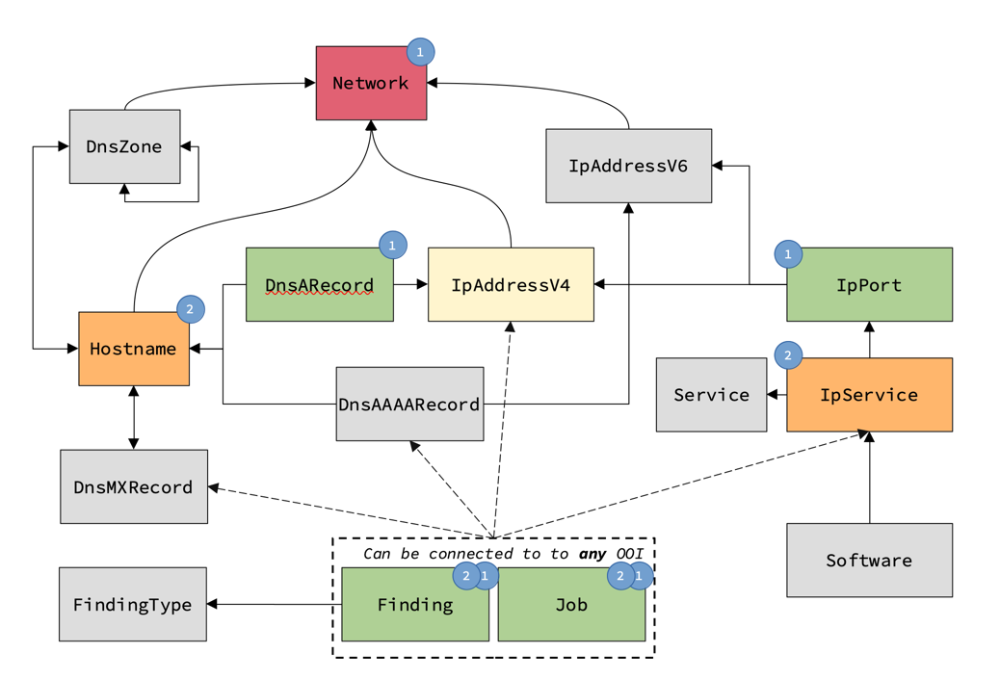

# Octopoes

Octopoes is KAT's knowledge-graph. It stores the knowledge KAT has gathered about its domain. As Octopoes uses [XTDB](https://xtdb.com) for bi-temporal data-storage, Octopoes keeps the current state of the knowledge-graph, as well as a complete, queryable history of the knowledge-graph.

## Instructions

Install dependencies
```bash
python3 -m pip install -r requirements.txt
```

### Run Octopoes API
```bash
python3 -m uvicorn octopoes.api.api:app [--port 8000]
```

### Run the event processor
```bash
python3 -m celery -A octopoes.tasks.tasks worker -B -s /tmp/celerybeat-schedule --loglevel=WARNING
```
_Note: The `-B` flag instructs celery start the Celery Beat scheduler in the same process_
_Note: The `-s` flag is used to specify the beat schedule location and should be writeable by the user the process runs in_


## Healthcheck
```bash
# Return XTDB connection info
curl http://localhost:8000/_dev/health
# Return some XTDB objects (or empty list [])
curl http://localhost:8000/_dev/objects

# To request data for a different KAT-client:
curl http://localhost:8000/clientx/healthcheck
```


## OOI
The domain of discourse, on which Octopoes operates, is described by the OOI datamodel. The OOI (Object of Interest) model is described by entities and relations between them. The OOI model is currently defined in Octopoes itself (module `octopoes.model.ooi`). However, it is planned to be defined in the Openkat schema registries, decoupling the applicable domain from the logic.


## Origin

Each OOI must have an origin to exist in the knowledge-graph. Origins can be supplied to Octopoes in 3 ways:
- origin through declaration
- origin through observation
- origin through inference

Each origin consists of:
- the identifier of the origin-method
- a source OOI
- a set of result OOIs
- additional metadata. E.g. the task-ID that made the observation

## Origin through declaration
An OOI is declared to exist by a user of KAT.

_In this case, OOI B is both source and result_
```{mermaid}
flowchart RL

D[Declaration D]

  subgraph result[ ]
    B[OOI B]
  end

B-.source.-D
D-.result.- result
```

## Origin through observation
An observation is reported by a normalizer
- An observation has a key that identifies the normalizer
- An observation always has a source OOI
- An observation always has a (possibly empty) set of result OOIs
```{mermaid}
flowchart LR

A[OOI A]
O["Observation O (OOI A)"]

  subgraph outp[ ]
  B[OOI B]
  C[OOI C]
  end

A-.source.-O
O-.result.- outp

```

## Origin through inference
An object is inferred from other objects in the knowledge-graph. This is achieved by rules, declared in bits. A bit is a rule that is applied to a pattern in the knowledge-graph.

```{mermaid}
flowchart TD

  subgraph pattern[ ]
  direction TB
  A[OOI A]---B[OOI B]
  A---C[OOI C]
  end

  subgraph result[ ]
  direction RL
  D[OOI D]---E[OOI E]
  end

BIT["Bit B (OOI A)"]

A-.source.-BIT
pattern-.pattern.-BIT
BIT-.result.- result

```


## Graph mutations
Mutations can only be made by supplying an origin to Octopoes. This can be an origin through declaration, or origin through
observation. When, after an origin-update, an OOI is no longer referenced by any origin. The OOI will be deleted from the knowledge-graph.

*Example:* observation O has result B and C
```{mermaid}
flowchart LR

A[OOI A]
A-.source.-O
O["Observation O (OOI A)"]

O-.result.- result

    subgraph result[ ]
    direction LR
    B[OOI B]---C[OOI C]
    end
```

After a mutation, observation O has result B.
C is no longer referenced, and is deleted from the knowledge-graph.
```{mermaid}
flowchart LR

A[OOI A]
O["Observation O (OOI A)"]

    subgraph result[ ]
    direction LR
    B[OOI B]
    end

C[OOI C]:::someclass

A-.source.-O
O-.result.- result
B[OOI B]x--xC[OOI C]

classDef someclass fill:#f96, color:#000, stroke:#000;
```

If C had been referenced by another origin, it would not have been deleted.

_OOI C is not deleted, since it's still referenced by Observation P_
```{mermaid}
flowchart LR

A[OOI A]
O["Observation O (OOI A)"]
subgraph result[ ]
  direction LR
  B[OOI B]
end
C2[OOI C]

A-.source.-O
O-.result.- result
B[OOI B]x--xC2

E[OOI E]
P["Observation P (OOI B)"]
subgraph result2[ ]
  direction LR
  D[OOI D]---C[OOI C]
end

E-.source.-P
P-.result.- result2
```

## Code Architecture
In high level, the code architecture is as follows:

- _Origin gets reported to the API_
- _API calls the service layer_
- _Service layer calls the data layer_
- _Data layer sends out a mutation event_
- _Listener catches the mutation event_
- _Listener calls service layer to process mutation_
```{mermaid}
flowchart LR

Listener
API
OctopoesService


API --> OctopoesService

Listener --> OctopoesService
OctopoesService --> Repository

Repository --> XTDB[(XTDB)]
Repository --> EventManager
EventManager --> Listener
```

### Sequence: save_origin
```{mermaid}
sequenceDiagram

actor Client
participant API
participant OctopoesService
participant OriginRepository
participant OOIRepository
participant XTDB
participant EventManager

Client ->>+ API: save_origin(origin, oois, valid_time, organisation)
API ->>+ OctopoesService: save_origin(origin, oois, valid_time)
OctopoesService ->>+ OriginRepository: save(origin, valid_time)
OriginRepository ->> XTDB: get(origin, valid_time)
OriginRepository ->> OriginRepository: compare(origin)
OriginRepository ->> XTDB: save(origin, valid_time)
OriginRepository ->> EventManager: publish( CREATE_ORIGIN )
OriginRepository ->- OctopoesService: #nbsp
OctopoesService ->>+ OOIRepository: save(ooi, valid_time)
OOIRepository ->> XTDB: get(ooi, valid_time)
OOIRepository ->> OOIRepository: compare(ooi)
OOIRepository ->> XTDB: save(ooi, valid_time)
OOIRepository ->> EventManager: publish( UPDATE_OOI )
OOIRepository ->- OctopoesService: #nbsp
OctopoesService ->- API: #nbsp
API ->- Client: #nbsp
```
### Sequence: process update ooi
```{mermaid}
sequenceDiagram

actor EventManager
participant Listener
participant OctopoesService
participant OriginRepository
participant XTDB

EventManager ->>+ Listener: handle_event(event<UPDATE_OOI>)
Listener ->> OctopoesService: handle_update_ooi(event, valid_time)
OctopoesService ->> OriginRepository: get_origin(event.origin, type=inference)
OriginRepository ->> OctopoesService: bits
loop bits
  OctopoesService ->> OctopoesService: run_bit
end

Listener ->>- EventManager: #nbsp
```

## Crux / XTDB
[Crux](https://opencrux.com/main/index.html) is the central database of OOIs within KAT. Crux is a graph-database that can store objects (schemalessly), while providing object history and audit-trail functionality out-of-the-box. The term *bitemporal* means it tracks every object on 2 time axis: valid-time and transaction-time.

- Valid-time means the state of an object at a certain time *X* (mutable).
- Transaction-time means the state of an object with all transactions-processed until time *Y* (immutable)

This is especially useful for forensics-type queries like: What was the state of an object at time *X (valid-time)*, with the information we had at time *Y (transaction-time)*.

Good to know: Crux tracks the history of each object by its **primary key**.

[Read more about Crux bitemporality](https://opencrux.com/articles/bitemporality.html)

## OOI

OOI objects are instances of relatively simple classes, which inherit from `OOIBase`.

Because all OOIs are stored in Crux and Crux tracks object history by primary key, KAT defines a way to reliably determine the primary key of an object by its attributes. This is called the [natural key](https://en.wikipedia.org/wiki/Natural_key) of an object.

The main advantage of this method, is that when enough attributes of an OOI are discovered, the primary key of this object is known. This allows reasoning about the exact same objects in several subsystems, without having to query a database.

Consider this (oversimplified) Person class
```python
from octopoes.models import OOI


class Person(OOI):
  name: str
  last_name: str
  age: int

  _natural_key_attributes: ['name', 'last_name']


# 2 completely separate systems can instantiate the the following Person OOI:
john = Person(name='John', last_name='Doe', age=42)


# And without having to search this person in a central database, the primary key is known:
john.natural_key # 'John/Doe'
john.primary_key # 'Person/John/Doe'
```
*Note that the primary key consists of the natural key prefixed by the OOI-type, to avoid PK collisions*

## Relationships

OOIs can be related to each other. At time of writing the OOI data structure looks like this:

*Directional arrows indicate a foreign key pointing to referred object*


In a one-to-many relationship (`A 1-* B`), the relationship is stored in B (**B points to A**). For example, an IP-address belongs to a Network. So the Network primary key is stored as a foreign key in the IP-address object.

```python
from octopoes.models import OOI, Reference
class Network(OOI):
    name: str
    _natural_key_attrs = ['name']

class IpAddressV6(OOI):
    Network: Reference[Network]
    address: str
    _natural_key_attrs = ['Network', 'address']
```

## A few example records



## OOI Reference

Even though foreign keys are actually simple strings, for ease of use these strings are represented in Octopoes by a special `Reference` object.

OOIRefs can be obtained in several ways.
```python
from octopoes.models import Reference
from octopoes.models.ooi.network import Network, IPAddressV6

# Through the .ref() method of an OOI instance
internet = Network(name='internet')
internet_ref = internet.reference

# Or from string
internet_ref = Reference.from_str('Network|internet')

# Create a related object with a ref
ip = IPAddressV6(network=internet_ref, address='2001:db8::1')
```

Since an OOIRef is a compound key, individual parts of the foreign key can be retrieved by the `parsed` property.
```python
from octopoes.models import Reference

ref = Reference.from_str('IpPort|internet|2001:db8::1|tcp|5050')

ref.tokenized.protocol # 'tcp'
ref.tokenized.port # '5050'
ref.tokenized.address.address # '2001:db8::1'
```



## Octopoes API

### OctopoesAPIConnector

The OctopoesAPIConnector class provides a python interface for connecting with Octopoes API.
It provides several methods for doing CRUD operations for the objects/entities.

#### Querying objects

In particular, for querying objects we have:

-  `OctopoesAPIConnector.list()` to filter on OOIs `type`, `scan_level`, `scan_profile_type` and `valid_time`.

This is used for example in the object overview page. Returns a paginated list of OOIs.

-  `OctopoesAPIConnector.get_tree()` to filter out neighbouring OOIs starting from a root OOI (`reference`) in
   the object graph.

The graph is traversed until a specified `depth` is reached, filtering on `types` and `valid_time`.
Returns a `ReferenceTree`: a tree-like structure of OOIs representing a subgraph of the objects graph.
The conversion from graph to tree happens through "unfolding" the graph during traversal and allowing duplication of
nodes in the tree to avoid cycles. Because of the duplication the structure includes a unique, flattened list of OOIs
present in the tree, the `ReferenceTree.store`, for convenience. Unsurprisingly, this method is used for rendering
object-graphs.

-  `OctopoesAPIConnector.list_origins()` to filter on `valid_time`, `source`, `result`, `task_id`and `origin_type`.

Due to the `task_id` filter, this allows users to connect OOIs to the most recent normalizer task
that found these OOIs. This is used to find the original boefje task and raw data that "proofs" the existence of the
OOIs. Returns a list of Origins.

-  `OctopoesAPIConnector.list_findings()` to filter Findings on `valid_time`, `severities`, `exclude_muted`,
   `only_muted`, `offset`, `limit`.

This method offers some Finding-specific filters for convenience on Finding pages.
Returns a paginated list of Findings.


## Abstract classes / subclassing
Relationships from an OOI class to another OOI class are inferred through its property types. It is
possible to define a relationship to an abstract class.

For querying purposes and grouping purposes these abstract classes can also be used.

```python
from octopoes.models import OOI, Reference
from octopoes.connector.octopoes import OctopoesAPIConnector

# Define abstract class and subclasses
class IPAddress(OOI):
  ...

class IPAddressV4(IPAddress):
  ...

class IPAddressV6(IPAddress):
  ...


# Relationships to abstract class
class IPPort(OOI):
    address: Reference[IPAddress] # Any subclass of IPAddress (IPAddressV4, IPAddressV6)
    protocol: str
    port: int


class TagExample(OOI):
    ooi: Reference[OOI] # Any subclass of OOI..
    tag: str


# Query abstract class
OctopoesAPIConnector('http://octopoes', '_dev').list({IPAddress})
```

## Querying
Octopoes API uses the OOI model to construct Crux queries. For complex graph-querying, Crux's [pull-syntax](https://www.opencrux.com/reference/1.16.0/queries.html#pull) is used to build a query tree. Crux can join objects to properties which hold (lists of) foreign keys.

Imagine a query "Give me IpAddressV4 with primary key ***X*** and all related objects **2** levels deep".

What happens under the hood:
  - A relation map is created with all OOI classes and their relations
  - A query plan is created by traversing the relation map 2 levels deep. The queryplan is a tree of QueryNode objects
  - The query plan is transformed into a Crux Datalog query, utilizing its pull syntax to join related objects


**Rules**:
A few rules come into play when planning the query.
- Relations are not traversed back through the previous relation. E.g.:
  `IpAddressV4 -> IpPort -> IpAddressV4`
- Leaf nodes are OOI classes that have too many relations to effectively traverse if they are not the starting node. Currently these are `Network`, `Finding` and `Job`

**Query Plan Visualization:**
The OOI class tree is traversed 2 levels deep. Bear in mind that both Finding and Job can be related to any OOI, so the following paths are valid:
```
- IpAddressV4 -> Finding
- IpAddressV4 -> Job
- IpAddressV4 -> DnsARecord -> Finding
- IpAddressV4 -> DnsARecord -> Job
- IpAddressV4 -> IpPort -> Finding
- IpAddressV4 -> IpPort -> Job
- IpAddressV4 -> IpPort -> IpService
- IpAddressV4 -> DnsARecord -> Hostname
....etc
```

Hence the 1 and 2 levels markers on Finding and Job in the image below.


## Run bit manually

It is possible to manually run a bit using

```shell
$ ./tools/run_bit.py ORGANIZATION_CODE BIT_ID OOI
```

This will execute the bit with debug logging turned on. `run_bit.py` supports
the `--pdb` option to enter the standard Python Debugger when an exceptions
happens or breakpoint is triggered.

If you are using the standard docker compose developer setup, you can use
`docker compose exec` to execute the command in the container:

```shell
$ docker compose exec octopoes_api ./tools/run_bit.py ORGANIZATION_CODE BIT_ID OOI
```

Example usage:

```shell
$ docker compose exec octopoes_api ./tools/run_bit.py ORGANIZATION_CODE BIT_ID OOI
```

## Tests

The unit tests `octopoes/tests` are run using
```bash
python -m unittest discover octopoes/tests
```
