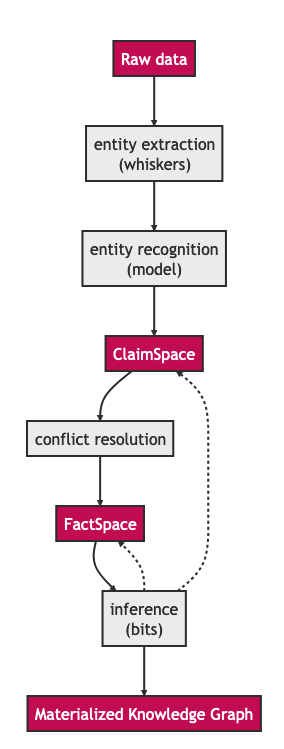

Octopoes Research
#################

General note to the reader: this document is based on some internal project notes and does not have an official or formal status.
It may contain oversights, mistakes, and/or omissions. Any thoughts or insights are very welcome through GitHub or by contacting the team through Signal!

Master students from the University of Groningen have written a paper about the use of Semantic Web Technologies in OpenKAT.

- :download:`Investigating the use of Semantic Web Technologies in OpenKAT (paper)<pdf/Investigating the use of Semantic Web Technologies in OpenKAT paper.pdf>`
- :download:`Investigating the use of Semantic Web Technologies in OpenKAT (slides) <pdf/Investigating the use of Semantic Web Technologies in OpenKAT slides.pdf>`

Introduction
============
The project has gone through several iterations of refinement and changes in scope, but the overall software architecture has remained stable for a while now.

This document concerns Octopoes, a core component within KAT which is intended to store a modeled copy of the world in a bi-temporal graph database. Octopoes is intended to include a reasoning engine that is able to post-process data by executing rules to draw conclusions from a given dataset.

While the architecture of KAT is quite clear and documented, the workings of Octopoes are still slightly obscure and not sufficiently formally defined. This lack of documentation and formalization in this core component of KAT is currently resulting in unclear constraints considering the rule-engine, vagueness of to be made trade-offs between expressivity and computational complexity, etc.

A large revision of Octopoes is currently in the works that should incorporate the learnings and experience of the last two years. This revision should address most of the current challenges and it is of vital importance to have a (relatively formal) description of the intended workings.

This document is divided in two parts. Part 1 addresses the context of Octopoes and sketches rough requirements. Complexities of the intended functionality are described, with their respective backgrounds.

Part 2 attempts to sketch the possible components that, when combined, result in the software that satisfies the requirements, within the known constraints.

*Note: as KAT is first and foremost developed for application in the cybersecurity domain, some examples in this document are given in this context.*

Part I - Requirements, context and inherent complexities
========================================================

Context of Octopoes in KAT
--------------------------

Event loop
^^^^^^^^^^

KAT as a whole can be defined as a configurable, distributed crawler. A feedback loop is constructed by continuously:

1. Executing programs that gather data, with entities as input
2. Structuring the yielded data to extract entities
3. Storing the extracted entities in a persisted graph
4. Feeding these entities as input for the programs in step 1

  Event loop

KAT dataflow
^^^^^^^^^^^^
For reasons like scalability and extensibility the above concept is broken up and realized into multiple components.

  Data flow

Objectives
----------

KAT
^^^

* The ability to timestamp and sign raw output data and metadata (primarily bytes' responsibility)
* The ability to schedule new scans for newly created objects and recurring scans for existing objects (primarily mula's responsibility)
* The ability to extract structured data from raw data (primarily whisker's responsibility)

Octopoes
^^^^^^^^

* The ability to draw conclusions ("findings") automatically from data, based on business rules which are called “bits”.
* Create new objects from business rules
    * And by extension: trigger new business rules on those new objects
* Perform advanced, complex, and fast queries on the data for analysis, alerting, and reporting
* The ability to change, reduce, and expand the set of objects and rules throughout KAT's lifecycle
* A domain-independent architecture, i.e. the model should accommodate domains beyond technical cybersecurity
* The ability to enable and disable certain objects and rules
* The ability for objects to inherit clearance levels from their neighbors, in an automatic and sensible way (n.b. probably specific to the security domain - maybe generalizable through bits)

Desired/future
^^^^^^^^^^^^^^

* Temporal reasoning about historical states of the data
* The ability to federate several KAT installations, to enable distributed computing and accept signed results from other instances (e.g. to gain information about private networks and systems).

Complexities of Octopoes
------------------------

Realizing these objectives comes with several challenging aspects.

Open-world assumption
^^^^^^^^^^^^^^^^^^^^^

Octopoes gains knowledge by three methods:

1. Observation by scanning the world
2. Information declared to be true by users or other software systems
3. Reasoning through defined rules (bits)

Per definition, Octopoes is not authoritative of the data it captures and therefore has to take an open-world assumption (OWA). In short, this means that the information stored in Octopoes is not complete (Octopoes does not know the full state of the world). Octopoes can only make claims about data that is known. Questions about information that is unknown to Octopoes are consequently answered by ‘unknown’.

On the contrary, a system making a closed-world assumption (CWA), seems to be simpler to deal with. CWA systems have complete knowledge of their respective domain and are therefore authoritative. Any questions asked to this system can be definitively answered with a yes or no.
In a “classical” application, the database source contains the complete knowledge about the domain. Questions like “Is there an order with id 31” can be answered with “no” definitively.

  Example of an authoritative database

.. figure:: img/octopoes/owa_database.png
  :alt: Example of an open-world database like KAT

  Example of an open-world database like KAT

Question: “Is port 443 open on IPAddress 2.2.2.2?”

KAT's answer: “Unknown”

Contradicting information
^^^^^^^^^^^^^^^^^^^^^^^^^

Information about the world can come from several sources. Direct observations but also third parties can be sources of information. It is absolutely not guaranteed that these several sources agree on statements about the world and it is even likely that these sources will contradict each other at some point.

Octopoes needs to deal with this, by performing (naive) disambiguation. Perhaps an approach based on confidence scores of sources and the age of the provided information is suitable.

*Example claims:*

* Shodan claims the state of port 80 of IPv4 address 1.1.1.1 as ‘closed’, 2 days ago
* A nmap scan claims the state of port 80 of IPv4 address 1.1.1.1 as ‘filtered’, 1 day ago
* A HTTP request to port 80 of IPv4 address 1.1.1.1 is successful, resulting in a claim of the port state ‘open’, *just now*

An approach to determine the state of the port could be to first compare the confidence levels of the sources.

* Shodan is a third party, resulting in a low source confidence score
* Nmap provides a direct observation, resulting in a relatively high source confidence score
* The HTTP request cannot be successful without the open port, resulting in a very high source confidence

Then, take into account the age of each claim.

* The Shodan claim was 2 days ago, resulting in a low age confidence score
* The nmap claim was 1 day ago, resulting in a medium age confidence score
* The HTTP request claim was just now, resulting in a very high age confidence score

A possible approach could be to multiply the source confidence score with the age confidence score and take the highest combined confidence score as for truth.

Logic
^^^^^
By including rule-base data processing into a system, it needs to be clear that the domain of computational and mathematical logic is entered. We will briefly go over some of the basics of logic. At its core, logic consists of premises resulting in consequences. Given a set of premises, a reasoner can infer logical consequences and therefore yield additional (implicit) knowledge.

  Logic and reasoning

For the first iteration of the rule engine in Octopoes, a simple approach was proposed to find objects in the graph satisfying specific conditions and applying labels to these objects.

*Example rule:*

Condition: Public IPv4 address with port 1433 open

Logical consequence: Vulnerability with high severity

IPv4Address(x) ^ Port(y) ^ RelationState("open", x, y) -> Finding(Severity 1, Reason "Open Port", x, y)

(where x is an object that satisfies the criteria of an IPv4 address, y is an object that satisfies the criteria of a port, RelationState() represents a relationship linking two objects together with the condition "open".)

The premises (knowledge base and rules) form the mathematical proof for the existence of the consequence.

  Knowledge and derived knowledge

Reasoning
^^^^^^^^^

In this simple example, the logical consequence of this rule is not a premise for another rule. Therefore, the derived knowledge (presence of a high vulnerability) is a first-order derivative from the knowledge base. It gets more complicated though, when derived consequences can be a premise for another rule. Recursion of inference can start to occur, resulting in a process which is called inference chaining.

Reasoning, and logic in general, is a whole field in mathematics and philosophy. As for Octopoes, it seems that it should resemble a deductive, classical logic computational framework.

  Inference chaining

Consistency
^^^^^^^^^^^
When a logical system is in the picture, it should be noted that a world of intricacies arises. Logical consistency is a primary example. It is possible that rules contradict themselves or each other, causing paradoxes. The simplest paradox is the liar paradox and can be described as x = not(x).

Such a simple rule is relatively easy to detect. However, in a more complex ruleset, a paradox might arise from a looping logical chain where the consequence disproves the premise, causing the total knowledge to be inconsistent. Depending on the chosen rule language, it might be possible to detect such logical inconsistencies early by introspecting the rules (a.k.a. stratification).

Logical programming
^^^^^^^^^^^^^^^^^^^

As we are dealing with computational logic, which has been a field of study since the 1950’s, there is a ton of research to build upon. In mathematics, there are plenty of algebraic logics, of which some have been translated into the computational field, like the logic programming languages Prolog and Datalog.

It is however also possible to define rules in a Turing complete language like Python, when it is hooked into the reasoning engine. The logic programming paradigm of choice does have implications, as described below.

==================================================================================================== ================================================================================================================================
Formal declarative logic, e.g. Prolog                                                                Turing complete logic, e.g. Python
==================================================================================================== ================================================================================================================================
Allows for validation of rulesets for early error feedback, e.g. paradox detection, loop detection   More accessible to contributors.
Steep learning curve, thus less accessible to contributors                                           No introspection/stratification possible to detect paradoxical or looping rules. Possibly resulting in unpredictable behavior.
==================================================================================================== ================================================================================================================================

Regarding Octopoes, a decision should be made which logic programming paradigms are the most suitable for this project.

Note: perhaps there are alternative logic programming methodologies (Python libraries?) that are currently unexplored by us which give us the best of both worlds?
Perhaps something like https://owlready2.readthedocs.io/en/latest/ or https://github.com/MNoorFawi/pytholog

Computing inferences and materialization
^^^^^^^^^^^^^^^^^^^^^^^^^^^^^^^^^^^^^^^^

At any time in the lifecycle of a logical reasoning engine, assuming both a valid knowledge base {a, b, c, d} and valid ruleset {rules}, there is an implicit derived set of knowledge {a, b, c, d, e, f, g}.

There are different ways of computationally generating proof for a consequence. There are algorithms available using forward-chaining, backward-chaining and a mix of both.

An algorithm can attempt to formally verify a statement when asked by using these chaining methods. Another approach is to continuously compute all logical consequences, resulting in full materialization of the derived knowledge set. An industry example of this approach (materialization-based reasoning) is RDFox.

  Inference and materialization

What knowledge can we actually infer from our objects?
^^^^^^^^^^^^^^^^^^^^^^^^^^^^^^^^^^^^^^^^^^^^^^^^^^^^^^
Currently, Octopoes records more or less literally what Boefjes and Bits find: a combination of an object and the state of an object (e.g. port 80 was found to be open by nmap a day ago).

However, this little piece of information actually contains more knowledge than would appear at a first glance. For example, we can also infer that:

* we know that nmap has successfully;
* we know that a Boefje has run a day ago;
* we know that port 80 is NOT not open
    * Although nmap only uses a limited set of states for each port, for some objects the logical inverse of a state could be very large. For example, if you know that the domain openkat.nl has a SOA record (primary nameserver) pointing at 8.8.8.8, you also know that it does not have a primary nameserver at 1.1.1.1, 2.2.2.2, or any other address in the complete IPv4 space. (Note: the DNS specification technically allows this, even though it does not make sense semantically. This serves as an example.)
* we know that we cannot make claims about port 443 based on this knowledge alone

How to model the difference between knowing, not knowing, and knowing what you don't know?

Knowing things
^^^^^^^^^^^^^^

In principle, this is the "default" that we model in Octopoes: we have objects, states of objects, and rules to infer knowledge about those objects and states. These may then result in findings and conclusions. This is reasonably straightforward, provided the rules are correct.

Not knowing things
^^^^^^^^^^^^^^^^^^

...in a closed world:
"""""""""""""""""""""
When dealing with closed-world assumptions, there exist by definition a finite number of objects and states. When you know the state of an object, you know with certainty that it does not occupy any of the other states. Therefore: given that the world is closed and finite, it is possible to exhaustively reason about the states of all objects that you have no explicit knowledge about. In other words: the ability to reason and know things about the world is complete.
(If the object is not in the known set, it does therefore not exist at all).

...in an open world:
""""""""""""""""""""
However, Octopoes deals with an open-world. There is inherent uncertainty in observations, and about how many and which objects and states actually exist. The observer does by definition not know the state of all things. It is reasonable to assume that our domain model is not completely exhaustive. If there is no explicit knowledge available about any given object, it cannot be conclusively determined that the object therefore does not exist, or the state that it occupies.

Knowing that you don't know things
^^^^^^^^^^^^^^^^^^^^^^^^^^^^^^^^^^
To recap: in a closed world, there are no things that you don't know about.
Consequence: all conclusions drawn about the world are authoritative.

In an open world, you know that there are (probably) things you don't know about. Consequence: conclusions drawn about the world are not authoritative, and may be wrong.

A practical example for Octopoes that arises is the following: if we know that a certain object has DNS records, but are not able to scan it for some reason, we cannot conclude anything about e.g. whether it misses SPF or DMARC entries. If this is not properly modeled, it may result in wrong conclusions, such as:

* A finding that SPF or DMARC does not exist
    * This cannot be concluded as we have no concrete evidence for it nor against it, nor can we conclusively reason about this, as we are dealing with an open-world.

* No finding about the existence of SPF or DMARC
    * This is correct, but doesn't tell us anything about the state of security or compliance of the object. If it is missing or faulty and should be there, we cannot say that the object is secure. However, if we consider all objects without explicit SPF or DMARC to be noncompliant, we do not account for edge-cases and situations where they may in fact not be required.

* A finding that we have insufficient information about the state of SPF or DMARC
    * This is correct, but problematic when used as a general approach. There are, in our open-world, an infinite number of states and objects that we have no information about. Do we then create findings for all of these possible gaps of knowledge?

Other assorted notes and thoughts
^^^^^^^^^^^^^^^^^^^^^^^^^^^^^^^^^

When constraining the rule engine, so that consequences of rules cannot be input for other rules, the situation arises that the derived knowledge is derivative of order 1 of the knowledge base + ruleset. However, there is no way of knowing how many iterations are required to derive all possible knowledge from the derived new object.
This can result in two potentially problematic situations: namely a huge amount of iterations which is finite but computationally expensive (see below):

  applyRule(Object x, Rule r) -> Object(x’)

  applyRule(Object x', Rule r) -> Object(x’')

  applyRule(Object x'', Rule r) -> Object(x'’')

  etc...

...or an infinite recursion or paradox. For example contradictory rules or findings. Detecting such inconsistencies requires resolving all rules, traditionally through a parser or language such as Haskell or Prolog.

Configurability
"""""""""""""""

While the main use case of KAT currently remains in the cybersecurity space, at its core KAT is a general, configurable data-processing application. This means that any KAT source code is - in principle - domain-unaware and that all domain logic is configured through plugins.

(https://blog.opencog.org/2013/03/24/why-hypergraphs/)

Current state
"""""""""""""
KAT is essentially a data processing platform. Utilizing a range of methods to gather data, KAT creates a modeled copy of a particular domain. Rules are applied on top of this model to derive more data, for example to annotate and categorize data points.

Because of the decision to persist rule-derived data as additional facts, Octopoes could be described as a materialization-based reasoning engine.

Even though the underlying database called XTDB is not specifically a graph database (but a document-store with the capability for graph querying), Octopoes is essentially a hypergraph. The internal state of the reasoning engine (reason maintenance) links input graphs to output graphs.

In this document, KAT’s architecture is analyzed to provide insight into the requirements and constraints of such decisions. The outcome of this analysis can then hopefully be used in the strategic planning and to make decisions based on what is technically reasonably achievable.

To put things into perspective: the authors of this document have by necessity been required to do extensive research into the academic, state-of-the-art research fields of knowledge representation, graph theory, propositional and first-order logic, declarative/logical programming, and (symbolic) reasoning and inference. Some of the fundamental problems that plague Octopoes/KAT are worthy of a doctoral dissertation. At an abstract level, Octopoes/KAT can be called a symbolic artificial intelligence system.

Current problems
""""""""""""""""
Some of the effects of the current implementation of KAT are currently undocumented. There are for example undocumented limitations to the rule engine. Also, the computational complexity is unknown, resulting in unpredictability of e.g. CPU load when handling larger datasets.

Computational complexity of reconstructing a historical graph
"""""""""""""""""""""""""""""""""""""""""""""""""""""""""""""

Computational complexity of storing the complete, current state of the graph
""""""""""""""""""""""""""""""""""""""""""""""""""""""""""""""""""""""""""""

Design complexity of reconstructing a historical graph
""""""""""""""""""""""""""""""""""""""""""""""""""""""

A complication for the architecture is that reinterpreting a historical state of the graph (xtdb's valid_time), in essence:

* requires all original raw data;
* requires the corresponding definition of the graph universe (e.g. models, definitions, and rules) at that time.

Computational complexity of temporal graph reasoning
""""""""""""""""""""""""""""""""""""""""""""""""""""
In addition, one of the intended features of KAT is to make use of the two XTDB axes of valid_time and transaction_time. The difference between these is that valid_time is the moment when knowledge is intrinsically true (e.g. port 80 was open) whereas transaction_time is the moment that this is recorded in the graph. Transaction_time is thus, by definition, immutable. The key consequence of this difference is that it becomes possible to know which knowledge was NOT directly recorded in the graph but was true at that moment (and that this was discovered later). In the context of information security this enables policymakers, in hindsight, to identify oversights and blind spots (e.g. what could we have known or discovered had we taken certain actions or implemented certain rules). In short, it allows a complete historical view of the graph to answer questions like: "What was known at time X (transaction_time) about time Y (valid_time)".

We have mentioned before that there is an intrinsic computational challenge in graph calculations. With bi-temporality, this is exacerbated. One of the intended features of KAT is that it should be possible to enable and disable certain rules, findings, and objects. The consequence of this feature is that complete alternate timelines about the state of knowledge can be computed. For example, in the reality where rule/object X is never enabled, all consequences stemming from that reality must be completely (re)computed, as there is no way beforehand to know which relational rules are affected by the change(s). This idea is extremely powerful and unprecedented in the world of information security for the same reason as the one mentioned in the previous paragraph. Keeping track of these "parallel universes", in such a way that they can be queried at-will, is an exponentially expensive problem.

Potential solution (considered in Octopoes v3): only actively compute and maintain a valid_time and transaction_time of now(), and only compute alternative timelines on-request or at certain timestamps. We have called this Consolidation of the graph. This will result in a single timeline of valid_time * transaction_time pairs, with additional on-demand reconsolidation of historical valid times in the current transaction time.

Space complexity of temporal graph reasoning
""""""""""""""""""""""""""""""""""""""""""""

In addition to the computational complexity explained above, there is also space complexity. To be able to perform querying historical states (e.g. backwards in both valid and transaction-time), it is necessary to store changes in the schema over (transaction) time. (Note that changes in the raw data are already recorded traditionally in a separate relational database, the bytes module).

If we do not store changes in the schema over time, it becomes impossible to perform introspection to allow model-aware queries, or check that the state of the graph was correct at a certain transaction time.

To look back into a historical valid_time state, it then requires a complete recompute of the graph at the “now” transaction-time. So, only questions like "How does our current knowledge and model change how we look at, and what we know about, time Y (valid_time)" can be answered.

Potential solution (considered in Octopoes v3): same as the previous chapter, and explicitly store the GraphQL schema definition in such a way that it becomes append-only and backwards introspectable. However, this most likely requires explicit namespacing and versioning of our schema definition and model.

Computational complexity of relational rules
""""""""""""""""""""""""""""""""""""""""""""
Due to the recursive nature of this processing model, there is no way to know how many iterations are required to find/extract all knowledge from the data (halting problem).

Also, in the case of relational rule input patterns, responding to data updates, might get very complex as one needs to evaluate subclass membership for every rule R, for every data point update P. Naively, this results in a quadratic time complexity of O(R*P).

Inclusion of probabilistic paradigms?
"""""""""""""""""""""""""""""""""""""
One could argue that a problem which is probabilistic in nature, requires a solution that takes the role of probability as a first-class citizen in its architecture. Perhaps this can be framed as a sliding scale where one can decide up until where in the data processing pipeline probability should be taken into account.

One extreme would be the current implementation, which eliminates probability in the earliest possible stage, after which the data processing happens non-probabilistic in the inference and beyond.

The other extreme is to embed probability throughout the entire data processing pipeline, where even derived conclusions have a certain probability.

Part II - Working towards a solution
====================================

Stages of data processing
-------------------------

In this part, architectural considerations are documented. A proposal for the primary dataflow is drawn below.

Data model / domain of discourse
^^^^^^^^^^^^^^^^^^^^^^^^^^^^^^^^

To start off, it seems imperative that some sort of data model is central in Octopoes’ architecture. To be able to recognize entities, to reason about them and to provide introspection, a domain of discourse must be known. Validation at this stage is questionable, this must perhaps take place in the bits/rules

Upfront DDL?
^^^^^^^^^^^^
At the bare minimum, to make sure that incoming data about the world is resolved into claims about entities, entity recognition must be possible. It must be known somewhere that IPv4Address 1.1.1.1 in the output of BoefjeX is the same entity as IPv4Address 1.1.1.1 in the output of BoefjeY.

An architectural choice lies in the rest of the schema definition (DDL). Do we enforce a strict data model upfront and validate incoming data against it? Or is the data model the result of introspection of FactSpace?

Entity ID
^^^^^^^^^

Thought: are Entity IDs generated, or a hash of their identifying (natural key) attributes?

Generated IDs result into more lookups when ingesting incoming data. This however can be sped up with a cache like Redis or the like.

Natural key hashes result into less lookups, but it makes migrations more painful in some situations.

ClaimSpace
----------

Plugin output = Claim Set

Claim can be:

* Entity exists
* Entity does not exist (note: this is not supported in Octopoes v2)
* Entity has attribute, with value x

The Claim Set of a plugin-OOI combination replaces the previous Claim Set of the same combination.

  ClaimSpace

FactSpace
---------
The stage where claims are consolidated into (assumed) facts.

  FactSpace

Thought: certain objects have dependencies. It would be weird if an Ip Port exists, while the IPAddress itself does not.

  Dataflow with claim and factspace

Inference
---------

One of the powerful intended features of KAT is that a rule can create/modify data, which could then trigger another rule to create/modify even more data. This allows data to pass through multiple layers of rule-based processing.

Rule execution is triggered through the definition of a rule’s input. To allow expressiveness, a rule’s input is defined as a pattern. The rule should be applied to each occurrence of said pattern. The diagram below is an example of a rule (bit) which triggers on a pattern, and produces new nodes in the graph. Note that the output changes the graph itself, which means that pattern matching will have to be redone for the entire graph.

  Graph rule patterns

The simplest patterns could e.g. be a class of entities, resulting in rule execution for each entity in the class. More complex patterns could be a subset of a class of entities that conform to a certain condition, defined by a - possibly relational - query. Rule execution in this case, should only happen if an entity exists in the defined subset.

Handling updates / incoming data
--------------------------------
When assuming the rules are not paradoxical, the complete set of knowledge equals the explicit knowledge plus the implicit knowledge obtained by the reasoner. As such, this complete set of knowledge can be considered a pure derivative of the knowledge base.

In database terminology, the equivalent would be a view. Octopoes chooses to fully compute and store the implicit knowledge, gained by executing all rules on the base data. Effectively resulting in a materialized view. For all intents and purposes, Octopoes considers all inferred knowledge to be a cached overlay atop the observed and declared data points.

When changes in the base data (Claims or rules) are received there are several possible approaches of recomputing the materialized view.

Batch processing
^^^^^^^^^^^^^^^^
One way could be to remove all derived data points from the graph and recompute the complete materialized graph from scratch. This could be considered a batch-based approach. It could be worth investigating this rather simple approach. However, it is likely resulting in redundant re-computes of the same data causing it to be computationally costly. Overall, this will probably create a bottleneck with slow throughput, slowing down the complete feedback loop significantly.

Above does not even take into account that because of the cyclic data flow from base to the final derivative, even one recompute of the materialized view could be quite costly. (Bits result into Claims, causing the claims to be recomputed, causing new bits, causing new Claims, etc).

Incremental processing / streaming
^^^^^^^^^^^^^^^^^^^^^^^^^^^^^^^^^^
A less computationally expensive approach could be adoption of the novel paradigm called timely dataflow. This approach allows for efficient incremental materialized view updates by constraining recompute of derived data.

Due to time constraints the exact internal workings remain unknown to us for now. But looked at at a glance, this stream processing technique seems to trade space-complexity to reduce the time-complexity. It is currently unclear to us what the impact of the intended recursive rule-processing might be on the complexity, but it seems to be able to handle recursion fine.
