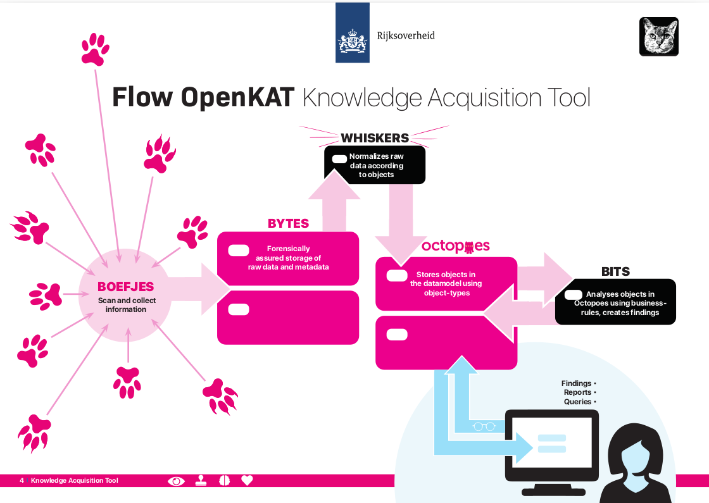
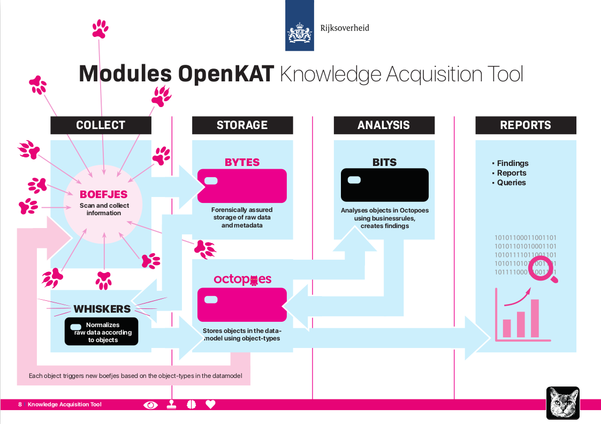

======================
How does OpenKAT work?
======================

General notes
=============

OpenKAT aims to monitor, record and analyze the status of information systems. OpenKAT scans networks, analyzes vulnerabilities and creates accessible reports. It integrates the most widely used network tools and scanning software into a modular framework, accesses external (public) databases such as Shodan and combines the information from all these sources into clear reports.

What OpenKAT adds to the available security and monitoring tools is the ability to combine the output from different sources for the purpose of analysis. Thanks to its object-oriented data model and forensically secured database, OpenKAT contains a complete overview and timeline of monitored systems. This makes the development through time insightful for analysis and provable for audits and controls.

OpenKAT uses a configurable data model. All information is translated into objects, which are stored in the database. This contains both the original information and the objects. Analysis is done on the database based on business rules, noting changes with previous points in time. OpenKAT delivers findings in a dashboard or via reporting software.

Basic concepts
==============

Central to OpenKAT are objects and the data model. Objects (or 'Objects Of Interest, OOI') are created by collecting and analyzing information. The objects found are analyzed using business rules, leading to findings that are included as objects in the data model.

The data model helps in the search for more information, through the logical coherence of objects. Object types are defined in the data model. When an object is found, OpenKAT automatically checks whether related objects are also present. Based on this, it searches for information again, completing the circle.

Objects, the data model and recursivity
***************************************

The information collected by OpenKAT is stored as objects. For example, an object is "an IP address" or "a hostname". If there is a hostname, based on the data model, OpenKAT also expects an IP address and possible open ports.

Depending on the clearance or indemnification given this is then scanned for, which in turn yields more information, which in turn can trigger new scans. This process continues until OpenKAT has searched the entire data model for this hostname. How far OpenKAT goes in searching depends on the clearances.

.. image:: img/flowopenkat.png
  :alt: flow of OpenKAT

The basic installation of OpenKAT includes a data model based on networks and information systems. The system has scanning software to map, analyze and report on networks. The strength of OpenKAT is that it is modular and easy to expand. This can be done based on the existing data model. It can also be extended to other domains, for example in the area of compliance, as long as there is a logical coherence of information.

OpenKAT checks key aspects of configuration, accessibility and presence of vulnerabilities. In addition, the premise is that changes should be noticed: after all, a change is a peculiarity, which can signal a security risk. The temporal database used by OpenKAT also makes it possible to look back, that is, "from when to when" a particular situation occurred.

Indemnification
***************

OpenKAT works with a system of indemnities for scanning, linked to intrusion levels. An organization gives an indemnification for a certain intensity of scan. For each intrusion level, the level is specified, in order to prevent unexpected problems for a production system.

Intrusion levels or indemnities:

:L0: 'do nothing: do not touch and don't gather information about this object'.

:L1: 'retrieve information from public sources, but don't touch the object itself'.

:L2: 'touch at normal user level'.

:L3: 'detectable scanning'.

:L4: 'intensive scanning'.

If scanning with OpenKAT poses a risk then it applies to all actors who have access to this particular system and this would already be worthy of a finding.

Users and organizations
***********************

Scanning and reporting in OpenKAT are different systems with separate users. The red team user issues the command and determines the safeguard, the reporting user has read access and views the results.

:Red team user: Gives the system a certain command and safeguard ('scan this network, with this intrusion level'). Based on this, OpenKAT collects information.

:Reporting user: Has read only access to the objects, can look through time at the performed scans and see what findings the system has created.

System design
=============

The system has four parts: information collection, storage, analysis and reporting.

Collection: Boefjes and Whiskers
********************************

Boefjes collect the information for OpenKAT. They are scripts that can call a tool or collect information themselves. Whiskers are the normalizers that try to filter out objects. These objects fit the data model being used. The scheduler "Mula" deploys boefjes depending on the query, the available clearance (the "intrusion level") and the information found. Thus, a scan leads to new data, which produces findings based on the business rules. This in turn can lead to new deployment of boefjes, who scan additional parts of a system.

Storage: Bytes and Octopoes
***************************

Objects are stored in Octopoes, the database of objects accessible for analysis. Here objects can be viewed in logical context and over time. All original information, along with metadata, is stored separately in Bytes. This can be used to verify the creation of objects and findings.

Bytes stores all original information including the full metadata in timestamped and signed records. This makes the observation by OpenKAT and the process that led to an object and any conclusions reproducible and traceable, which is also called forensic assurance. The metadata also includes, for example, the software version of OpenKAT, of the boefjes and of any external scanning tools, so that it is possible to trace why certain observations were or were not made.

The standard installation of Octopoes includes a data model suitable for information security. This can be supplemented or adapted to the specific situation in which OpenKAT is used. There are already parties involved in the development phase that want to use OpenKAT for checking certain administrative aspects of certification, which fits well with the current application.

Analysis: Bits
**************

The objects in the database can be analyzed using business rules, which are included in Bits. For example, a list of open ports associated with an IP address is fine in one situation, but leads to a finding in another. A finding associated with a particular object is also stored as an object in Octopoes, and can lead to more scans or other actions. Bits, like Boefjes and Whiskers, are modular, customizable and easy to add. A finding based on a business rule can lead to additional scans or actions from OpenKAT.

Reports
*******

Reports can be created in a couple of ways. In the standard installation of OpenKAT, there are a number of options for creating reports: by object and thematically. For example, there are findings reports with all findings based on the business rules such as:

- configurations
- old software
- ports
- missing headers
- SSL problems and certificates
- SPF and mail configuration

OpenKAT can generate reports in a number of formats, including LaTeX and PDF. An API is also available that can interface with other systems.
