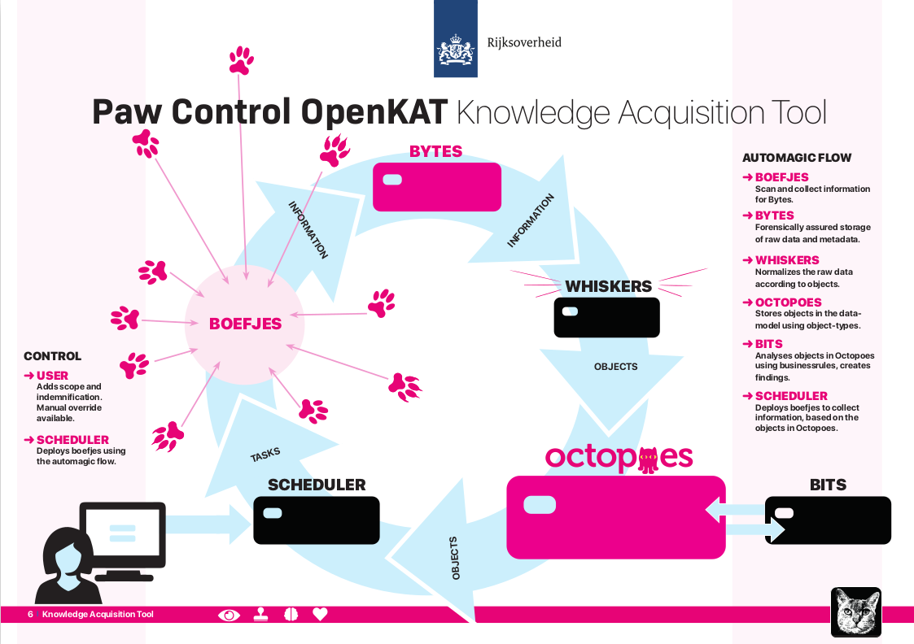

===============
What is OpenKAT
===============

Introduction
============

OpenKAT aims to monitor, record and analyze the status of information systems. OpenKAT scans networks, analyzes vulnerabilities and creates accessible reports. It integrates the most commonly used network tools and scanning software into a modular framework, accesses external databases and combines the information from all these sources into clear reports.

White papers
============

Two brochures or white papers about OpenKAT have been created with a general explanation, both are in Dutch. You can read them without giving your email address :-)

- :download:`the 'TL;DR' of 2 pages (English) <pdf/OpenKAT handout_ENG.pdf>`
- :download:`the extensive brochure on OpenKAT (Dutch) <pdf/introductie OpenKAT V20220621.pdf>`

These, like the section of the documentation you are reading now, are aimed at a general understanding of the system. The documentation for each module goes into more detail about the software itself.

If, when using OpenKAT, your computer gives a purring sound, it is just a sign of a well functioning instance of this software. Just stay away from the nails while playing.

Securityconcept
===============

The premise behind OpenKAT is that most security incidents are caused by known vulnerabilities and configuration errors. Making mistakes is human, so you can't prevent it. Therefore, the goal is to find known vulnerabilities and configuration errors and fix them as quickly as possible. OpenKAT provides the tools for this. The Ministry of Health in the Netherlands made it publicly available under the EU PL 1.2 licence, to be applied as widely as possible.

Who is OpenKAT for?
===================

OpenKAT is built to monitor a larger number of systems, such as the IT systems during the pandemic. Typical users are (network) organizations that want to monitor their systems, like Z-Cert does in healthcare or the Dutch Ministry of Health with the test providers that want to connect to CoronaCheck.

The nicest playground for OpenKAT is a situation where many systems are active. In the user group around OpenKAT we see larger organizations from the non-profit sector, their service providers, hosting providers, auditors and others involved in information security.

Where do I start with OpenKAT?
==============================

The documentation explains how the system works and what the main principles are. This gives an impression, but after reading the documentation, trying it yourself is the best way to find out how OpenKAT works. There are `several options to install OpenKAT <https://docs.openkat.nl/technical_design/index.html>`_.

The easiest way to get to know the system is a local installation. If you don't have a debian or ubuntu machine (yet), try the Gitpod test environment. `The installation chapter <https://docs.openkat.nl/technical_design/index.html>`_ has a comprehensive roadmap for creating a local installation. In addition to the documentation, read `the readme from the general repository <https://github.com/minvws/nl-kat-coordination>`_ (dutch).

Where is the software located?
==============================

OpenKAT consists of separate modules that each perform a specific task. All modules are located in the `NL-KAT-Coordination <https://github.com/minvws/nl-kat-coordination>`_ repository. The :ref:`Modules of OpenKAT<modules>` section of the documentation goes into detail on each of these modules.

Responsible disclosure
======================

OpenKAT scans for vulnerabilities. If you find any, it is valid that you deal with them properly. If you come across a vulnerability in a central government system you can report it to the `NCSC <https://www.ncsc.nl/contact/kwetsbaarheid-melden>`_.

Many organizations have their contact information in ``security.txt`` in the root of their domain, so you get straight to the right people. Not every organization handles it equally professionally, but that's no reason not to want to use that standard yourself.

What are the plans for the future?
==================================

OpenKAT was created during the pandemic. Publishing the source code is one way to give the software built during this period a longer life. With OpenKAT, the Ministry of Health is contributing to the `National Cybersecurity Strategy <https://www.rijksoverheid.nl/actueel/nieuws/2022/10/10/kabinet-presenteert-nieuwe-cybersecuritystrategie>`_ (dutch) and supports the continued development of the system.

Since the source code was published, 'OpenKAT days' have been organized regularly, the community around OpenKAT has grown, and developers from various other organizations are working on modules for the system. It is the first government project to be developed in this way. If you also want to help, contact the team at meedoen@openkat.nl.

The long-term goal is for OpenKAT to play a permanent role in information security in healthcare and in the Netherlands as a whole. The system itself provides a good basis for this and its modular structure makes it easily adaptable to a specific context. Thanks to the EU PL 1.2 license, such contributions will be made available to all users as much as possible.
