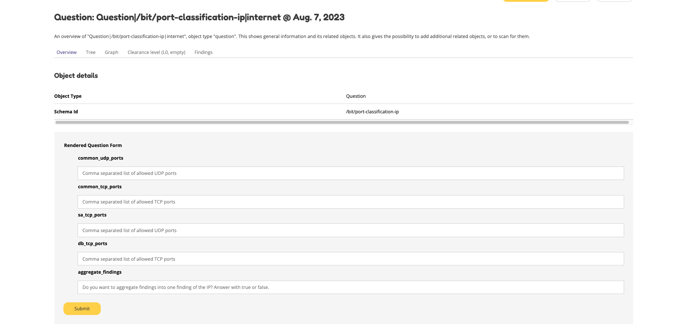

===============================================
Plugins for OpenKAT: boefjes, whiskers and bits
===============================================

OpenKAT is modular and can be easily extended. This guide provides a first step for the development of new plugins:

- boefjes that scan

- whiskers that collect objects

- bits that contain businessrules

OpenKAT comes with a KATalog of boefjes, which can be viewed through the front end of the system. The premise is that all information is processed and stored in the smallest unit, ensuring the modular nature of OpenKAT.

OpenKAT can access multiple KATalogs, so it is possible to create your own overview of boefjes in addition to the official KATalog. This is of interest to organizations that use boefjes for specific purposes or with software that has a different licensing model.

This guide explains how the plugins work and how they are created, and gives an overview of which plugins already exist. It also explains the configuration options available.

What types of plugins are available?
====================================

There are three types of plugins: deployed by OpenKAT to collect information, translate information into objects for the data model and then analyze this information. Boefjes gather facts, Whiskers structure the information for the data model and Bits determine what you want to think about it; they are the business rules. Each action is cut into the smallest possible pieces.

- Boefjes gather factual information, such as by calling an external scanning tool like nmap or using a database like Shodan.

- Whiskers analyze the information and turn it into objects for the data model in Octopoes.

- Bits contain the business rules that do the analysis on the objects.

Boefjes and Whiskers are linked together through the mime-type that the boefje passes along to the information. For each mime-type, multiple Boefjes and Whiskers are possible, each with its own specialization. Thus, the data from a boefje can be delivered to multiple whiskers to extract a different object each time. Bits are linked to objects and assess the objects in the data model. Some bits are configurable with a specific configuration stored in the graph.

How does it work?
=================

A hostname given as an object to OpenKAT, for example, is used as input to a search by the matching boefjes. Based on the data model, logically related objects are searched to get a complete picture.

Thus, OpenKAT is like a snowball rolling through the network based on the data model. The logical connections between objects point the way, and OpenKAT keeps looking for new boefjes until the model is complete.

The new objects in the data model are evaluated by Bits, the business rules. This produces findings, which are added as objects. For example, the hostname includes a DNS configuration, which must meet certain requirements. If it goes outside the established parameters it leads to a finding.

Where to start?
===============

The first question is what information you need. If you know this, there are a number of options, which determine what is best to do:

- the information is already present in the data model -> create a businessrule (bit)
- the information is present in the output of an existing boefje -> create a normalizer (whiskers)
- the information is not yet available -> create a boefje, modify the data model and create a normalizer

If you want to add factual information, use a boefje. Want to add an opinion or analysis, use a bit.

OpenKAT assumes that you collect and process all information in the smallest possible units so that they can contribute back to other combinations and results. This is how you maintain the modular nature of the package.

To make a finding about a CVE to a software version, you need multiple objects: the finding of the software, the version, the CVE. That combination then leads to the object of the finding.

Existing boefjes
================

The existing boefjes can be viewed via the KATalog in OpenKAT and are on `GitHUB in the boefjes repository. <https://github.com/minvws/nl-kat-boefjes/tree/main/boefjes>`_

Object-types, classes and objects.
----------------------------------

When we talk about object-types, we mean things like IPAddressV4. These have corresponding python classes that are all derived from the OOI base class. These classes are defined in the Octopoes models directory.

They are used everywhere, both in code and as strings in json definition files.

When we talk about objects, we usually mean instance of such a class, or a 'record' in the database.

Example: the boefje for shodan
------------------------------

The boefje calling shodan gives a good first impression of its capabilities. The boefje includes the following files.

- __init.py__, which remains empty
- boefje.json, containing the normalizers and object-types in the data model
- cover.jpg, with a matching cat picture for the KATalog
- description.md, simple documentation of the boefje
- main.py, the actual boefje
- normalize.py, the normalizer (whiskers)
- normalizer.json, which accepts and supplies the normalizer
- requirements.txt, with the requirements for this boefje
- schema.json, settings for the web interface

boefje.json
***********

boefje.json is the definition of the boefje, with its position in the data model, the associated normalizer, the object-types and the findings that the combination of boefje and normalizer can deliver.

An example:

.. code-block:: json

    {
        "id": "shodan",
        "name": "Shodan",
        "description": "Use Shodan to find open ports with vulnerabilities that are found on that port",
        "consumes": [
            "IPAddressV4",
            "IPAddressV6"
        ],
        "environment_keys": ["SHODAN_API"],
        "scan_level": 1
    }

The object-types associated with this boefje are *IPAddressV4, IPAddressV6*.

This boefje consumes IP addresses and produces findings about the open ports, supplemented by the information about these ports.

Using the template as a base, you can create a boefje.json for your own boefje. Just change the *name* and *id* to the name your boefje.

NOTE: If your boefje needs object-types that do not exist, you will need to create those. This will be described later in the document.

The boefje also uses variables from the web interface, like the Shodan the API key. There are more possibilities, you can be creative with this and let the end user bring settings from the web interface. Use *environment_keys* for this. The schema.json file defines the metadata for these fields.

schema.json
***********

To allow the user to add information through the web interface, add the schema.json file to the folder where your boefje is located. This json is used as the basis for a form for the user. In this case, it can contain an API key, but it can also be something else that your boefje responds to. This Schema must conform to the https://json-schema.org/ standard.

Currently, however, OpenKAT only understands fairly shallow structures. For example, not all field types are supported, nor does OpenKAT understand references. You can test whether your Schema is neatly understood by checking the settings form in Rocky's KAT catalog for your boefje.

In case your boefje uses sensitive secrets, such as API keys, make sure to add them to the secret section. This will ensure they are hidden in the Katalogus from regular users.

.. code-block:: json

 {
  "title": "Arguments",
  "type": "object",
  "properties": {
    "SHODAN_API": {
      "title": "SHODAN_API",
      "maxLength": 128,
      "type": "string",
      "description": "A Shodan API key (see https://developer.shodan.io/api/requirements)."
    }
  },
  "required": [
    "SHODAN_API"
  ],
  "secret": [
    "SHODAN_API"
  ]
 }

main.py
*******

The boefje itself imports the shodan api module, assigns an IP address to it and accepts the output. This output goes to Bytes and is analyzed by one (or more) normalizers. The link between the normalizer and the byte is made via the mime-type, which you can give in the ``set`` function in the byte. The code block below also contains a check, to prevent you from asking for non-public IP addresses.

.. code-block:: python

	import json
	import logging
	from typing import Tuple, Union, List

	import shodan

	from os import getenv
	from ipaddress import ip_address

	from boefjes.job_models import BoefjeMeta

	def run(boefje_meta: BoefjeMeta) -> List[Tuple[set, Union[bytes, str]]]:
	    api = shodan.Shodan(getenv("SHODAN_API"))
	    input_ = boefje_meta.arguments["input"]
	    ip = input_["address"]
	    results = {}

	    if ip_address(ip).is_private:
	        logging.info("Private IP requested, I will not forward this to Shodan.")
	    else:
	        try:
	            results = api.host(ip)
	        except shodan.APIError as e:
	            if e.args[0] != "No information available for that IP.":
	                raise
	            logging.info(e)

	    return [(set(), json.dumps(results))]

Normalizers
-----------

The normalizer imports the raw information, extracts the objects from it and gives them to Octopoes. Since OpenKAT 1.3.0, the normalizers are fully self-contained. They consist of the following files:

- __init__.py
- normalize.py
- normalizer.json

normalizer.json
***************

The normalizers translate the output of a boefje into objects that fit the data model. Each normalizer defines what input it accepts and what object-types it provides. In the case of the shodan normalizer, it involves the entire output of the shodan boefje (created based on IP address), where findings and ports come out. The normalizer.json defines these:

.. code-block:: json

	{
	    "id": "kat_shodan_normalize",
	    "consumes": [
	        "boefje/shodan"
	    ],
	    "produces": [
	        "Finding",
	        "IPPort",
	        "CVEFindingType"
	    ]
	}

normalize.py
************

The file normalize.py contains the actual normalizer: Its only job is to parse raw data and create, fill and yield the actual objects (of valid object-types that are subclassed from OOI like IPPort).

.. code-block:: python

	import json
	import logging
	from typing import Iterable, Union
	
	from boefjes.job_models import NormalizerMeta
	from octopoes.models import OOI, Reference
	from octopoes.models.ooi.findings import CVEFindingType, Finding
	from octopoes.models.ooi.network import IPPort, PortState, Protocol
	
	
	def run(normalizer_meta: NormalizerMeta, raw: Union[bytes, str]) -> Iterable[OOI]:
	    results = json.loads(raw)
	    ooi = Reference.from_str(normalizer_meta.raw_data.boefje_meta.input_ooi)
	
	    if not results:
	        logging.info("No Shodan results available for normalization.")
	    elif "data" not in results:
	        logging.warning("Shodan results exist without data.")
	    else:
	        for scan in results["data"]:
	            port_nr = scan["port"]
	            transport = scan["transport"]
	
	            ip_port = IPPort(
	                address=ooi,
	                protocol=Protocol(transport),
	                port=int(port_nr),
	                state=PortState("open"),
	            )
	            yield ip_port
	
	            if "vulns" in scan:
	                for cve, _ in scan["vulns"].items():
	                    ft = CVEFindingType(id=cve)
	                    f = Finding(finding_type=ft.reference, ooi=ip_port.reference)
	                    yield ft
	                    yield f

Adding object-types
===================

If you want to add an object-type, you need to know with which other object-types there is a logical relationship. An object-type is as simple as possible. As a result, a seemingly simple query sometimes explodes into a whole tree of objects.

Adding object-types to the data model requires an addition in Octopoes. Here, an object-type can be added if it is connected to other object-types. Visually this is well understood using the `Graph explorer <https://mispo.es/model-explorer/model-explorer.html>`_. The actual code is `in the Octopoes repo <https://github.com/minvws/nl-kat-octopoes/tree/main/octopoes/models/ooi>`_.

As with the boefje for shodan, here we again use the example from the functional documentation. A description of an object-type in the data model, in this case an IPPort, looks like this:

.. code-block:: python

	class IPPort(OOI):
	    object_type: Literal["IPPort"] = "IPPort"
	
	    address: Reference = ReferenceField(IPAddress, max_issue_scan_level=0, max_inherit_scan_level=4)
	    protocol: Protocol
	    port: Annotated[int, Field(gt=0, lt=2**16)]
	    state: Optional[PortState] = None
	
	    _natural_key_attrs = ["address", "protocol", "port"]
	    _reverse_relation_names = {"address": "ports"}
	    _information_value = ["protocol", "port"]
	
	    @classmethod
	    def format_reference_human_readable(cls, reference: Reference):
	        tokenized = reference.tokenized
	        return f"{tokenized.address.address}:{tokenized.port}/{tokenized.protocol}"

Here it is defined that to an IPPort belongs an IPadress, a Protocol and a PortState. It also specifies how scan levels flow through this object-type and specifies the attributes that format the primary/natural key: "_natural_key_attrs = ["address", "protocol", "port"]". More explanation about scan levels / indemnities follows later in this document.

The PortState is defined separately. This can be done for information that has a very specific nature so you can describe it.

.. code-block:: python

 class PortState(Enum):
    OPEN = "open"
    CLOSED = "closed"
    FILTERED = "filtered"
    UNFILTERED = "unfiltered"
    OPEN_FILTERED = "open|filtered"
    CLOSED_FILTERED = "closed|filtered"

Bits: businessrules
===================

Bits are businessrules that assess objects within Octopoes. Which ports are allowed to be open, which are not, which software version is acceptable, which is not. Does a system as a whole meet a set of requirements associated with a particular certification or not? Some bits are configurable through a specific 'question object', which is explained below.

In the hostname example, that provides an IP address, and based on the IP address, we look at which ports are open. These include some ports that should be open because certain software is running and some ports that should be closed because they are not used from a security or configuration standpoint.

The example below comes from the functional documentation and discusses the Bit for the IPPort object. The bit used for the analysis of open ports consists of three files:

- __init.py__, an empty file
- bit.py, which defines the structure
- port_classification.py, which contains the business rules

Bit.py gives the structure of the bit, containing the input and the businessrules against which it is tested. An example is included below. The bit consumes input objects of type IPPort:

.. code-block:: python

	from bits.definitions import BitDefinition, BitParameterDefinition
	from octopoes.models.ooi.network import IPAddress, IPPort
	
	BIT = BitDefinition(
	    id="port-classification-ip",
	    consumes=IPAddress,
	    parameters=[
	        BitParameterDefinition(ooi_type=IPPort, relation_path="address"),
	    ],
	    module="bits.port_classification_ip.port_classification_ip",
	    config_ooi_relation_path="IPAddress.network",
	)

The businessrules are contained in the module *port_classification*, in the file *port_classification.py*. This bit grabs the IPPort object and supplies the KATFindingType and Finding objects. The businessrules in this case distinguish three types of ports: the COMMON_TCP_PORTS that may be open, SA_PORTS that are for management purposes and should be closed, and DB_PORTS that indicate the presence of certain databases and should be closed. The port classification is configurable. Aggregate findings will make sure that all findings of the same type will be shown into one finding. 

The specification for a bit is broad, but limited by the data model: Whereas Boefjes are actively gathering information externally, bits only look at the existing objects they receive from Octopus. Analysis of the information can then be used to create new objects, such as the KATFindingTypes which in turn correspond to a set of specific reports in OpenKAT.

.. code-block:: python

	 from typing import List, Iterator
	
	 from octopoes.models import OOI
	 from octopoes.models.ooi.findings import KATFindingType, Finding
	 from octopoes.models.ooi.network import IPPort
	
	 COMMON_TCP_PORTS = [25, 53, 110, 143, 993, 995, 80, 443]
	 SA_PORTS = [21, 22, 23, 3389, 5900]
	 DB_PORTS = [1433, 1434, 3050, 3306, 5432]
	
	
	def get_ports_from_config(config, config_key, default):
	    ports = config.get(config_key, None)
	    if ports is None:
	        return default
	    return list(map(int, ports.split(","))) if ports else []
	
	
	def run(input_ooi: IPPort, additional_oois: List, config: Dict[str, str]) -> Iterator[OOI]:
	    aggregate_findings = config.get("aggregate_findings", "False").lower() == "true" if config else False
	    open_ports = []
	
	    common_tcp_ports = get_ports_from_config(config, "common_tcp_ports", COMMON_TCP_PORTS)
	    common_udp_ports = get_ports_from_config(config, "common_udp_ports", COMMON_UDP_PORTS)
	    sa_tcp_ports = get_ports_from_config(config, "sa_tcp_ports", SA_TCP_PORTS)
	    db_tcp_ports = get_ports_from_config(config, "db_tcp_ports", DB_TCP_PORTS)
	
	    for ip_port in additional_oois:
	        port = ip_port.port
	        protocol = ip_port.protocol
	        if protocol == Protocol.TCP and port in sa_tcp_ports:
	            open_sa_port = KATFindingType(id="KAT-OPEN-SYSADMIN-PORT")
	            if aggregate_findings:
	                open_ports.append(ip_port.port)
	            else:
	                yield open_sa_port
	                yield Finding(
	                    finding_type=open_sa_port.reference,
	                    ooi=ip_port.reference,
	                    description=f"Port {port}/{protocol.value} is a system administrator port and should not be open.",
	                )
	        elif protocol == Protocol.TCP and port in db_tcp_ports:
	            ft = KATFindingType(id="KAT-OPEN-DATABASE-PORT")
	            if aggregate_findings:
	                open_ports.append(ip_port.port)
	            else:
	                yield ft
	                yield Finding(
	                    finding_type=ft.reference,
	                    ooi=ip_port.reference,
	                    description=f"Port {port}/{protocol.value} is a database port and should not be open.",
	                )
	        elif (protocol == Protocol.TCP and port not in common_tcp_ports) or (
	            protocol == Protocol.UDP and port not in common_udp_ports
	        ):
	            kat = KATFindingType(id="KAT-UNCOMMON-OPEN-PORT")
	            if aggregate_findings:
	                open_ports.append(ip_port.port)
	            else:
	                yield kat
	                yield Finding(
	                    finding_type=kat.reference,
	                    ooi=ip_port.reference,
	                    description=f"Port {port}/{protocol.value} is not a common port and should possibly not be open.",
	                )
	    if aggregate_findings and open_ports:
	        ft = KATFindingType(
	            id="KAT-UNCOMMON-OPEN-PORT",
	        )
	        yield ft
	        yield Finding(
	            finding_type=ft.reference,
	            ooi=input_ooi.reference,
	            description=f"Ports {', '.join([str(port) for port in open_ports])} are not common ports and should "
	            f"possibly not be open.",
	        )

Bits can recognize patterns and derive new objects from them.

For example: The bit for *internet.nl* can thus deduce from a series of objects whether a particular site meets the requirements of internet.nl or not. This bit retrieves findings from a series of items and draws conclusions based on them. The analysis underlying this is built up from small steps, which go around OpenKAT several times before enough information is available to draw the right conclusions:

.. code-block:: python

	from bits.definitions import BitDefinition, BitParameterDefinition
	from octopoes.models.ooi.dns.zone import Hostname
	from octopoes.models.ooi.findings import Finding
	from octopoes.models.ooi.web import Website
	
	BIT = BitDefinition(
	    id="internet-nl",
	    consumes=Hostname,
	    parameters=[
	        BitParameterDefinition(ooi_type=Finding, relation_path="ooi [is Hostname]"),  # findings on hostnames
	        BitParameterDefinition(
	            ooi_type=Finding, relation_path="ooi [is HTTPResource].website.hostname"
	        ),  # findings on resources
	        BitParameterDefinition(
	            ooi_type=Finding, relation_path="ooi [is HTTPHeader].resource.website.hostname"
	        ),  # findings on headers
	        BitParameterDefinition(ooi_type=Finding, relation_path="ooi [is Website].hostname"),  # findings on websites
	        BitParameterDefinition(
	            ooi_type=Finding, relation_path="ooi [is HostnameHTTPURL].netloc"
	        ),  # findings on weburls
	        BitParameterDefinition(ooi_type=Website, relation_path="hostname"),  # only websites have to comply
	    ],
	    module="bits.internetnl.internetnl",
	)

Configurable bits
=================

As policy differs per organization or situation, certain bits can be configured through the webinterface of OpenKAT. Currently the interface is quite rough, but it provides the framework for future development in this direction.

Question object
---------------

Configurable bits require a place where the configuration is stored. It needs to be tracable, as the configuration is important when judging the results of a scan. The solution is to store the config in the graph.

When a relevant object is created, a configurable bit throws a question object at the user. This question can be answered with a json file or through the webinterface. The configuration of the bit is then stored as an object in the graph.

My first question object
------------------------

Under 'Objects', create a network object called 'internet'. Automagically a question object will be created. You will be able to find it in the objects list. If you already have a lot of objects, filter it using the 'question' objecttype.

The question object allows you to customize the relevant parameters. At the time of writing, the only configurable bit is IPport. This allows you to change the allowed ports on a host.

Open the question object, answer the questions and store the policy of your organization. Besides the allowed and not allowed ports, this bit also has the option to aggregate findings directly.

The IPport question object has five fields:

Allowed:

- common udp ports
- common tcp ports

Not allowed:

- sa ports (sysadmin)
- db ports (database)

Findings:

- aggregate findings

After adding the relevant information, your question object will be stored and applied directly. It can be changed or added through the webinterface.

What happens in the background?
-------------------------------

The question object is more than just a tool to allow or disallow ports, it is the framework for future development on configurations. A configurable ruleset is a basic requirement for a system like OpenKAT and we expect it to evolve.

The dataflow of the question object works as per this diagram:

.. mermaid::

   sequenceDiagram
      participant User
      participant Rocky
      participant Normalizer
      participant Octopoes
      participant Bits
      participant Bytes

    Normalizer->>Octopoes: Add Network
    Bits->>Octopoes: Add Question["What ports may be open for this Network?"]
    Rocky->>Octopoes: Get Question
    Rocky->>User: Prompt Question to user
    User->>Rocky: Give answer (form)
    Rocky->>Bytes: Add answer (json) to Bytes
    Bytes->>Normalizer: Read answer
    Normalizer->>Octopoes: Create Config
    Bits->>Octopoes: Read Config

After the relevant object has been created, within the normal flow of OpenKAT a question object will be created. The advantage of this is to store all relevant data in the graph itself, which allows for future development.

Advantages and outlook
----------------------

Storing the configs in the graph is a bit more complex than just using a config file which can be edited and reloaded at will. The advantage of storing the configuration in the graph is that it allows the user to see from when to when a certain configuration was used within OpenKAT.

In the future, one goal is to have 'profiles' with a specific configuration that can be deployed automagically. Another wish is to add scope to these question objects, relating them to specific objects or for instance network segments.

Add Boefjes
===========

There are a number of ways to add your new boefje to OpenKAT.

- Put your boefje in the local folder with the other boefjes
- Do a commit of your code, after review it can be included
- Add an image server in the KAT catalog config file ``*``

``*`` If you want to add an image server, join the ongoing project to standardize and describe it. The idea is to add an image server in the KAT catalog config file that has artifacts from your boefjes and normalizers as outputted by the Github CI.
