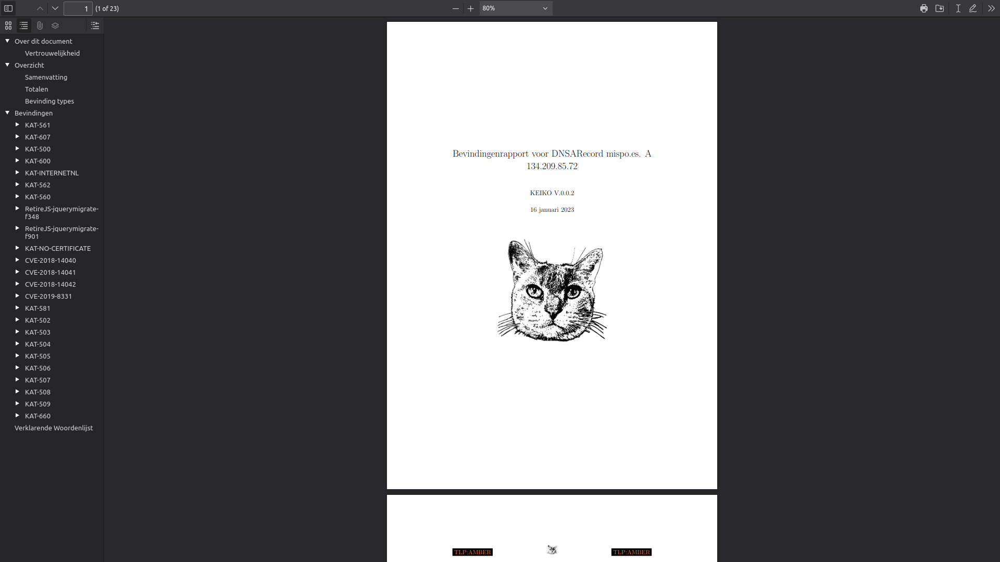

==========
User Guide
==========

This manual covers the day-to-day use of OpenKAT via the web interface. The concepts behind OpenKAT are explained in the "How does OpenKAT work" section. When using OpenKAT for the first time, the on-boarding flow is available, see the section in this chapter.

Web interface
=============

The user interface of OpenKAT consists of five screens, which provide access to the information and main functions of the system:

- Crisis Room (main)
- KAT catalog
- Findings
- Objects
- Tasks

Crisis Room
-----------

The Crisis Room provides the overview of all findings, which can be viewed for different times. The time of day can be selected with the option button after which the findings that were applicable at that time become visible.

.. image:: img/crisisroom.png
  :alt: crisisroom

KAT catalog
-----------

The KAT catalog contains all the tools that this instance of KAT has access to, all the boefjes and normalizers. Click on a boefje for more information, such as the objects it can search for.

Boefjes can be deployed automatically or manually. New boefjes can be added by the administrator, either locally or by adding an external KAT catalog in Rocky's config file.

Automatic deployment of boefjes depends on the safeguard level, which can be set for each object. If no safeguard is set, it can be derived from a logically connected object for which it is.

Each boefje has an info page with information about the tools used, the associated objects and the safeguard level required to use the boefje.

.. image:: img/boefjeinfopage.png
  :alt: Findings

Findings
--------

The findings made by KAT can be seen on the Findings page. Use the filters to select the findings. Click on the finding for more information or to generate a report on this finding.

.. image:: img/findings.png
  :alt: Findings

A finding is also an object in the data model, and can also be found on the objects page.

Objects
-------

The Objects page lists all the objects in Octopus. For each object there is information about:

- properties
- relationship with other objects
- findings
- level of safeguarding

The objects page is a practical page to find information about a host or system. The objects can be filtered and a report per object can be easily created and exported.

.. image:: img/findingsreportperobject.png
  :alt: findings per object

The object detail page provides more information about a specific object, such as the number of findings for this object. More information can be requested per finding:

.. image:: img/findingdetail.png
  :alt: finding detail

Tasks
-----

The scans of KAT can be found on the Tasks page as tasks. A task is created per boefje and per normalizer, with a status. Per task, the object is displayed and the json with metadata can be downloaded. This includes the hash of the scan performed.

.. image:: img/boefjes.png
  :alt: tasks

Users and organizations
=======================

OpenKAT has administrators, users and organizations.

Organizations
-------------

Organizations own the systems for which KAT is deployed. From KAT, multiple organizations can be monitored simultaneously, each with its own settings. The 1.4rc2 includes additional options for creating new organizations via an API. Please contact meedoen@openkat.nl if you would like to help test and develop this.

Users
-----

The administrator is responsible for the system. Besides the administrator two usertypes have been defined: the red team user who can launch new scans and the regular user who has read access and can request reports.

User management
---------------

Users and organizations can be created in the on boarding flow, in the Web interface or automated. The administrator of the system can create organizations and do user management. The administrator of an organization in turn can create users within the organization. The django interface provides additional capabilities for user management via the command line, for use in an automated deployment and linkage to external user management.

OpenKAT Objects
===============

Adding an initial object with an appropriate safeguard puts OpenKAT to work. This can be done in on-boarding, but objects can also be added individually or as CSV files.

Properties
----------

Objects can be viewed via the 'Objects' page in OpenKAT's main menu. Here are the already created objects with the type and safeguard level for each object. Objects can be added, scanned, filtered and there is an export option.

New objects can be created via the 'add' option. This can be done individually or per CSV. The specification of the CSV is included on the page where it can be provided.

Start scan
----------

Based on the object and the clearance, OpenKAT provides an overview of available boefjes. All users can perform a manual scan appropriate to the given safeguard level. The manual scan is accelerated by the scheduler. The results appear as findings with the object.

View Findings
-------------

Findings appear on the general findings page, but can also be viewed by object.

Scan levels and indemnities
===========================

Boefjes can collect information with varying intensity. OpenKAT has a system of safeguards to control permission to perform scans and prevent damage to the systems under test.

For each object, the 'indemnification level' menu indicates how deeply scanning is allowed. Here the user gives an agreement on the risks of the scans and permission to store the information gathered on these systems.

The levels used range from level 0 to level 4, from 'do not scan' to 'very intrusive'. Scanning levels are distributed in the data model, either by inheritance or by user statements. The different levels are qualitative in nature. L1 'do not touch' is obvious, but the difference between L2 'normal user' and L3 'detectable scanning' is at the discretion of the developer and administrator. The use of NMAP, for example, falls in between and depends heavily on the arguments the tool brings.

.. list-table:: Scan levels
   :widths: 25 50
   :header-rows: 1

   * - Level
     - Description
   * - L0
     - do not scan
   * - L1
     - do not touch
   * - L2
     - normal user
   * - L3
     - detectable scan
   * - L4
     - intensive scan

Indemification by user
----------------------

The user's statement counts as an indemnification for scanning a particular object. This obtains permission to scan and store the information. The statement is given at the start of a new scan or specifically for certain objects.

Inheritance
-----------

Objects are linked to other objects in the data model. Underlying objects receive the same safeguard level, parent objects a lower level. For example, a hostname has an ip address for which the same safeguard level applies, but it also has a DNS server that may be outside the organization's domain and receives a lower level.

Extended profiles
-----------------

L0: Do not scan
***************

The user can explicitly indicate that certain systems should not be scanned. For example, because he is not the owner of these.

L1: Do not touch
****************

OpenSource and passive data collection. For this profile, objects are viewed through various freely available data and sources via the Internet. These can be sources that do not have explicit permission (e.g. LinkedIn, DNS, leaked password databases). The goal here is to detect public information that could be a risk to the client: information that could be misused by an attacker in a targeted attack.

Examples of sources/tools used:

- Shodan (via API)
- HaveIbeenPnwed
- DNS

L2: Touching at the normal user level
*************************************

Targeted scans, limited intrusive. Scan will be dosed and skip known sensitive scans. The scanned target usually continues to function without problems.

Example of scanning tools useful for this purpose:

- Nmap
- Nikto
- Burp passive scanner

L3: Detectable scan
*******************

This scan will be more intrusive: connect to services to find out versions, try to log in with commonly used (default) login credentials, automated testing of found vulnerabilities whether they are vulnerable, more intensive guessing of urls and more intensive crawling of web pages.

A greater number of scans will be performed, resulting in a spike in data traffic. The infrastructure may not be designed for this.

Example of useful scanning tools and methods:

- Nessus, Nexpose, Acunetix
- Burp Intruder, active scanner

L4: Intensive scan
******************

The premise of the test profile is to verify whether an attacker can exploit vulnerabilities to give himself more extensive access to the tested environment. Thus, known exploit code is applied in this level.

Reports
=======

OpenKAT displays all findings in the crisis room, the entry point for all current information from the system. In addition, OpenKAT can create thematic reports and display findings per object. The reports are available in the front end and as PDF, based on a LaTeX parser. The organization's house style can also be incorporated. It is also possible to link to other reporting and alerting systems.

My first scan
=============

If you are using OpenKAT for the first time you can use the on-boarding flow. The on-boarding flow helps you through the full cycle of OpenKAT. After following this flow, you will have a functioning OpenKAT installation running a first set of scans. By adding more objects, releasing and selecting boefjes, you can find out more information and perform analysis.

The on-boarding flow uses the following steps to get you going:

- Create admin account with 2FA

The administrator account in the front end uses a login, password and two-factor authentication with one-time passwords. The code for creating the one time passwords is available as a string and as a QR code.

- Organization creation

The organization is the entity that "owns" the systems to be scanned and on whose behalf the user can provide an indemnification. From an OpenKAT installation, multiple organizations can be scanned, each with its own settings and its own objects. Organizations can be created automatically from release 1.5 on the basis of an API, which is relevant for larger systems.

- User creation

Users in OpenKAT are the red team and the read-only user.

- Choosing a report ("what question do you ask OpenKAT?")

OpenKAT starts with a question, for example about the situation around the DNS configuration of a particular domain. For this, choose the relevant report.

- Creating an object ('what should OpenKAT look at first?')

Add the objects that OpenKAT can take as a starting point for the scan, for example a hostname.

- Specify clearance level ('how intensive should OpenKAT search?')

Specify the intensity of the scan: how intensely may OpenKAT scan? The heavier, the greater the impact on the system being scanned.

- Select boefjes and have OpenKAT scan them

Based on the report, object and safeguard, select the relevant boefjes for your first scan and run the scan.

- View results: in the web interface or as a PDF report

The scan is an ongoing process, looking for information based on derivation and logical connections in the data model. The results of the scan appear over time, any findings can be viewed by object, at Findings and in the Crisis Room. In each context, reports can also be generated.
