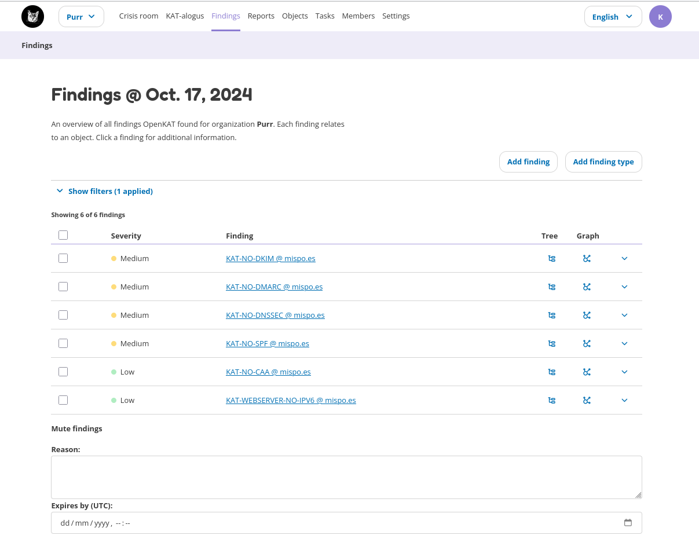
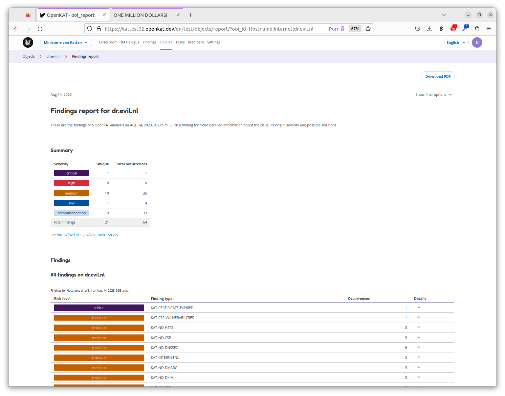
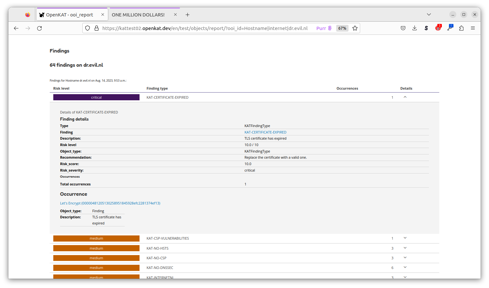
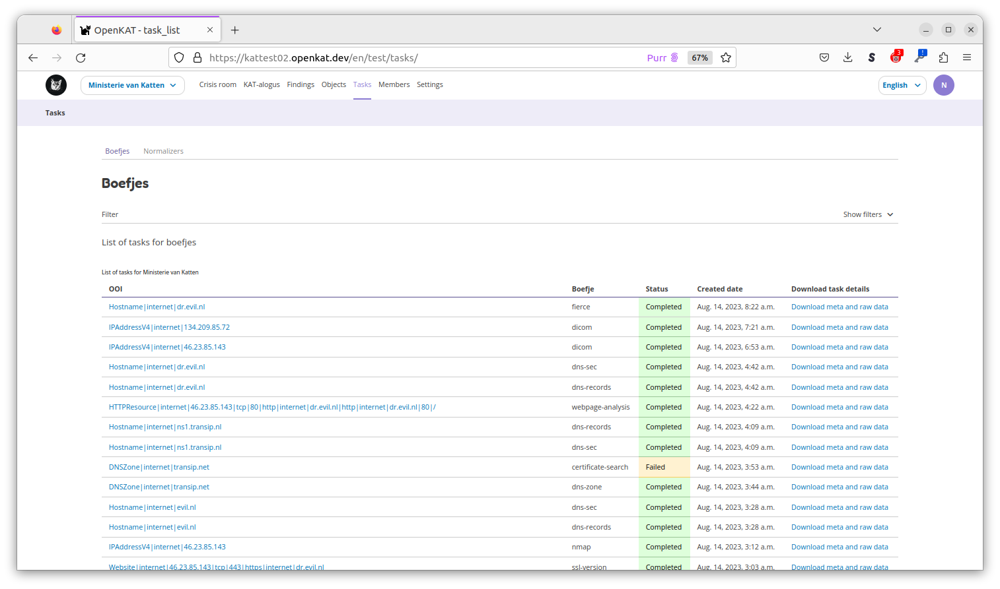

==========
User Guide
==========

This manual covers the day-to-day use of OpenKAT via the web interface. The concepts behind OpenKAT are explained in the "How does OpenKAT work" section. When using OpenKAT for the first time, the on-boarding flow is available, see the section in this chapter.

Web interface
=============

The user interface of OpenKAT consists of five screens, which provide access to the information and main functions of the system:

- Crisis Room (main)
- KAT catalog
- Findings
- Objects
- Tasks

Crisis Room
-----------

The Crisis Room provides the overview of all findings, which can be viewed for different times. The time of day can be selected with the option button after which the findings that were applicable at that time become visible.

.. image:: img/crisisroom.png
  :alt: crisisroom

KAT catalog
-----------

The KAT catalog contains all the tools that this instance of KAT has access to, all the boefjes and normalizers. Click on a boefje for more information, such as the objects it can search for.

Boefjes can be deployed automatically or manually. New boefjes can be added by the administrator, either locally or by adding an external KAT catalog in Rocky's config file.

Automatic deployment of boefjes depends on the safeguard level, which can be set for each object. If no safeguard is set, it can be derived from a logically connected object for which it is.

.. image:: img/katalogus.png
  :alt: KAT catalog

Each boefje has an info page with information about the tools used, the associated objects and the safeguard level required to use the boefje.

.. image:: img/boefjeinfopage.png
  :alt: Findings

Findings
--------

The findings made by KAT can be seen on the Findings page. Use the filters to select the findings. Click on the finding for more information or to generate a report on this finding.

A finding is also an object in the data model, and can also be found on the objects page.

Objects
-------

The Objects page lists all the objects in Octopus. For each object there is information about:

- properties
- relationship with other objects
- findings
- level of safeguarding

The objects page is a practical page to find information about a host or system. The objects can be filtered and a report per object can be easily created and exported.

The object detail page provides more information about a specific object, such as the number of findings for this object. More information can be requested per finding:

Tasks
-----

The scans of KAT can be found on the Tasks page as tasks. A task is created per boefje and per normalizer, with a status. Per task, the object is displayed and the json with metadata can be downloaded. This includes the hash of the scan performed.

Users and organizations
=======================

OpenKAT has administrators, users and organizations.

Organizations
-------------

Organizations own the systems for which KAT is deployed. From KAT, multiple organizations can be monitored simultaneously, each with its own settings. The 1.4rc2 includes additional options for creating new organizations via an API. Please contact meedoen@openkat.nl if you would like to help test and develop this.

Users
-----

OpenKAT knows four types of users: the client, the red team user, the admin and the superuser. In OpenKAT, permissions utilise a stacked model. This means that a higher permission level includes all lower permissions of the lower levels. The client is a 'read only' type of user, the red teamer is a researcher who can start scans. The admin is an administrative user who can do user management etc, the superuser can do all.

Rights and functions per user type
----------------------------------

+-----------------------------------------------------------------------------------------------------+------+----------+-------+-----------+
| Action                                                                                              | USER | RED TEAM | ADMIN | SUPERUSER |
+=====================================================================================================+======+==========+=======+===========+
| Login                                                                                               | x    | x        | x     | x         |
+-----------------------------------------------------------------------------------------------------+------+----------+-------+-----------+
| Can start scans on objects with enough clearance                                                    | x    | x        | x     | x         |
+-----------------------------------------------------------------------------------------------------+------+----------+-------+-----------+
| Can view reports                                                                                    | x    | x        | x     | x         |
+-----------------------------------------------------------------------------------------------------+------+----------+-------+-----------+
| Can start scans on objects with not enough clearance, but the user has enough clearance             |      | x        | x     | x         |
+-----------------------------------------------------------------------------------------------------+------+----------+-------+-----------+
| Can edit settings of scan tools                                                                     |      | x        | x     | x         |
+-----------------------------------------------------------------------------------------------------+------+----------+-------+-----------+
| Can enable/disable scan tools                                                                       |      | x        | x     | x         |
+-----------------------------------------------------------------------------------------------------+------+----------+-------+-----------+
| Can add objects                                                                                     |      | x        | x     | x         |
+-----------------------------------------------------------------------------------------------------+------+----------+-------+-----------+
| Can give clearance to objects up to it’s own clearance level                                        |      | x        | x     | x         |
+-----------------------------------------------------------------------------------------------------+------+----------+-------+-----------+
| Can give clearance to users                                                                         |      |          | x     | x         |
+-----------------------------------------------------------------------------------------------------+------+----------+-------+-----------+
| Can manage organisation members                                                                     |      |          | x     | x         |
+-----------------------------------------------------------------------------------------------------+------+----------+-------+-----------+
| Can create new account(s) in OpenKAT                                                                |      |          | x     | x         |
+-----------------------------------------------------------------------------------------------------+------+----------+-------+-----------+
| Can create new and add, or add existing accounts, to the organisation                               |      |          | x     | x         |
+-----------------------------------------------------------------------------------------------------+------+----------+-------+-----------+
| Can view users of an organisation                                                                   |      |          | x     | x         |
+-----------------------------------------------------------------------------------------------------+------+----------+-------+-----------+
| Can edit users of an organisation                                                                   |      |          | x     | x         |
+-----------------------------------------------------------------------------------------------------+------+----------+-------+-----------+
| Can view organisation details                                                                       |      |          | x     | x         |
+-----------------------------------------------------------------------------------------------------+------+----------+-------+-----------+
| Can edit organisation details and settings                                                          |      |          | x     | x         |
+-----------------------------------------------------------------------------------------------------+------+----------+-------+-----------+
| Can add organisations                                                                               |      |          |       | x         |
+-----------------------------------------------------------------------------------------------------+------+----------+-------+-----------+
| Can start scans on objects with not enough clearance, and the user also hasn’t got enough clearance |      |          |       | x         |
+-----------------------------------------------------------------------------------------------------+------+----------+-------+-----------+
| Can access Django admin                                                                             |      |          |       | x         |
+-----------------------------------------------------------------------------------------------------+------+----------+-------+-----------+

User management
---------------

Users and organizations can be created in the on boarding flow, in the Web interface or automated. The administrator of the system can create organizations and do user management. The administrator of an organization in turn can create users within the organization. The django interface provides additional capabilities for user management via the command line, for use in an automated deployment and linkage to external user management.

Adding users through a CSV file
-------------------------------

Adding multiple users at a time to OpenKAT can be done using a CSV file.

How does it work?
*****************

Select the organization to which the new users will be added. On the members page click the Add member(s) menu and select Upload a CSV. This takes you to the CSV upload page.

Download the template file, fill in the data of the users you want to add and upload them into the system. The new users will be added to the organization of your choice.

.. image:: img/csvformat.png
  :alt: CSV format

How should I prepare the CSV file?
**********************************

CSV files are great when they work. Edit the downloaded template file and use a plain texteditor to make sure your CSV file contains exactly what is needed for its purpose.

Each user will have its on line in the CSV file. The template has five columns: full_name, email, account_type, trusted_clearance_level, acknowledged_clearance_level.

*User details:*

A user is recognized by their full name and email address.

* full_name : the full name of the user
* email : a working emailadress of the user

*User type:*

Through the CSV upload you can add the usertypes client, admin and redteam. Read about users and roles in the `user section of the documentation <https://docs.openkat.nl/manual/usermanual.html#users>`_

* account_type : client, admin or redteam

*User clearance:*

Clearance levels are related to the scan level of the Boefjes a user is able to dispatch. Read about this in the `scan level section of the documentation <https://docs.openkat.nl/manual/usermanual.html#scan-levels-and-indemnities>`_.

The trusted_clearance_level is the level a user receives from the organization. It is the maximum level available for this user, based on the decision of the admin or superuser. The acknowledged_clearance_level is the level accepted by the user. Both can be added in the CSV file. The accepted level can be changed by the user.

* trusted_clearance_level : between -1 and 4
* accepted_clearance_level : between -1 and 4

*Warnings*

If the CSV file contains data that cannot be parsed OpenKAT will give a warning with the data concerned.

User notification
*****************

After the CSV file has been uploaded the users receive a welcome email on their account. The link in this email allows them to create a password for their account.

::

 Content-Type: text/plain; charset="utf-8"
 MIME-Version: 1.0
 Content-Transfer-Encoding: 7bit
 Subject: Verify OpenKAT account on localhost:8000
 From:
 To: a@bbbb.dl
 Date: Thu, 20 Jul 2023 13:34:32 -0000
 Message-ID: <168986007241.76.14464090403674779824@af745d470510>

 Welcome to OpenKAT. You're receiving this email because you have been added to organization "test" at localhost:8000.
 Please go to the following page and choose a new password:

  http://localhost:8000/en/reset/MTY/brn1pk-914a9d550dbb2a5b0269c85f6b667e21/

 Sincerely,
 The OpenKAT team

OpenKAT Objects
===============

Adding an initial object with an appropriate safeguard puts OpenKAT to work. This can be done in on-boarding, but objects can also be added individually or as CSV files.

Properties
----------

Objects can be viewed via the 'Objects' page in OpenKAT's main menu. Here are the already created objects with the type and safeguard level for each object. Objects can be added, scanned, filtered and there is an export option.

New objects can be created via the 'add' option. This can be done individually or per CSV. The specification of the CSV is included on the page where it can be provided.

Start scan
----------

Based on the object and the clearance, OpenKAT provides an overview of available boefjes. All users can perform a manual scan appropriate to the given safeguard level. The manual scan is accelerated by the scheduler. The results appear as findings with the object.

View Findings
-------------

Findings appear on the general findings page, but can also be viewed by object.

Scan levels and indemnities
===========================

Boefjes can collect information with varying intensity. OpenKAT has a system of safeguards to control permission to perform scans and prevent damage to the systems under test.

For each object, the 'indemnification level' menu indicates how deeply scanning is allowed. Here the user gives an agreement on the risks of the scans and permission to store the information gathered on these systems.

The levels used range from level 0 to level 4, from 'do not scan' to 'very intrusive'. Scanning levels are distributed in the data model, either by inheritance or by user statements. The different levels are qualitative in nature. L1 'do not touch' is obvious, but the difference between L2 'normal user' and L3 'detectable scanning' is at the discretion of the developer and administrator. The use of NMAP, for example, falls in between and depends heavily on the arguments the tool brings.

.. list-table:: Scan levels
   :widths: 25 50
   :header-rows: 1

   * - Level
     - Description
   * - L0
     - do not scan
   * - L1
     - do not touch
   * - L2
     - normal user
   * - L3
     - detectable scan
   * - L4
     - intensive scan

Indemification by user
----------------------

The user's statement counts as an indemnification for scanning a particular object. This obtains permission to scan and store the information. The statement is given at the start of a new scan or specifically for certain objects.

Inheritance
-----------

Objects are linked to other objects in the data model. Underlying objects receive the same safeguard level, parent objects a lower level. For example, a hostname has an ip address for which the same safeguard level applies, but it also has a DNS server that may be outside the organization's domain and receives a lower level.

Extended profiles
-----------------

L0: Do not scan
***************

The user can explicitly indicate that certain systems should not be scanned. For example, because he is not the owner of these.

L1: Do not touch
****************

OpenSource and passive data collection. For this profile, objects are viewed through various freely available data and sources via the Internet. These can be sources that do not have explicit permission (e.g. LinkedIn, DNS, leaked password databases). The goal here is to detect public information that could be a risk to the client: information that could be misused by an attacker in a targeted attack.

Examples of sources/tools used:

- Shodan (via API)
- HaveIbeenPnwed
- DNS

L2: Touching at the normal user level
*************************************

Targeted scans, limited intrusive. Scan will be dosed and skip known sensitive scans. The scanned target usually continues to function without problems.

Example of scanning tools useful for this purpose:

- Nmap
- Nikto
- Burp passive scanner

L3: Detectable scan
*******************

This scan will be more intrusive: connect to services to find out versions, try to log in with commonly used (default) login credentials, automated testing of found vulnerabilities whether they are vulnerable, more intensive guessing of urls and more intensive crawling of web pages.

A greater number of scans will be performed, resulting in a spike in data traffic. The infrastructure may not be designed for this.

Example of useful scanning tools and methods:

- Nessus, Nexpose, Acunetix
- Burp Intruder, active scanner

L4: Intensive scan
******************

The premise of the test profile is to verify whether an attacker can exploit vulnerabilities to give himself more extensive access to the tested environment. Thus, known exploit code is applied in this level.

Bits
====

Bits are businessrules that assess objects. These can be disabled or enabled using environment variables. Almost all bits are enabled by default and be disabled by adding the bit to `BITS_DISABLED`. The disabled bits can be enabled using `BITS_ENABLED`. For example:

.. code-block:: sh

    BITS_ENABLED='["bit1","bit2"]'
    BITS_DISABLED='["bit3"]'

Note that if you enable a bit that was previously enabled the bit won't be automatically run for every OOIs it should have run on, but only when it is triggered again after a new scan or other bit that has run. When a bit that was previously enabled is disabled the resulting OOIs from that bit will also not be automatically removed. Only when the bit triggers instead of running the bit the resulting OOIs of the previous run will be deleted. This also means that if the bit isn't triggered the old OOIs will not be removed.

Reports
=======

OpenKAT displays all findings in the crisis room, the entry point for all current information from the system. In addition, OpenKAT can create thematic reports and display findings per object. The reports are available in the front end and as PDF, based on a LaTeX parser. The organization's house style can also be incorporated. It is also possible to link to other reporting and alerting systems.

.. image:: img/report.png
  :alt: Report

My first scan
=============

If you are using OpenKAT for the first time you can use the on-boarding flow. The on-boarding flow helps you through the full cycle of OpenKAT. After following this flow, you will have a functioning OpenKAT installation running a first set of scans. By adding more objects, releasing and selecting boefjes, you can find out more information and perform analysis.

The on-boarding flow uses the following steps to get you going:

- Create admin account with 2FA

The administrator account in the front end uses a login, password and two-factor authentication with one-time passwords. The code for creating the one time passwords is available as a string and as a QR code.

- Organization creation

The organization is the entity that "owns" the systems to be scanned and on whose behalf the user can provide an indemnification. From an OpenKAT installation, multiple organizations can be scanned, each with its own settings and its own objects. Organizations can be created automatically from release 1.5 on the basis of an API, which is relevant for larger systems.

- User creation

Users in OpenKAT are the red team and the read-only user.

- Choosing a report ("what question do you ask OpenKAT?")

OpenKAT starts with a question, for example about the situation around the DNS configuration of a particular domain. For this, choose the relevant report.

- Creating an object ('what should OpenKAT look at first?')

Add the objects that OpenKAT can take as a starting point for the scan, for example a hostname.

- Specify clearance level ('how intensive should OpenKAT search?')

Specify the intensity of the scan: how intensely may OpenKAT scan? The heavier, the greater the impact on the system being scanned.

- Select boefjes and have OpenKAT scan them

Based on the report, object and safeguard, select the relevant boefjes for your first scan and run the scan.

- View results: in the web interface or as a PDF report

The scan is an ongoing process, looking for information based on derivation and logical connections in the data model. The results of the scan appear over time, any findings can be viewed by object, at Findings and in the Crisis Room. In each context, reports can also be generated.

Trusted timestamps in OpenKAT
=============================

OpenKAT can use a trusted timestamp provider for the raw data in Bytes. This timestamp provider needs to conform to rfc3161. It can be set in the `Bytes .env file <https://github.com/minvws/nl-kat-coordination/blob/main/bytes/.env-dist>`_.

About the protocol
------------------

The RFC3161 timestamp protocol is a simple and effective way to add a timestamp to data. The data concerned is hashed to provide an identifier. The hash is uploaded and timestamped by the server. As long as you trust the server, you can prove the data existed at the point in time indicated by the server.

Wikipedia has a nice explanation of the protocol, including lovely images:

`https://en.wikipedia.org/wiki/Trusted_timestamping <https://en.wikipedia.org/wiki/Trusted_timestamping>`_

The `RFC 3161 itself is human readable as well <https://www.ietf.org/rfc/rfc3161.txt>`_

Available timestamp servers
---------------------------

The .env file in Bytes specifies a time stamp server. The default specification is empty in order to prevent you from querying an external server without prior knowledge. OpenKAT will sign the data itself but for proper timestamping an external server is required. `Find a list of public servers here <https://github.com/trbs/rfc3161ng>`_.

Add the timestamp server address and the certificate to the .env file in Bytes and restart OpenKAT. It will automatically use the specified server for all new data.

How to verify a timestamp?
--------------------------

The verification process involves the raw data, the hash from it and the timestamp that was set using this hash. Using the following steps we can verify the data:

* download the raw data
* verify the hash
* check the timestamp

Download the raw data
*********************

The raw data of your object can be found in the object page or task that created it. Download the zip file, open it and locate the raw_meta json. Inside are the hash of the data and the retrieval link for the timestamp. In this document we will check an object timestamped with the freetsa.org server, so parts of this example might be different depending on the service you have configured.

* Raw data filename (example): ``[example file name]``
* JSON filename (example): ``raw_meta_[example file name].json``

Verify the hash
***************

Check the hash of the file using the timestamp::

  #!/bin/bash

  timestamp=$(jq -r ".boefje_meta.ended_at" raw_meta_[example file name].json | python3 -c "import datetime, sys; print(datetime.datetime.fromisoformat(sys.stdin.readline().strip()).timestamp())")

  cat [example file name] <(echo $timestamp) | tr -d '\n' | shasum -a 512

The result of this should deliver a hash exactly similar to the one in the JSON.

Verify the timestamp
********************

Check the timestamp using openssl tools. Add the hash and retrieval link to small files and compare them to the certs from the timestamp service::

  #!/bin/bash

  jq -r ".secure_hash" raw_meta_[example file name].json | tr -d '\n' > data_file
  jq -r ".hash_retrieval_link" raw_meta_[example file name].json | base64 -d > time_stamp_token
  wget https://freetsa.org/files/tsa.crt
  wget https://freetsa.org/files/cacert.pem

  openssl ts -verify -in time_stamp_token -token_in -data data_file -CAfile cacert.pem -untrusted tsa.crt``

The output of these commands is quite verbose, which makes it possible to follow the steps. If everything is correct and the data has not been changed, you will receive a ``Verification: OK`` as result, confirming the data is correct.

Automation of the verification process
**************************************

OpenKAT has been created to automate tedious tasks such as this one. We like to include an automated verification process for objects that includes the entire chain of information, with nice green checkmarks. It is on the roadmap, if you want to contribute to it you are most welcome! Get in touch through meedoen@openkat.nl.

What are Config OOI's?
======================

Config OOI's are, in principle, the same as regular objects, but serve to apply preferences to underlying OOI's.
They are an extra input for specific bits that run on underlying objects.
Re-running all bits (through the Settings menu) will make sure they are applied.

The below Config OOI's can be added by going to the ``Network|internet`` object detail page,
clicking "Add" under "Related objects", selecting "Config" in the dropdown menu, and then clicking "Add object".

The ``Type`` and ``ooi`` fields should be automatically filled by default.
In principle, only the ``bit-id`` string field and ``config`` JSON field should be filled in manually.

HSTS
----

You can currently configure the ``max-age`` before HSTS headers will be considered to be too short lived.

.. code-block:: json

    {
        "object_type": "Config",
        "ooi": "Network|internet",
        "bit-id": "check-hsts-header",
        "config": {"max-age": "4153600"}
    }

Port classification
-------------------

Setting aggregate_findings to ``True`` will aggregate all findings of the same type into one finding,
resulting in cleaner finding reports (both in the web UI and in PDF's). For example, ``KAT-UNCOMMON-OPEN-PORT``
will be aggregated into one finding, instead of one separate finding per port.

.. code-block:: json

    {
        "object_type": "Config",
        "ooi": "Network|internet",
        "bit-id": "port-classification-ip",
        "config": {"aggregate_findings": "True"}
    }

Also you can configure which open ports should create findings and which ports should not. This is done by settings
common_tcp_ports, common_udp_ports, sa_tcp_ports and/or db_tcp_ports. Common TCP ports are ports that will never trigger a finding. A good example is 443. Same counts for common udp ports.
SA (system administrator) ports will trigger a medium finding that a system administrator port is open, for example, port 22 is usually is SA port. Lastly, DB (database) ports trigger a more severe finding when a database port is open. As an of the configuration example:

.. code-block:: json

    {
        "object_type": "Config",
        "ooi": "Network|internet",
        "bit-id": "port-classification-ip",
        "config": {"common_tcp_ports": "1,2,3", "sa_tcp_ports": "4,5,6"}
    }

Defaults are:

.. code-block:: python

    COMMON_TCP_PORTS = [
        25,  # SMTP
        53,  # DNS
        80,  # HTTP
        110,  # POP3
        143,  # IMAP
        443,  # HTTPS
        465,  # SMTPS
        587,  # SMTP (message submmission)
        993,  # IMAPS
        995,  # POP3S
    ]

    COMMON_UDP_PORTS = [
        53,  # DNS
    ]

    SA_TCP_PORTS = [
        21,  # FTP
        22,  # SSH
        23,  # Telnet
        3389,  # Remote Desktop
        5900,  # VNC
    ]
    DB_TCP_PORTS = [
        1433,  # MS SQL Server
        1434,  # MS SQL Server
        3050,  # Interbase/Firebase
        3306,  # MySQL
        5432,  # PostgreSQL
    ]

You can set the ports of SA and DB to an empty string to disable the check.
