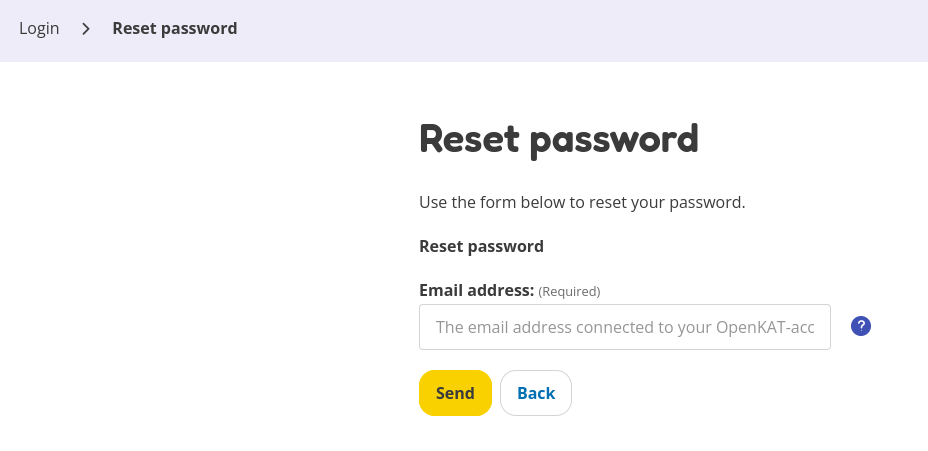

=============================================
iRealisatie Secure Development Pathway (iSDP)
=============================================

The iRealisatie Secure Development Pathway (`iSDP <https://github.com/minvws/rdo-isdp/tree/main>`_) is a pathway based on the OWASP ASVS 4.0.3 (Application Security Verification Standard).
The ASVS aims to provide a framework for improving the security of web applications by offering a detailed checklist of security requirements.
It serves as a security manual that helps developers and product owners understand what they should aim for to keep their applications secure.

Chapter V02 - Authentication
============================

Chapter "V02 - Authentication" of ASVS is about making sure only the right people get access to your application.
It helps you use the best methods to identify users and verify that they are who they say they are.

.. mermaid::

    flowchart LR
        rectId["iSDP: Chapter V02 - Authentication"] --> n1["Beheer je gebruikersaccount in je applicatie?"]
        n1 -- Ja --> n2["V2.1 V2.5"]
        n1 -- Nee --> n3["Skip V02"]
        n2 --> n4["Gebruik je een authenticator in je applicatie?"]
        n4 -- Ja --> n5["V2.2 V2.3 V2.7 V2.8"]
        n4 -- Nee --> n6["Implementeer 2FA met authenticator"]

        n1@{ shape: decision}
        n4@{ shape: decision}
        n1:::Pine
        n2:::Pine
        n3:::Rose
        n4:::Aqua
        n4:::Pine
        n5:::Rose
        n6:::Pine
        classDef Aqua stroke-width:1px, stroke-dasharray:none, stroke:#46EDC8, fill:#DEFFF8, color:#378E7A
        classDef Pine stroke-width:1px, stroke-dasharray:none, stroke:#254336, fill:#27654A, color:#FFFFFF
        classDef Rose stroke-width:1px, stroke-dasharray:none, stroke:#FF5978, fill:#FFDFE5, color:#8E2236
        style n1 stroke:#00C853

|compliant| 2.1.1 - Verify that user set passwords are at least 12 characters in length (after multiple spaces are combined).
-----------------------------------------------------------------------------------------------------------------------------

In the file ``rocky/rocky/settings.py:256`` you can see that the default minimum length is 12 characters.

.. code-block:: python

    AUTH_PASSWORD_VALIDATORS = [
        {
            "NAME": "django.contrib.auth.password_validation.MinimumLengthValidator",
            "OPTIONS": {"min_length": env.int("PASSWORD_MIN_LENGTH", 12)},
        }]

|partial_compliant| |accepted| 2.1.2 - Verify that passwords of at least 64 characters are permitted, and that passwords of more than 128 characters are denied.
----------------------------------------------------------------------------------------------------------------------------------------------------------------

We are compliant with the "At least 64 characters" part of the requirement.
Currently it is possible to create passwords that are longer than 128 characters.
As this is removed in the `ASVS 5.0 - 2.1.2 <https://github.com/OWASP/ASVS/blob/master/5.0/en/0x11-V2-Authentication.md#v21-password-security>`_ no fix will be implemented to limit 128 characters.

|compliant| 2.1.3 - Verify that password truncation is not performed. However, consecutive multiple spaces may be replaced by a single space.
---------------------------------------------------------------------------------------------------------------------------------------------

As can be seen in ``rocky/account/forms/account_setup.py:49`` no passwords are truncated.

.. code-block:: python

    password = forms.CharField(
        label=_("Password"),
        widget=forms.PasswordInput(
            attrs={
                "autocomplete": "off",
                "placeholder": _("Choose a super secret password"),
                "aria-describedby": "explanation-password",
            }
        ),
        help_text=get_password_validators_help_texts(),
        validators=[validate_password],
    )

|compliant| 2.1.4 - Verify that any printable Unicode character, including language neutral characters such as spaces and Emojis are permitted in passwords.
------------------------------------------------------------------------------------------------------------------------------------------------------------

As can be seen in ``rocky/account/forms/account_setup.py:49`` no characters are limited.

.. code-block:: python

    password = forms.CharField(
        label=_("Password"),
        widget=forms.PasswordInput(
            attrs={
                "autocomplete": "off",
                "placeholder": _("Choose a super secret password"),
                "aria-describedby": "explanation-password",
            }
        ),
        help_text=get_password_validators_help_texts(),
        validators=[validate_password],
    )

Also the example password ``ɶ(◕‿◕)֍֍T!1߷ɶ߷ɶ߷ɶ߷T!2(◕‿◕)`` was successfully used to created an account.

|compliant| 2.1.5 - Verify users can change their password.
-----------------------------------------------------------

It is possible to request a password reset at the ``https://<URL>/en/password_reset/``, see ``rocky/account/views/password_reset.py`` for the implementation.

|partial_compliant| 2.1.6 - Verify that password change functionality requires the user's current and new password.
-------------------------------------------------------------------------------------------------------------------

As can be seen in ``rocky/account/forms/account_setup.py:256`` no password is required to change to a new password.

.. code-block:: python

    class SetPasswordForm(auth_forms.SetPasswordForm):
        """
        A form that lets a user change set their password without entering the old
        password
        """

        error_messages = {"password_mismatch": _("The two password fields didn’t match.")}
        new_password1 = forms.CharField(
            label=_("New password"),
            widget=forms.PasswordInput(attrs={"autocomplete": "new-password", "placeholder": _("Enter a new password")}),
            strip=False,
            help_text=get_password_validators_help_texts,
            validators=[validate_password],
        )
        new_password2 = forms.CharField(
            label=_("New password confirmation"),
            strip=False,
            widget=forms.PasswordInput(attrs={"autocomplete": "new-password", "placeholder": _("Repeat the new password")}),
            help_text=_("Confirm the new password"),
            validators=[validate_password],
        )

Though this password reset is only possible through an email. Which means the requirement is not fully applicable.
Will be discussed in ``TODO``

|non_compliant| 2.1.7 - Verify that passwords submitted during account registration, login, and password change are checked against a set of breached passwords either locally (such as the top 1,000 or 10,000 most common passwords which match the system's password policy) or using an external API. If using an API a zero knowledge proof or other mechanism should be used to ensure that the plain text password is not sent or used in verifying the breach status of the password. If the password is breached, the application must require the user to set a new non-breached password.
----------------------------------------------------------------------------------------------------------------------------------------------------------------------------------------------------------------------------------------------------------------------------------------------------------------------------------------------------------------------------------------------------------------------------------------------------------------------------------------------------------------------------------------------------------------------------------------------------

Currently this check is not performed. Will be fixed in ``TODO``

|non_compliant| |accepted| 2.1.8 - Verify that a password strength meter is provided to help users set a stronger password.
---------------------------------------------------------------------------------------------------------------------------

Although this sounds great on paper it is a responsibility from the organization to be aware of secure passwords. Building a reliable an trustworthy password meter is difficult and it is questionable if it really has the desired effect.
For this reason in combination with the fact that in `ASVS 5.0 2.1.8 <https://github.com/OWASP/ASVS/blob/master/5.0/en/0x11-V2-Authentication.md#v21-password-security>`_ this requirement is set to ``[DELETED, INSUFFICIENT IMPACT]`` we have accepted to be non compliant with this requirement.

|non_compliant| 2.1.9 - Verify that there are no password composition rules limiting the type of characters permitted. There should be no requirement for upper or lower case or numbers or special characters.
---------------------------------------------------------------------------------------------------------------------------------------------------------------------------------------------------------------

Currently this check is not performed. Will be fixed in ``TODO``

|compliant|  2.1.10 - Verify that there are no periodic credential rotation or password history requirements.
-------------------------------------------------------------------------------------------------------------

We use `Django Password Validation <https://docs.djangoproject.com/en/4.2/topics/auth/passwords/#password-validation>`_ to configure passwords.
This library does not support the expiration of passwords, so by default, we are compliant with the requirement.

|compliant| 2.1.11 - Verify that "paste" functionality, browser password helpers, and external password managers are permitted.
-------------------------------------------------------------------------------------------------------------------------------

As can be seen in ``rocky/account/forms/account_setup.py:49`` no paste restrictions are set.

.. code-block:: python

    password = forms.CharField(
        label=_("Password"),
        widget=forms.PasswordInput(
            attrs={
                "autocomplete": "off",
                "placeholder": _("Choose a super secret password"),
                "aria-describedby": "explanation-password",
            }
        ),
        help_text=get_password_validators_help_texts(),
        validators=[validate_password],
    )

|non_compliant| 2.1.12 - Verify that the user can choose to either temporarily view the entire masked password, or temporarily view the last typed character of the password on platforms that do not have this as built-in functionality.
------------------------------------------------------------------------------------------------------------------------------------------------------------------------------------------------------------------------------------------

Currently this check is not performed. Note that in the ASVS 5.0 it is defined as "may allow".

Will be discussed in ``TODO``

2.5.1 - Verify that a system generated initial activation or recovery secret is not sent in clear text to the user.
-------------------------------------------------------------------------------------------------------------------

PROOF TODO

2.5.2 - Verify password hints or knowledge-based authentication (so-called "secret questions") are not present.
---------------------------------------------------------------------------------------------------------------

PROOF TODO

2.5.3 - Verify password credential recovery does not reveal the current password in any way.
--------------------------------------------------------------------------------------------

PROOF TODO

2.5.4 - Verify shared or default accounts are not present (e.g. "root", "admin", or "sa").
-------------------------------------------------------------------------------------------

PROOF TODO

2.5.5 - Verify that if an authentication factor is changed or replaced, that the user is notified of this event.
----------------------------------------------------------------------------------------------------------------

PROOF TODO

2.5.6 - Verify forgotten password, and other recovery paths use a secure recovery mechanism, such as time-based OTP (TOTP) or other soft token, mobile push, or another offline recovery mechanism.
---------------------------------------------------------------------------------------------------------------------------------------------------------------------------------------------------

PROOF TODO

.. |compliant| image:: img/compliant.svg
.. |non_compliant| image:: img/non_compliant.svg

.. |todo| image:: img/todo.svg
.. |accepted| image:: img/accepted.svg
