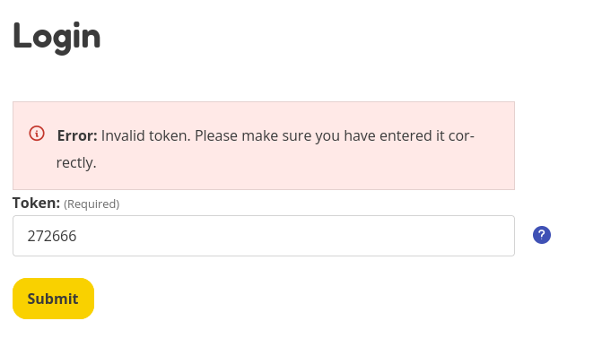

============================
Chapter V02 - Authentication
============================

Chapter "V02 - Authentication" of ASVS is about making sure only the right people get access to your application.
It helps you use the best methods to identify users and verify that they are who they say they are.

.. mermaid::

    flowchart LR
        rectId["iSDP: Chapter V02 - Authentication"] --> n1["Beheer je gebruikersaccount in je applicatie?"]
        n1 -- Ja --> n2["V2.1 V2.5"]
        n1 -- Nee --> n3["Skip V02"]
        n2 --> n4["Gebruik je een authenticator in je applicatie?"]
        n4 -- Ja --> n5["V2.2 V2.3 V2.7 V2.8"]
        n4 -- Nee --> n6["Implementeer 2FA met authenticator"]

        n1@{ shape: decision}
        n4@{ shape: decision}
        n1:::Pine
        n2:::Pine
        n3:::Rose
        n4:::Aqua
        n4:::Pine
        n5:::Rose
        n5:::Pine
        n6:::Pine
        n6:::Rose
        classDef Aqua stroke-width:1px, stroke-dasharray:none, stroke:#46EDC8, fill:#DEFFF8, color:#378E7A
        classDef Pine stroke-width:1px, stroke-dasharray:none, stroke:#254336, fill:#27654A, color:#FFFFFF
        classDef Rose stroke-width:1px, stroke-dasharray:none, stroke:#FF5978, fill:#FFDFE5, color:#8E2236
        style n1 stroke:#00C853

|compliant| 2.1.1 - Verify that user set passwords are at least 12 characters in length (after multiple spaces are combined).
-----------------------------------------------------------------------------------------------------------------------------

In the file ``rocky/rocky/settings.py:256`` you can see that the default minimum length is 12 characters.

.. code-block:: python

    AUTH_PASSWORD_VALIDATORS = [
        {
            "NAME": "django.contrib.auth.password_validation.MinimumLengthValidator",
            "OPTIONS": {"min_length": env.int("PASSWORD_MIN_LENGTH", 12)},
        }]

|partial_compliant| |accepted| 2.1.2 - Verify that passwords of at least 64 characters are permitted, and that passwords of more than 128 characters are denied.
----------------------------------------------------------------------------------------------------------------------------------------------------------------

We are compliant with the "At least 64 characters" part of the requirement.
Currently it is possible to create passwords that are longer than 128 characters.
As this is removed in the `ASVS 5.0 - 2.1.2 <https://github.com/OWASP/ASVS/blob/master/5.0/en/0x11-V2-Authentication.md#v21-password-security>`_ no fix will be implemented to limit 128 characters.

|compliant| 2.1.3 - Verify that password truncation is not performed. However, consecutive multiple spaces may be replaced by a single space.
---------------------------------------------------------------------------------------------------------------------------------------------

As can be seen in ``rocky/account/forms/account_setup.py:49`` no passwords are truncated.

.. code-block:: python

    password = forms.CharField(
        label=_("Password"),
        widget=forms.PasswordInput(
            attrs={
                "autocomplete": "off",
                "placeholder": _("Choose a super secret password"),
                "aria-describedby": "explanation-password",
            }
        ),
        help_text=get_password_validators_help_texts(),
        validators=[validate_password],
    )

|compliant| 2.1.4 - Verify that any printable Unicode character, including language neutral characters such as spaces and Emojis are permitted in passwords.
------------------------------------------------------------------------------------------------------------------------------------------------------------

As can be seen in ``rocky/account/forms/account_setup.py:49`` no characters are limited.

.. code-block:: python

    password = forms.CharField(
        label=_("Password"),
        widget=forms.PasswordInput(
            attrs={
                "autocomplete": "off",
                "placeholder": _("Choose a super secret password"),
                "aria-describedby": "explanation-password",
            }
        ),
        help_text=get_password_validators_help_texts(),
        validators=[validate_password],
    )

Also the example password ``ɶ(◕‿◕)֍֍T!1߷ɶ߷ɶ߷ɶ߷T!2(◕‿◕)`` was successfully used to created an account.

|compliant| 2.1.5 - Verify users can change their password.
-----------------------------------------------------------

It is possible to request a password reset at the ``https://<URL>/en/password_reset/``, see ``rocky/account/views/password_reset.py`` for the implementation.

.. image:: img/proof/chapter_2/proof_2.1.5.png

|partial_compliant| 2.1.6 - Verify that password change functionality requires the user's current and new password.
-------------------------------------------------------------------------------------------------------------------

As can be seen in ``rocky/account/forms/account_setup.py:256`` no password is required to change to a new password.

.. code-block:: python

    class SetPasswordForm(auth_forms.SetPasswordForm):
        """
        A form that lets a user change set their password without entering the old
        password
        """

        error_messages = {"password_mismatch": _("The two password fields didn’t match.")}
        new_password1 = forms.CharField(
            label=_("New password"),
            widget=forms.PasswordInput(attrs={"autocomplete": "new-password", "placeholder": _("Enter a new password")}),
            strip=False,
            help_text=get_password_validators_help_texts,
            validators=[validate_password],
        )
        new_password2 = forms.CharField(
            label=_("New password confirmation"),
            strip=False,
            widget=forms.PasswordInput(attrs={"autocomplete": "new-password", "placeholder": _("Repeat the new password")}),
            help_text=_("Confirm the new password"),
            validators=[validate_password],
        )

Though this password reset is only possible through an email. Which means the requirement is not fully applicable.
Will be discussed in `feature: Option to reset password within the application <https://github.com/minvws/nl-kat-coordination/issues/4173>`_.

|non_compliant| 2.1.7 - Verify that passwords submitted during account registration, login, and password change are checked against a set of breached passwords either locally (such as the top 1,000 or 10,000 most common passwords which match the system's password policy) or using an external API. If using an API a zero knowledge proof or other mechanism should be used to ensure that the plain text password is not sent or used in verifying the breach status of the password. If the password is breached, the application must require the user to set a new non-breached password.
----------------------------------------------------------------------------------------------------------------------------------------------------------------------------------------------------------------------------------------------------------------------------------------------------------------------------------------------------------------------------------------------------------------------------------------------------------------------------------------------------------------------------------------------------------------------------------------------------

Currently this check is not performed. Will be fixed in `ASVS / iSDP: 2.1.7 Verify that passwords submitted during account registration, login, and password change are checked against a set of breached passwords <https://github.com/minvws/nl-kat-coordination/issues/4174>`_.

|non_compliant| |accepted| 2.1.8 - Verify that a password strength meter is provided to help users set a stronger password.
---------------------------------------------------------------------------------------------------------------------------

Although this sounds great on paper it is a responsibility from the organization to be aware of secure passwords. Building a reliable an trustworthy password meter is difficult and it is questionable if it really has the desired effect.
For this reason in combination with the fact that in `ASVS 5.0 2.1.8 <https://github.com/OWASP/ASVS/blob/master/5.0/en/0x11-V2-Authentication.md#v21-password-security>`_ this requirement is set to ``[DELETED, INSUFFICIENT IMPACT]`` we have accepted to be non compliant with this requirement.

|compliant| 2.1.9 - Verify that there are no password composition rules limiting the type of characters permitted. There should be no requirement for upper or lower case or numbers or special characters.
---------------------------------------------------------------------------------------------------------------------------------------------------------------------------------------------------------------

In the file ``rocky/rocky/settings.py:256`` you can see that the default specifications only contain a password length.

.. code-block:: python

    AUTH_PASSWORD_VALIDATORS = [
        {
            "NAME": "django.contrib.auth.password_validation.MinimumLengthValidator",
            "OPTIONS": {"min_length": env.int("PASSWORD_MIN_LENGTH", 12)},
        }]

|compliant|  2.1.10 - Verify that there are no periodic credential rotation or password history requirements.
-------------------------------------------------------------------------------------------------------------

We use `Django Password Validation <https://docs.djangoproject.com/en/4.2/topics/auth/passwords/#password-validation>`_ to configure passwords.
This library does not support the expiration of passwords, so by default, we are compliant with the requirement.

|compliant| 2.1.11 - Verify that "paste" functionality, browser password helpers, and external password managers are permitted.
-------------------------------------------------------------------------------------------------------------------------------

As can be seen in ``rocky/account/forms/account_setup.py:49`` no paste restrictions are set.

.. code-block:: python

    password = forms.CharField(
        label=_("Password"),
        widget=forms.PasswordInput(
            attrs={
                "autocomplete": "off",
                "placeholder": _("Choose a super secret password"),
                "aria-describedby": "explanation-password",
            }
        ),
        help_text=get_password_validators_help_texts(),
        validators=[validate_password],
    )

|non_compliant| 2.1.12 - Verify that the user can choose to either temporarily view the entire masked password, or temporarily view the last typed character of the password on platforms that do not have this as built-in functionality.
------------------------------------------------------------------------------------------------------------------------------------------------------------------------------------------------------------------------------------------

Currently this check is not performed. Note that in the ASVS 5.0 it is defined as "may allow".

Will be discussed in `discussion ASVS / iSDP: 2.1.12 Verify that the user can choose to either temporarily view the entire masked password, or temporarily view the last typed character of the password on platforms that do not have this as built-in functionality. <https://github.com/minvws/nl-kat-coordination/issues/4212>`_.

|non_compliant| 2.2.1 - Verify that anti-automation controls are effective at mitigating breached credential testing, brute force, and account lockout attacks. Such controls include blocking the most common breached passwords, soft lockouts, rate limiting, CAPTCHA, ever increasing delays between attempts, IP address restrictions, or risk-based restrictions such as location, first login on a device, recent attempts to unlock the account, or similar. Verify that no more than 100 failed attempts per hour is possible on a single account.
-----------------------------------------------------------------------------------------------------------------------------------------------------------------------------------------------------------------------------------------------------------------------------------------------------------------------------------------------------------------------------------------------------------------------------------------------------------------------------------------------------------------------------------------------------------

Will be discussed in `discussion ASVS / iSDP: 2.2.1 - Verify that anti-automation controls are effective at mitigating breached credential testing, brute force, and account lockout attacks.... <https://github.com/minvws/nl-kat-coordination/issues/4306>`_.

|compliant| 2.2.2 - Verify that the use of weak authenticators (such as SMS and email) is limited to secondary verification and transaction approval and not as a replacement for more secure authentication methods. Verify that stronger methods are offered before weak methods, users are aware of the risks, or that proper measures are in place to limit the risks of account compromise.
------------------------------------------------------------------------------------------------------------------------------------------------------------------------------------------------------------------------------------------------------------------------------------------------------------------------------------------------------------------------------------------------

Secondary authentication is performed with secure authentication tokens, email or sms are not available options for primary or secondary option.

|non_compliant| 2.2.3 - Verify that secure notifications are sent to users after updates to authentication details, such as credential resets, email or address changes, logging in from unknown or risky locations. The use of push notifications - rather than SMS or email - is preferred, but in the absence of push notifications, SMS or email is acceptable as long as no sensitive information is disclosed in the notification.
----------------------------------------------------------------------------------------------------------------------------------------------------------------------------------------------------------------------------------------------------------------------------------------------------------------------------------------------------------------------------------------------------------------------------------------

Currently no notifications are send, this Will be fixed in `ASVS / iSDP: 2.2.3 - Verify that secure notifications are sent to users after updates to authentication details, such as credential resets, email or address changes, logging in from unknown or risky locations. The use of push notifications - rather than SMS or email - is preferred, but in the absence of push notifications, SMS or email is acceptable as long as no sensitive information is disclosed in the notification <https://github.com/minvws/nl-kat-coordination/issues/4307>`_.

|accepted| 2.5.1 - Verify that a system generated initial activation or recovery secret is not sent in clear text to the user.
------------------------------------------------------------------------------------------------------------------------------

As this is not the responsibility of the OpenKAT project but of the organization using the product, we have accepted this requirement.

|compliant| 2.5.2 - Verify password hints or knowledge-based authentication (so-called "secret questions") are not present.
---------------------------------------------------------------------------------------------------------------------------

As can be deduced from the code, no password hints are currently present.

|compliant| 2.5.3 - Verify password credential recovery does not reveal the current password in any way.
--------------------------------------------------------------------------------------------------------

As can be seen from the email below, no password is shared when performing a password reset:

.. code-block:: text

    Content-Type: text/plain; charset="utf-8"
    MIME-Version: 1.0
    Content-Transfer-Encoding: 7bit
    Subject: Password reset on localhost:8000
    From:
    To: example@openkat.nl
    Date: Wed, 12 Mar 2025 08:18:39 -0000
    Message-ID: <174176751958.88.10781402057800947700@dc8cef7be2d0>

        You're receiving this email because you requested a password reset for your user account at localhost:8000.
        Please go to the following page and choose a new password:

            http://localhost:8000/en/reset/Mg/cmjl[..snip..]2804/

        Sincerely,
    The OpenKAT team

|compliant| 2.5.4 - Verify shared or default accounts are not present (e.g. "root", "admin", or "sa").
------------------------------------------------------------------------------------------------------

In ``.env-dist`` accounts can be configured to not use default naming. By default unique names are used, with exception for the postgres account..

|non_compliant| 2.5.5 - Verify that if an authentication factor is changed or replaced, that the user is notified of this event.
--------------------------------------------------------------------------------------------------------------------------------

Currently no notifications are send, this Will be fixed in `ASVS / iSDP: Verify that if an authentication factor is changed or replaced, that the user is notified of this event. <https://github.com/minvws/nl-kat-coordination/issues/4310>`_.

|non_compliant| 2.5.6 - Verify forgotten password, and other recovery paths use a secure recovery mechanism, such as time-based OTP (TOTP) or other soft token, mobile push, or another offline recovery mechanism.
-------------------------------------------------------------------------------------------------------------------------------------------------------------------------------------------------------------------

As can be seen from the following code sample in ``rocky/account/views/password_reset.py``, the MFA is removed on a password reset.
.. code-block:: python

    def remove_twofactor_device(self):
        self.request.user.twofactordevice_set.all().delete()
        device = TOTPDevice.objects.filter(user=self.user.pk).exists()
        if device:
        device = TOTPDevice.objects.get(user=self.user.pk)
        device.delete()

Currently this requirement is not met. Will be fixed in https://github.com/minvws/nl-kat-coordination/issues/4311

|compliant| 2.7.1 - Verify that clear text out of band (NIST "restricted") authenticators, such as SMS or PSTN, are not offered by default, and stronger alternatives such as push notifications are offered first.
-------------------------------------------------------------------------------------------------------------------------------------------------------------------------------------------------------------------

The default authenticator is the TOTP manager from Django, SMS or PSTN are not available options.

|compliant| 2.7.2 - Verify that the out of band verifier expires out of band authentication requests, codes, or tokens after 10 minutes.
----------------------------------------------------------------------------------------------------------------------------------------

The out of band verifier is set to refresh after every 30 seconds and by default only allow 1 code as tolerance. This can be deduced from the following default config:

.. code-block:: python

    step = models.PositiveSmallIntegerField(
        default=30, help_text="The time step in seconds."
    )
    t0 = models.BigIntegerField(
        default=0, help_text="The Unix time at which to begin counting steps."
    )
    digits = models.PositiveSmallIntegerField(
        choices=[(6, 6), (8, 8)],
        default=6,
        help_text="The number of digits to expect in a token.",
    )
    tolerance = models.PositiveSmallIntegerField(
        default=1, help_text="The number of time steps in the past or future to allow."
    )

To prove this a token was generated, which was not used for ~5 minutes. AFter that a login with the code was attempted, which resulted in a invalid token message.

|compliant| 2.7.3 - Verify that the out of band verifier authentication requests, codes, or tokens are only usable once, and only for the original authentication request.
--------------------------------------------------------------------------------------------------------------------------------------------------------------------------

A token can only be used once, after that it is invalidated, including older tokens. This can be deduced from:

.. code-block:: python

    last_t = models.BigIntegerField(
        default=-1,
        help_text="The t value of the latest verified token. The next token must be at a higher time step.",
    )

To prove this a token was generated, which was used for a login. After that the same token was used again, which resulted in a invalid token message.

|compliant| 2.7.4 - Verify that the out of band authenticator and verifier communicates over a secure independent channel.
--------------------------------------------------------------------------------------------------------------------------

We are using the TOTP standard from the Django library. This is done through a separate channel, namely a mobile device.

|compliant| 2.8.1 - Verify that time-based OTPs have a defined lifetime before expiring.
----------------------------------------------------------------------------------------

The out of band verifier is set to refresh after every 30 seconds and by default only allow 1 code as tolerance. This can be deduced from the following default config:

.. code-block:: python

    step = models.PositiveSmallIntegerField(
        default=30, help_text="The time step in seconds."
    )
    t0 = models.BigIntegerField(
        default=0, help_text="The Unix time at which to begin counting steps."
    )
    digits = models.PositiveSmallIntegerField(
        choices=[(6, 6), (8, 8)],
        default=6,
        help_text="The number of digits to expect in a token.",
    )
    tolerance = models.PositiveSmallIntegerField(
        default=1, help_text="The number of time steps in the past or future to allow."
    )

.. |compliant| image:: img/compliant.svg
.. |non_compliant| image:: img/non_compliant.svg
.. |partial_compliant| image:: img/partial_compliant.svg
.. |accepted| image:: img/accepted.svg
