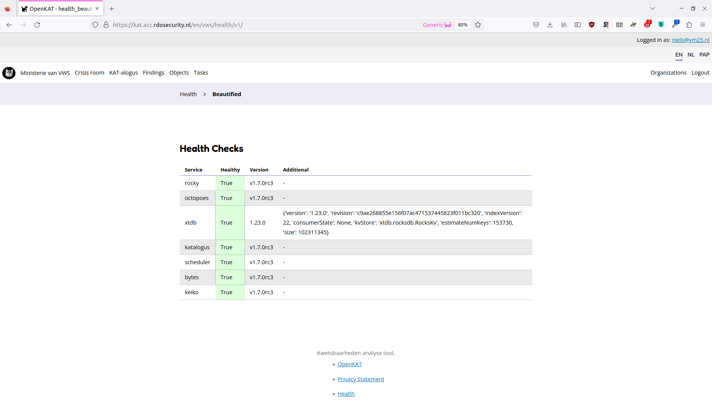
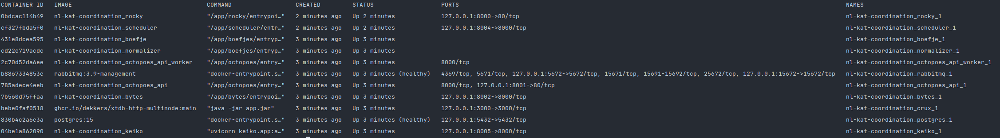

=============================
Debugging and troubleshooting
=============================

If OpenKAT does not function in the way you expect, there are several options to help you find the cause and solve the problem. Checking the healthpage, logs, services and usersettings are the basics.

If you can't find it, we look forward to bugreports as well. Squashing bugs makes everyone happy. Create an issue on GitHub or send us a report on meedoen@openkat.nl.

Healthpage
==========

The admin and superuser accounts have access to the health page. In the footer of every page, you can find a link to the Health page.
This page shows the status of all containerized KAT modules, their version, and any self-reported warnings or errors.
If you KAT deployment is not working properly, this is the first place to check.

You can also access the health JSON endpoint programmatically at ``http<s>://<rocky-host>/<org-code>/health``.

If one of the modules is unhappy, the 'windows 3.11 approach' of a simple restart might be needed. Otherwise there might be a configuration issue or bug. In the latter two cases, check the issues on Github or contact the team on signal or IRC.

Processes
=========

When debugging, check if the actual processes are running. Depending on the way you run OpenKAT, there are several ways to do this:

Docker containers
-----------------

``docker ps`` gives you an overview of all running Docker containers.

Packaged versions
-----------------

``systemctl status KAT-*`` gives you an overview of all KAT related processes.

The relevant services for OpenKAT:

* kat-mula.service
* kat-octopoes.service
* kat-keiko.service
* kat-rocky.service
* kat-boefjes.service
* kat-katalogus.service
* kat-octopoes-worker.service
* kat-normalizers.service
* kat-bytes.service

Debian package service logs
---------------------------

Sometimes, the logs might give output that is useful.

``journalctl`` has the output of the logs. Select the ``kat-*`` related services and relevant timeframe to find out more about the service you want to inspect.

Diskspace in debug mode
=======================

When OpenKAT runs in debug mode, it produces large logfiles. Several hours of debug mode might fill a disk, so make sure to check this and clean up space.

Permissions
===========

Check in the user interface if the users have permission to perform scans and are part of an organization.

The current usermodel also needs a superuser that is part of an organization. Normally this is set automagically. With several organizations in your instance the superuser might end up alone. This must be corrected through the Django interface, in which the superuser can be added to the organization.

You can reach the Django admin interface through ``/admin`` on the rocky instance. While you are there, do check the :ref:`Production: Hardening OpenKAT` page if you have not already done so.
