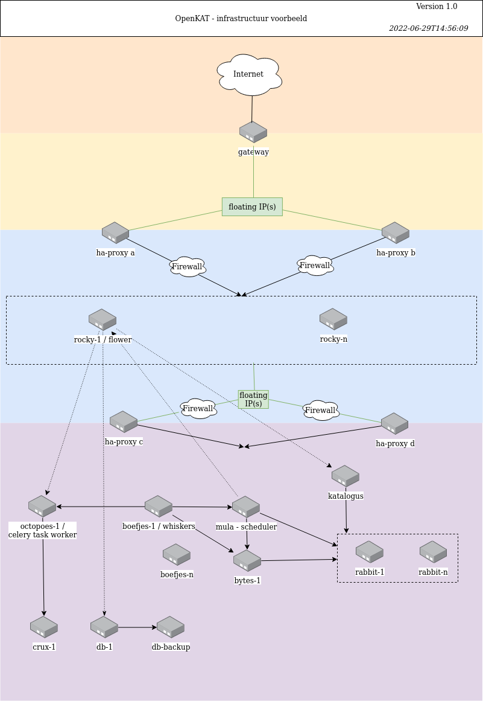

==================
Installation Guide
==================

OpenKAT can be installed in a number of ways. You can use OpenKAT in a way that suits your situation. For developers and for introductory purposes, there is a local installation, there are debian packages that are automatically built from each release, there are pre-built docker containers, and there is community work on kubernetes and nomad scripts. At VWS, OpenKAT is installed based on ansible script. Use the hardening guide for a production install.

Pre-built Docker images
=======================

The pre-built docker images are on the Github Container Registry. The deployment manual based on the pre-built docker images is included in this manual. A kubernetes script is being worked on for automatic deploy.

make kat
========

The 'developer option' or local install of OpenKAT, which builds the system from the source using docker containers. The manual for this install explains how to set up your computer for an install of OpenKAT.

Debian packages
===============

The Debian packages are now available as artifacts from the Github actions in the repository of each module. There is an unofficial installation script to merge them into a working installation, and a repository to enable ``apt install kat`` is under construction.

There is a beta community for the debian packages. If you want to get involved in this, send an email to meedoen@openkat.nl.

Example infrastructure
======================

A larger installation of KAT can scale both horizontally and vertically. The setup depends on your own preferences. We do not have an estimate for your hardware planning, but most work is done by Mula and Octopoes.

An example is shown in the diagram below. OpenKAT runs behind a proxy with firewalls, with Rocky accessible as the front end. From rocky, a second proxy connects to OpenKAT's components. Most components can be duplicated to distribute load and ensure availability. The arrows in the drawing indicate the direction in which the connections are initiated.

At the backend, a management interface can be added, adapted to the situation where OpenKAT is used. Each module has a healthpoint for monitoring.

Backups are particularly relevant for the raw data in Bytes and the userdata, possibly for speed the objects in Octopoes. Based on Bytes and the userdata, the system can in principle be redeployed and restored.

