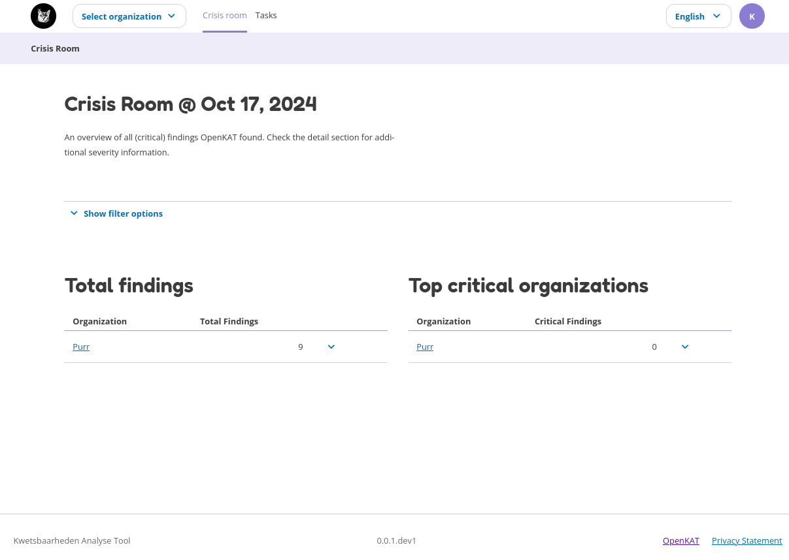
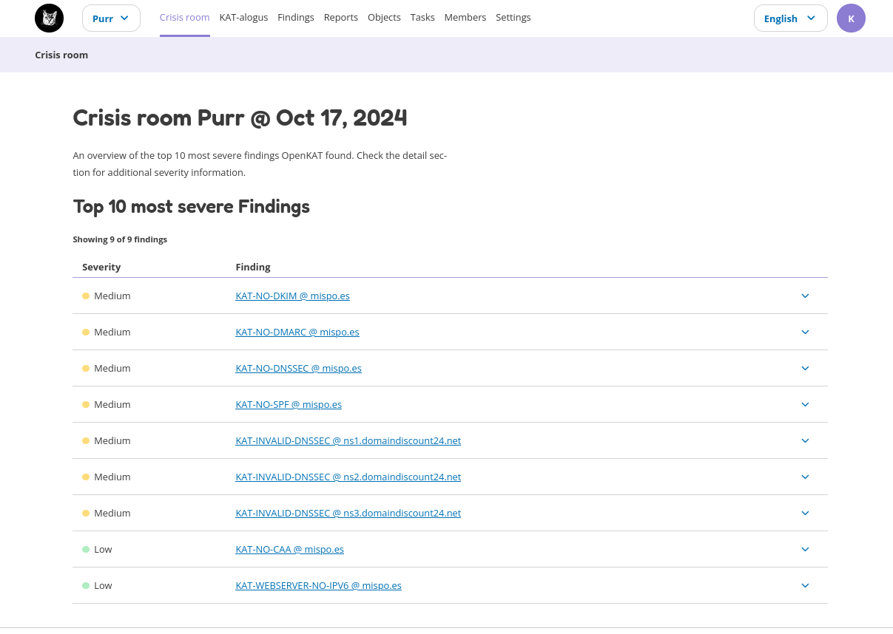

Crisis Room
===========

The Crisis Room gives an overview of findings for, which can be viewed for different moments in time. The date can be selected and the crisis room will provide an overview for that moment in time. Crisis rooms are available for:

- all organizations (the user has access to)
- each single organization (the user has access to)

The crisis room for all organizations shows which organizations you have access to and how many findings per severity are found. The screenshot below shows that there is one organization called Purr.

The crisis room for a single organization.

