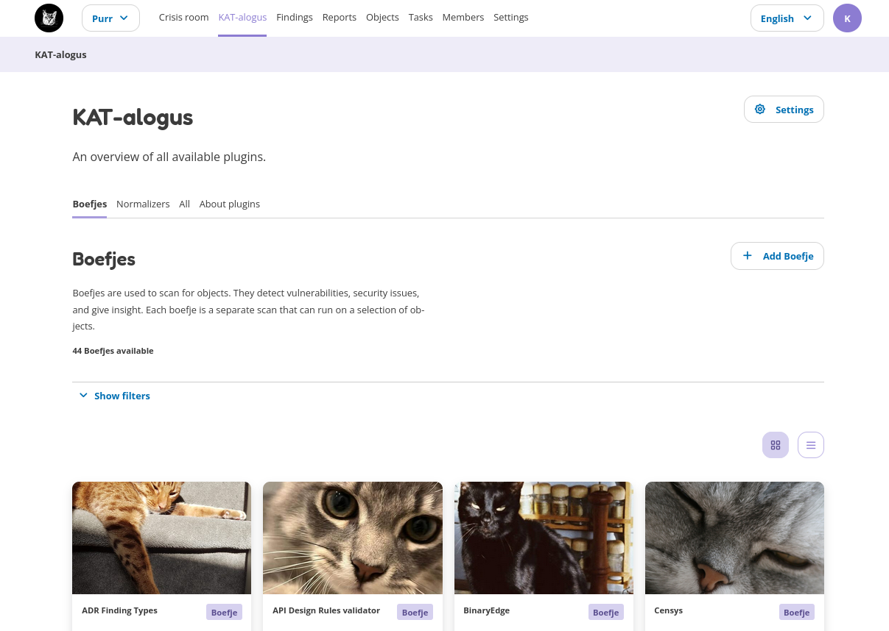
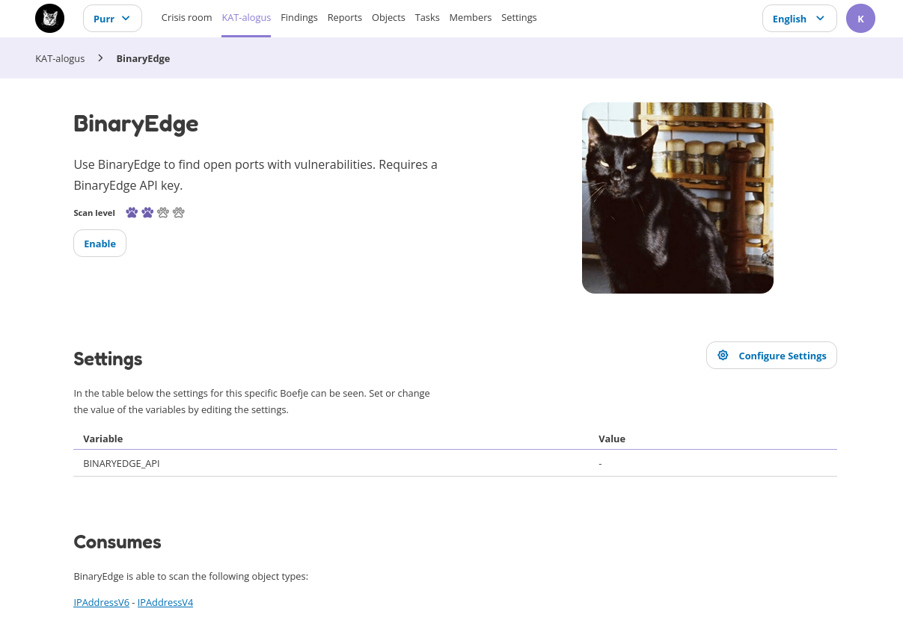

Katalogus
=========

The KAT catalog (katalogus) is the place where you can see which tools are available, enabled and/or disabled. Tools can be common security scanning tools, like nmap (checks which ports are open), or specific tools that check for a CVE vulnerability. The KAT catalog also contains all the normalizers, which parse the data from the tools. Each boefje and normalizer contains more information on how it works and what is required, including the objects it can search for, and which are required for the boefje to work.

Before a boefje or normalizer can run the following two conditions must be met:
- The boefje and corresponding normalizer are enabled. Note: all normalizers are enabled by default.
- The clearance level of your object (e.g. hostname or URL) is similar or higher than the required scan level of the enabled boefje.

New boefjes can be added by an administrator in the web interface, or by manually adding an external KAT catalog in the Rocky's config ile.

Each boefje has an details page with information about the tool, the scan level and additional settings that can be given to the boefje. It also gives an overview on the required objects before the boefje can run ("Consumes") and which output objects are created ("Produces"). The details page also gives an overview of all associated tasks and which objects match the clearance level.

