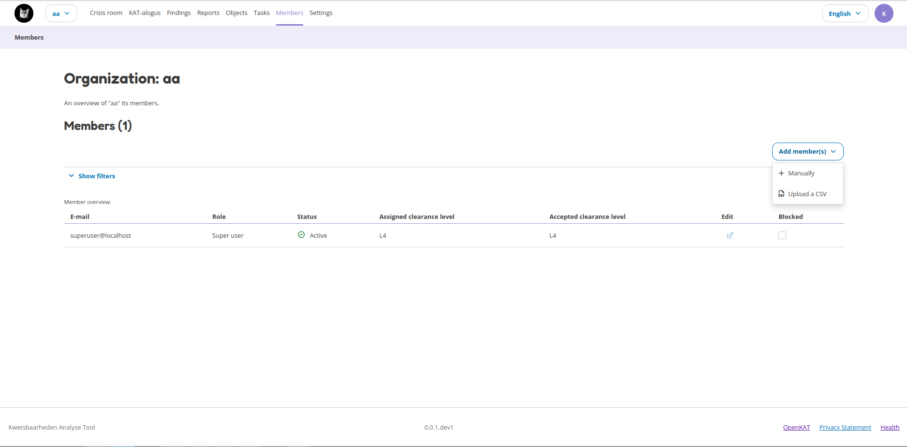

Members
=======

The Members page allows for user management and is visible to users who have the rights to do this. When you have sufficient rights you can add new users either manually or through a file upload (CSV). This page also shows the accepted and assigned clearance levels to each user and whether or not the user is active.

