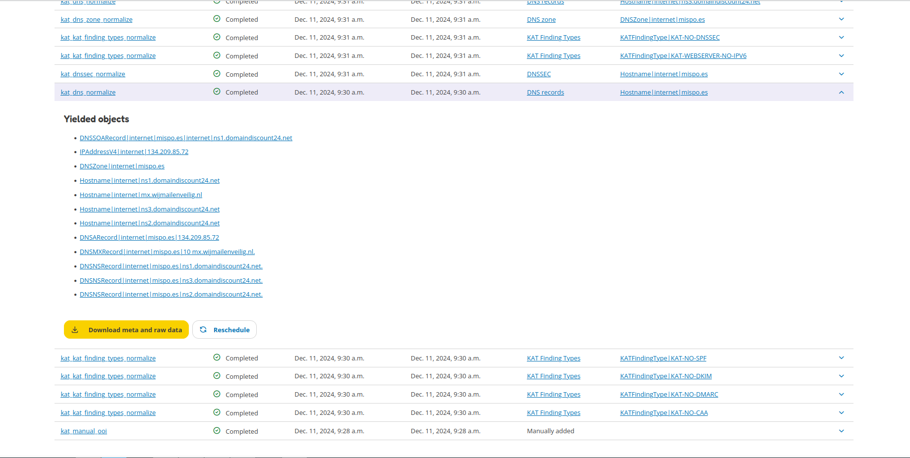

Tasks
=====

All tasks can be found on the Tasks page. A task is created for each job that needs to be performed, such as running a boefje, normalizer or for generating a report. Each task is performed on an object (such as a hostname, finding, DNS records, etc.) and tasks have a status to show if the task is completed, scheduled, queued, etc. Each task contains meta and raw data that can be downloaded. This is the output, error message, proof, security hashes, etc. that belongs to the boefje or normalizer. Tasks can also be rescheduled and filtered to find specific tasks.

Tasks are organised between the boefje and normalizer tabs. The image below shows what the boefje tab could look like.

.. image:: img/tasks-boefjes.png
  :alt: overview of boefje tasks

The image below shows the normalizer tasks by clicking on the normalizer tab.

.. image:: img/tasks-normalizers.png
  :alt: overview of normalizer tasks

The normalizer tab has a special functionality called 'yielded objects'. If the normalizer was able to extract new data (points) this will result in new yielded objects. As an example below, the DNS records for the hostname `mispo.es` are parsed. The normalizer identifies various DNS records (A, NS, MX, SOA) and other information and creates objects for each of the identified information. This information is now also available to other tools to be parsed, if possible.

