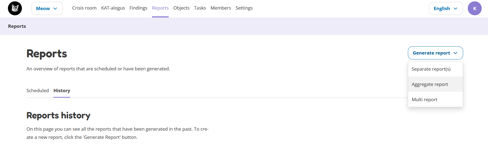
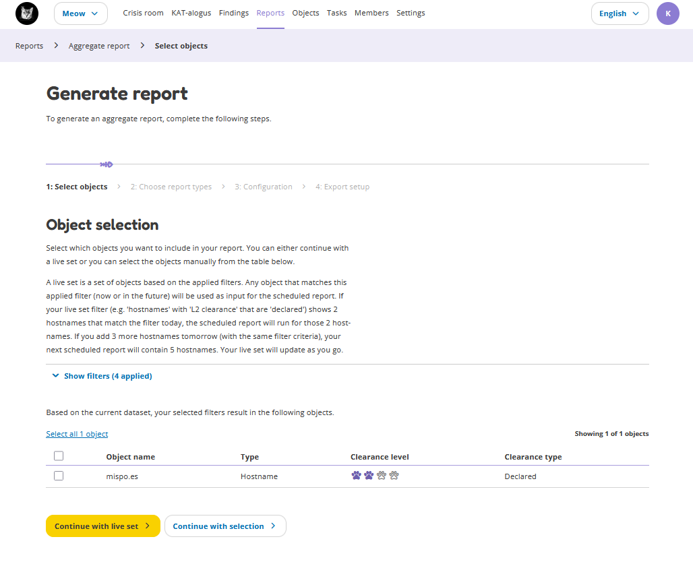
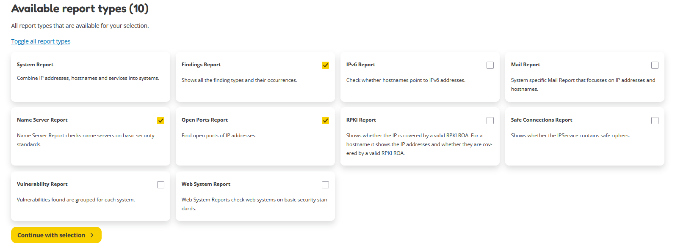
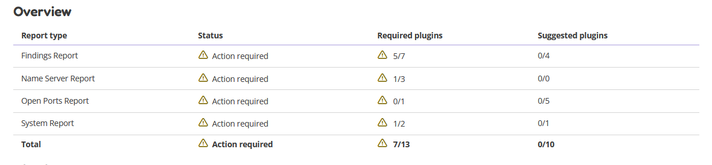
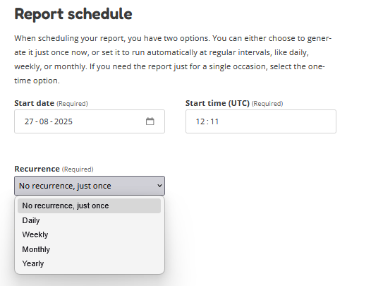

Generate a report
=================

OpenKAT can generate a report to summarize all findings.
In this section you will learn how to create a report, step by step.

Select the kind of report
-------------------------
To create a new report, go the Reports page. Press the 'Generate report' button and click on the kind of report you want to create.

There are three different kinds of reports:

- **Separate report:** selecting one or more reports will show the contents of each report below each other. This kinds of report might be turned off by default by your administrator.
- **Aggregate report:** selecting one or more reports will show aggregated data for each selected report. This means that some results are aggregated to provide a general overview of the current compliance status of the scanned objects.
- **Multi report:** allows you to compare one organisation with another based on the organisation tags. This is only possible for aggregate reports. A multi report is very similar to an aggregate report, but shows data across multiple organisations.

All kinds of reports can be exported as PDF. The Aggregate Report can also be exported as JSON.

Object selection
----------------
You can select objects manually or choose a live set. A live set is a set of objects based on the applied filters.
Any object that matches this applied filter (now or in the future) will be used as input for the scheduled report.
A live set can be useful for reports that will be created in the future and where objects
found later by OpenKAT must also be included in the report.

**Example:**
    If your live set filter (e.g. 'hostnames' with 'L2 clearance' that are 'declared') shows 2 hostnames that match the filter today,
    the daily scheduled report will run for those 2 hostnames. If you add 3 more hostnames tomorrow (with the same filter criteria),
    your next scheduled report will contain 5 hostnames. Your live set will update as you go.

Choose report types
-------------------
You can then select the desired report types. More information about all the different report types can be found :doc:`here <../navigation/reports>`.

Configuration
-------------
Next, you can see which plugins are required for the report and which plugins are recommended.
You need to enable the required plugins if you want the results in the report to be correct.
If you choose not to enable a plugin, the data that the plugin would collect or produce will be left out of the report, which will then be generated based on the available data collected by the enabled plugins.

**Important:**
    OpenKAT is designed to scan all known objects on a regular basis using the enabled plugins and set clearance levels.
    This means that scans will run automatically. Be patient; plugins may take some time before they have collected all their data.
    Enabling them just before report generation will likely result in inaccurate reports, as plugins have not finished collecting data.

Export setup
------------
In this final step, you can schedule the report and give the report a name. A report can be generated either once or periodically.

After pressing the 'Generate report' button at the bottom of the page, your report is scheduled.
You can view the schedule for this report on the Scheduled Reports page.
It will be generated in the background by OpenKAT at the start date and time that you have just selected in the final step.

As soon as the report has been generated, it will be visible on the Reports History page.

More information
----------------
To read more about the Reports and the report types, go to :doc:`../navigation/reports`.
