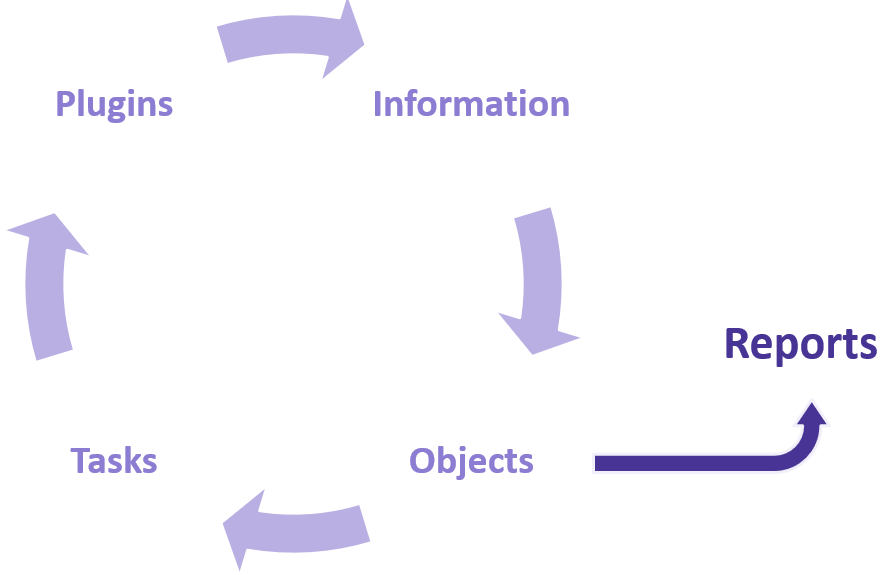

Introduction
============

Let's get started with OpenKAT! If you want to read more about what OpenKAT is and why it exists, please read :doc:`/about-openkat/index`.

General information
-------------------

OpenKAT is an open source vulnerability analysis tool that can monitor, record, and analyze the status of information systems.
OpenKAT does this automatically and continuously.

With OpenKAT, networks can be scanned, including websites, mail servers, and DNS servers.
The tool scans for vulnerabilities and analyzes them. Various plugins (which are the most commonly used network tools and scanning software) are used for this purpose.

All information found by OpenKAT can be converted into clear, accessible reports.

The scanning process
--------------------

OpenKAT scans, collects, analyzes and reports in an ongoing process:

The information collected by OpenKAT is stored as objects such as URLs, IP addresses, or hostnames.

After objects are stored, activated plugins start scanning the objects.
The results are stored as findings, but they can also be stored as objects, which can lead to new scans.
This process continues until OpenKAT has scanned every object.

Reports can be generated from the objects, providing a clear overview of all the information.

An example:
- A user adds a hostname object. OpenKAT will schedule a plugin to do DNS lookups on the hostname.
- The plugin will return DNS records that point to IP addresses. Those IP addresses are added to OpenKAT. OpenKAT will then schedule port scans on the IP addresses.
- Any open ports found will be added as new objects which may in turn trigger new scans to search for vulnerable software on these open ports.

How far OpenKAT goes with its search depends on the clearance levels that are provided. Read more about it here: :doc:`../basic-concepts/scan-levels-and-indemnification`.

So this is what OpenKAT does behind the scenes, in simple terms.
If you want more details about this process, please check the :doc:`../../developer-documentation/basic-principles/index` in the developer documentation.

User flow
---------

Now let's see how this looks to the user.

- A user of OpenKAT must first add objects, such as a URL, a hostname, or an IP address.
- Next, the user chooses which plugins will be used for the scans.
- After the plugins have had some time to gather information, the user can view the findings from the scan.
- The user can now also generate reports based on these findings. This can be done once or periodically.

Starting with OpenKAT
---------------------

To start with OpenKAT you have to log in first. If you have trouble logging in, please read :doc:`login-and-registration`.

After logging in, you continue to the onboarding. This onboarding will walk you through creating and scanning your first object and report. You can learn more about the onboarding process :doc:`here <onboarding>`.

You can also skip the onboarding and directly go to :doc:`start-scanning` to create your first object in OpenKAT.
