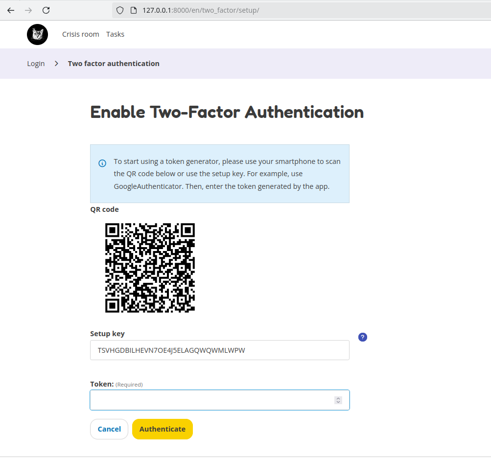
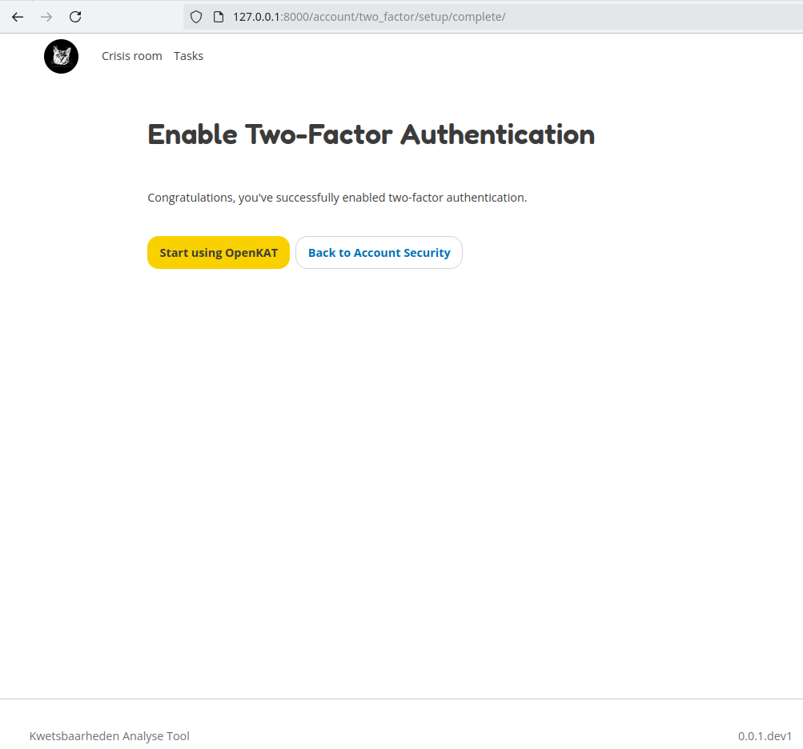

Login & registration
====================

Registration
------------

As an administrator, you can register new users on the "Members page". Read more about this page :doc:`here <../navigation/members>`.
Regular users should contact their system administrator.

Login
-----

Once you have credentials, you can log in with the given username and password.

Reset password
--------------

If you want to change your password, click on the profile menu on the top right and go to "Profile".
Then press "Reset password". After entering your email address, a reset link will be sent to this email address.

Two-factor authentication (2FA)
-------------------------------

After you log in, you will see the screen for setting up two-factor authentication. You have to scan the QR code with an authenticator application on your phone. The application on your phone will generate a token that you have to type in as a response. Every time you log in, you have to enter your username, password and 2FA token.

Once you have successfully setup 2FA you will see the following screen.

After this, continue to the onboarding. The onboarding starts with the registration process, which lets you create your very first organization.
