Onboarding
==========

If you are using OpenKAT for the first time, you can go through the onboarding flow. The onboarding flow helps you start your first scan. The onboarding flow also introduces the basic concepts of adding an object, setting a clearance level, enabling plugins, starting various scans and creating a report.

The onboarding consists of the following steps:

1. Welcome
2. Organization setup
    - Create/update an organization
    - Indemnification setup
    - User clearance level
3. Add object
    - Add object
    - Set object clearance level
4. Plugins
    - Plugin introduction
    - Enabling plugins and start scanning
5. Generating report

Step-by-step onboarding
-----------------------

Creating an organization (for administrators only)
**************************************************
When an administrator starts with the onboarding, the first step is the registration process, which lets you create your very first organization. The first page of the onboarding shows the welcome page.

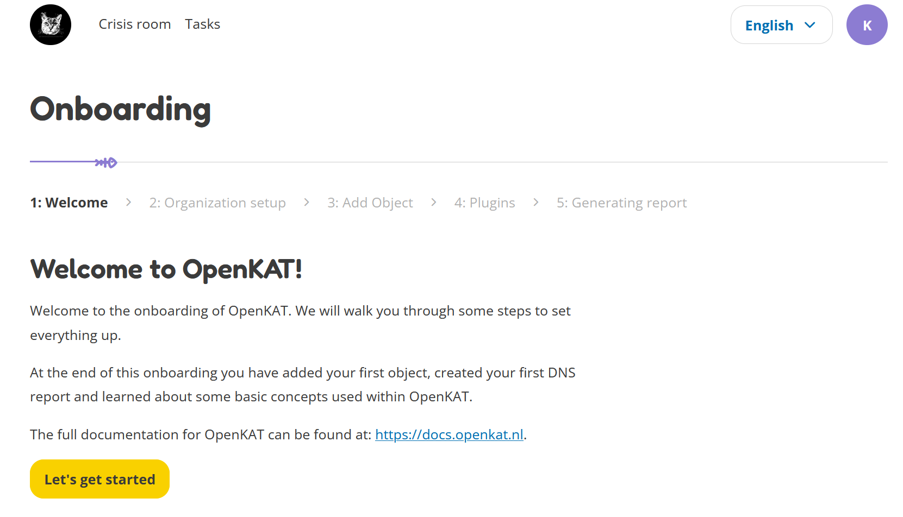

On the next page you are asked to enter the name of your organization and a code that is used to identify your organization. If you are unsure what to do here, take a look at the next screenshot.

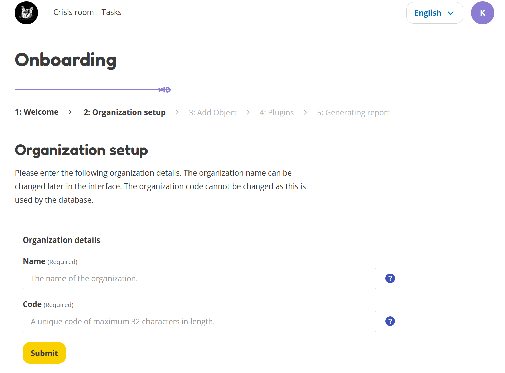

The dummy organization for this tutorial is called 'Meow', which is entered in the 'Name' field. The code we came up with that will identify this organization is 'meow'. Usually this is some kind of shorthand to identify your organization.

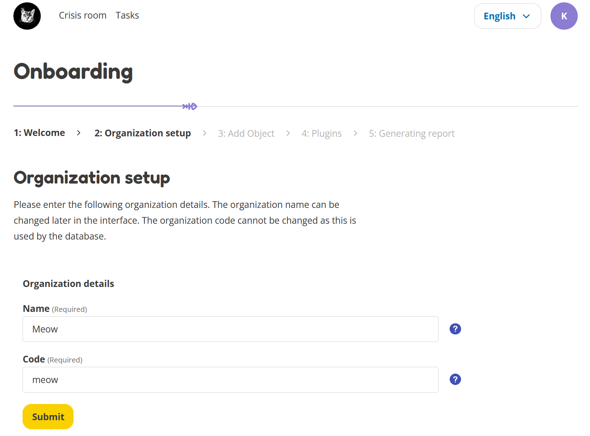

The next step is to add the indemnification statement. Before you are allowed to scan, you are legally required to sign a waiver stating that you know what you are doing when scanning websites/hosts and that the person who signed the waiver can be held accountable. Please read the indemnification carefully and click the checkboxes if you agree.

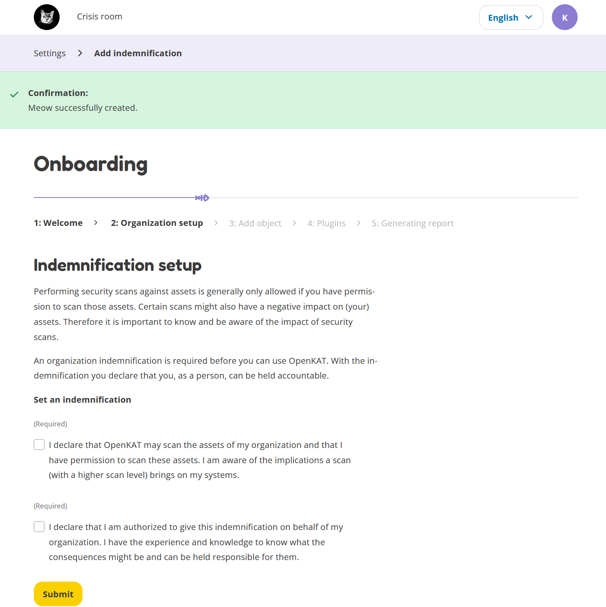

Continue onboarding (for all users)
***********************************
The following page shows some information about user clearance levels. At the bottom of the page, you can see which clearance level is trusted to you by the administrator. You can only continue if you have accepted this clearance level.

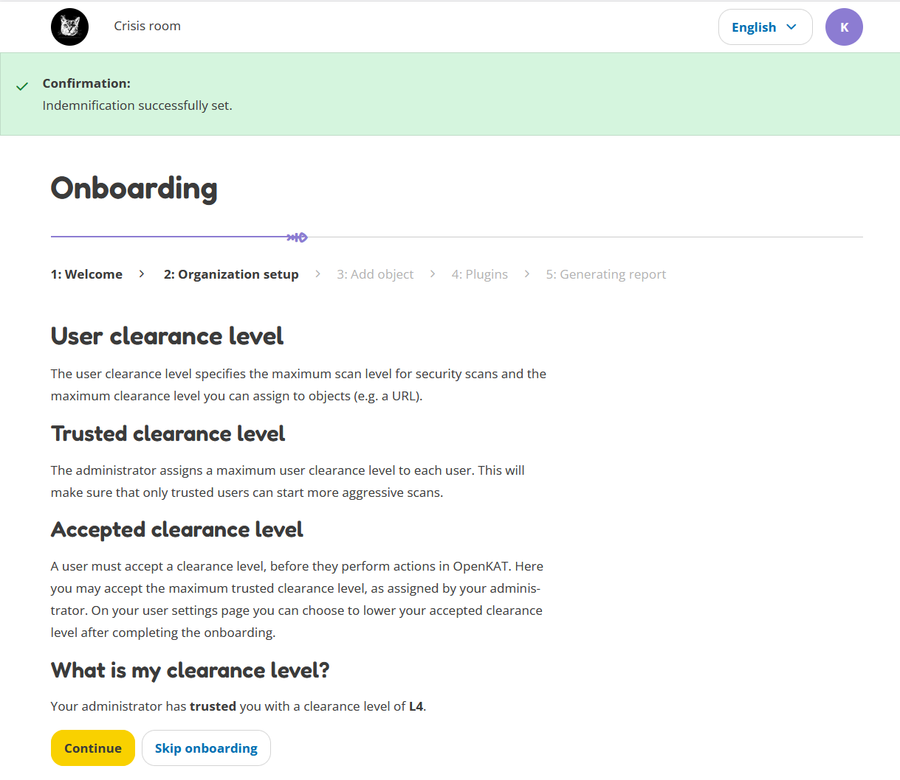

Here you can add your very first object! You do this by entering the URL for a website that you have permission to scan. The next screenshot will show you an example of what this could look like. Here we add our dummy URL `https://mispo.es`. Feel free to add this URL, as it is part of our testing environment.

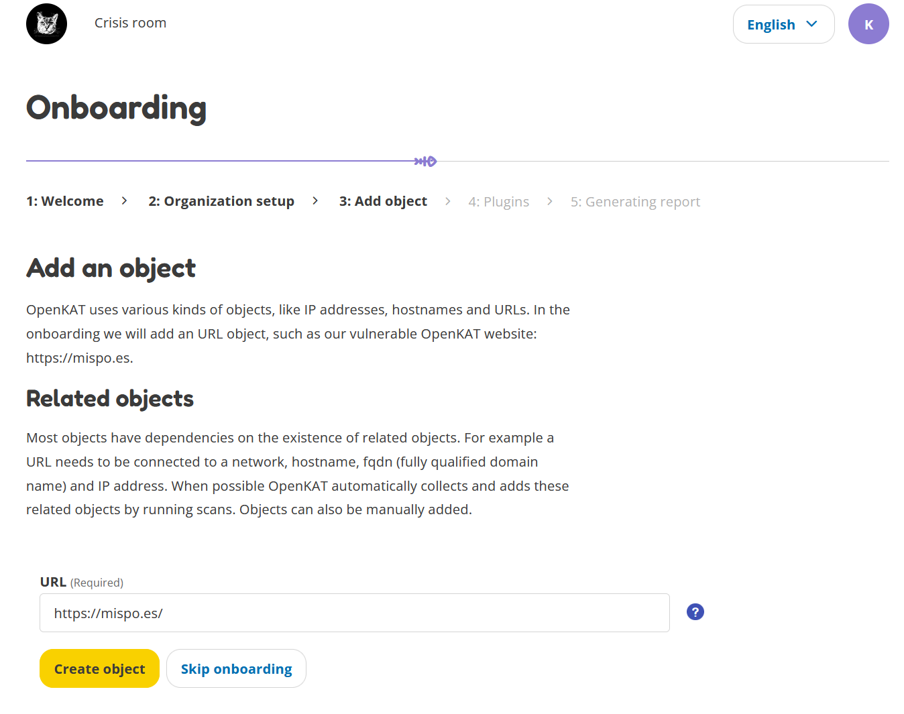

Each object in OpenKAT has a clearance level, stating how intrusive the scans for the object can be. If you give an object Level 1 clearance, only non-intrusive plugins are allowed to scan it. If you give it Level 4 clearance, all plugins, including the very intrusive ones, will scan this object. Since this is the onboarding, we set the clearance level to Level 1.

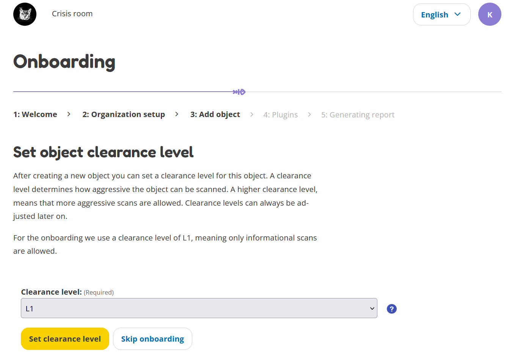

The plugins in OpenKAT have various scan levels to indicate if they are more or less intrusive for the objects that are scanned. Here you can find two examples of a less intrusive plugin (DNS zone) and a more intrusive plugin (Fierce). This level of intrusiveness is indicated by the number of paws, where more paws is more intrusive.

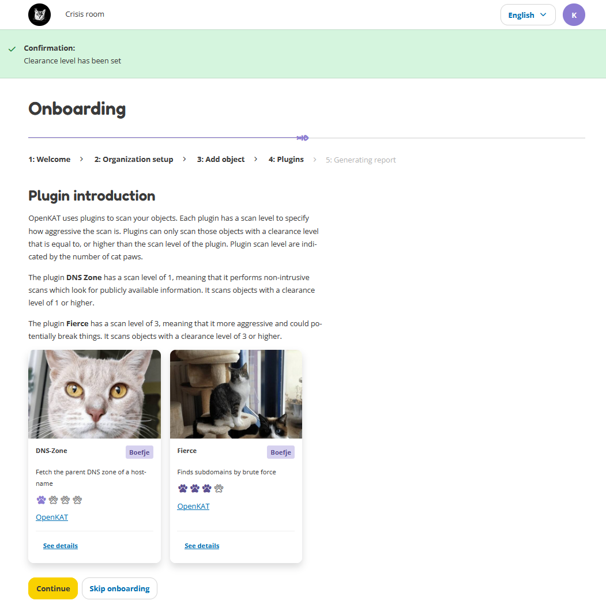

Before we can scan we have to enable plugins. Here you can choose some plugins. By default all three plugins are enabled. They are all non-intrusive plugins that will gather basic DNS data for your added URL.

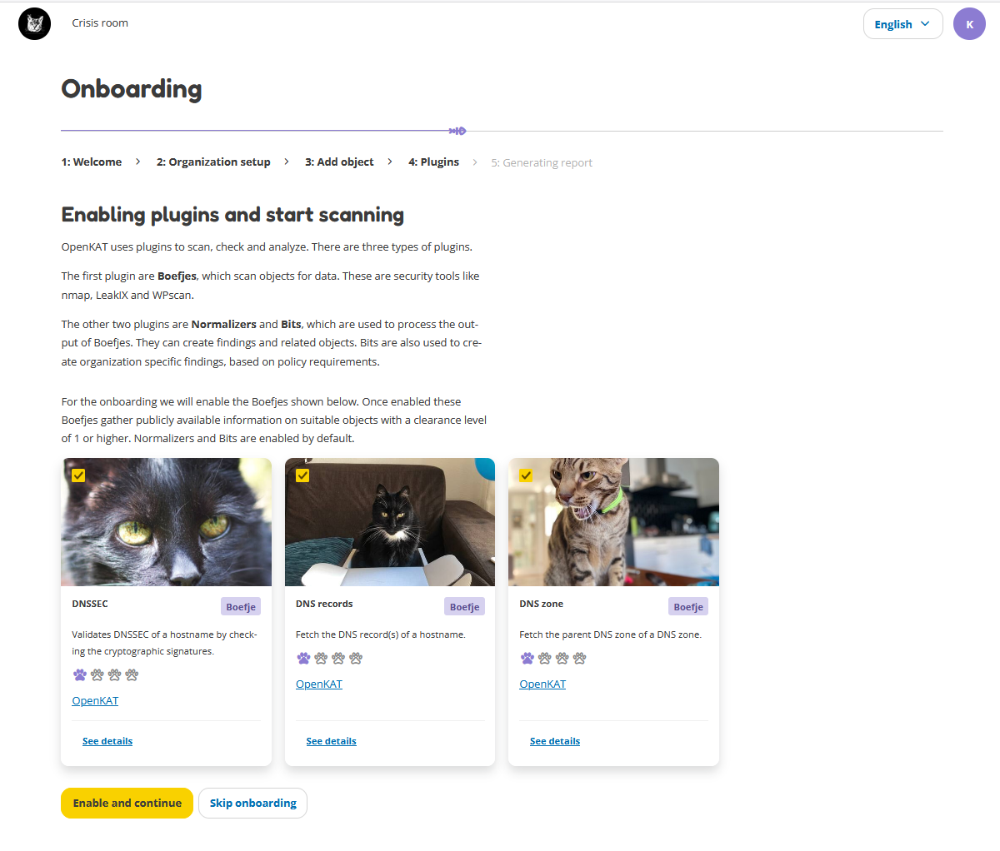

The final step is generating a report. During the onboarding, we will create a DNS-report.

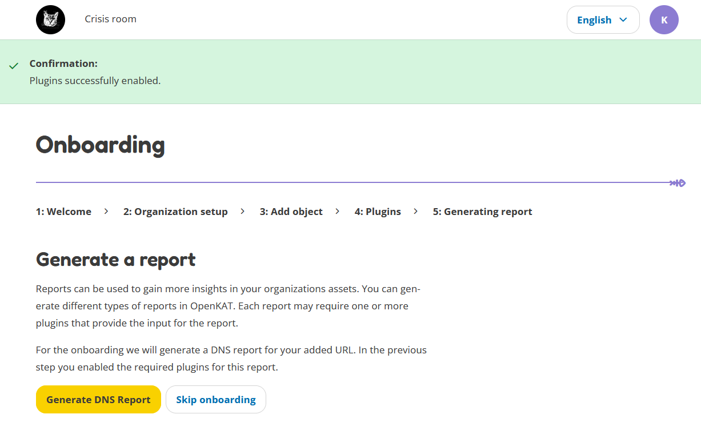

This is the last page, after which you can start exploring OpenKAT. The Boefjes are currently running to collect data about your URL. Your DNS Report will be generated in 3 minutes, so the Boefjes have some time to complete. In the meantime you can explore OpenKAT. Go back to the Report History page to view your DNS Report after a couple of minutes.

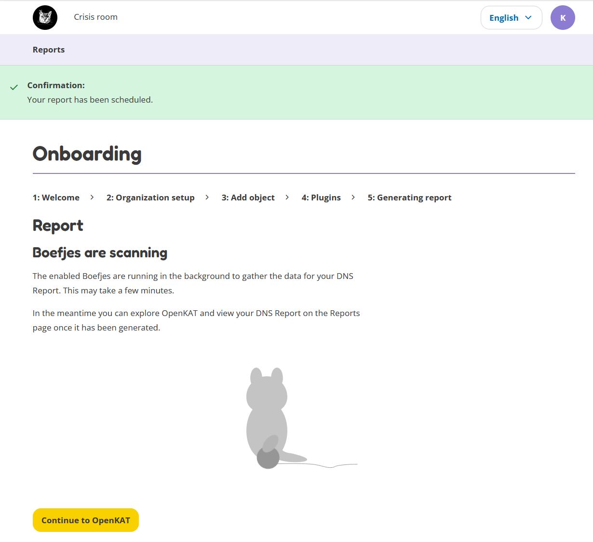

After three minutes, you can open your DNS Report on the Report History page. Here is your very first DNS report! Congrats.

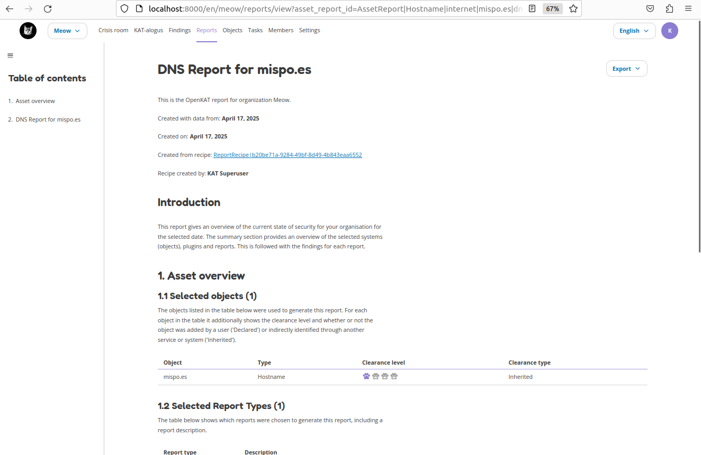

Now get familiar with OpenKAT and explore! If you need any help with navigating around and becoming familiar with OpenKAT, you can always go to the user manual.In the user manual you will find information on all the user interface related items of OpenKAT.
