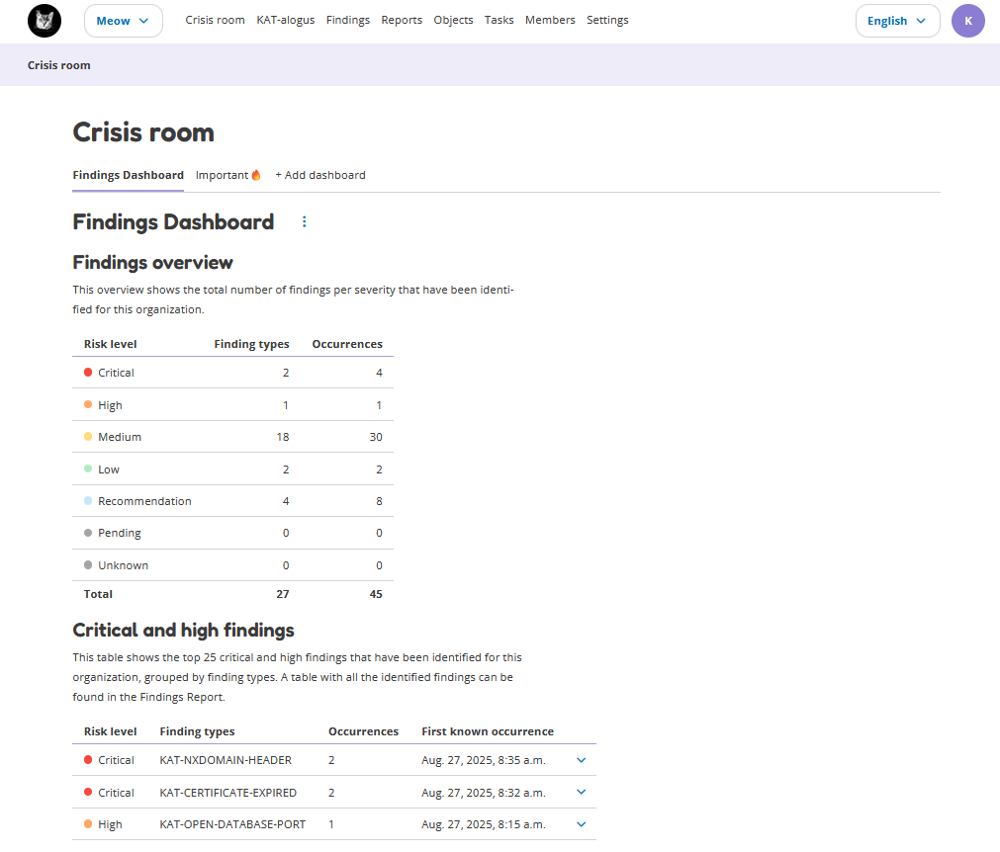
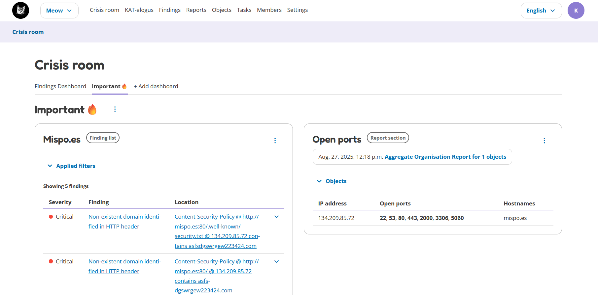
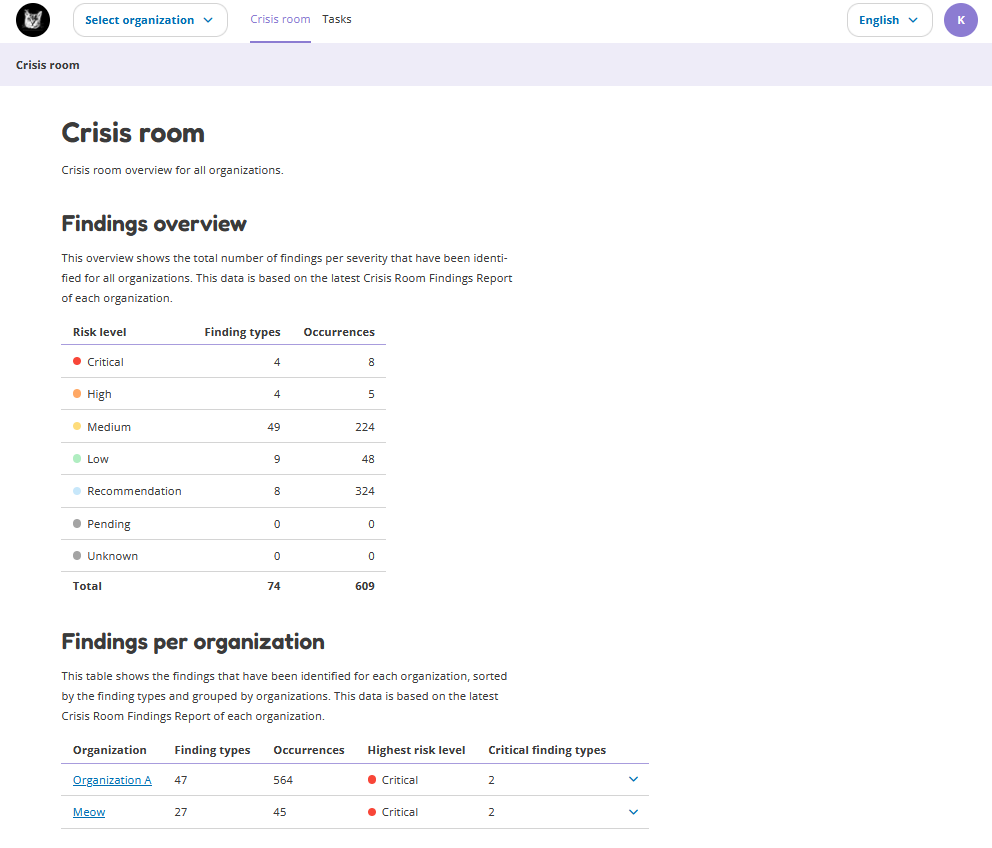

Crisis Room
===========

In OpenKAT we differentiate two Crisis Rooms:

- **Single Organization Crisis Room:** a Crisis Room for each organization separately
- **General Crisis Room:** one general Crisis Room for all the organizations

Single Organization Crisis Room
-------------------------------
This page shows a Crisis Room for each organization separately.
Here, a user can create its own dashboards.

Findings Dashboard
******************
There is always one default dashboard, the 'Findings Dashboard', where you can see the most important findings at a glance.
This section shows an overview table with the amount of findings that have been identified for the selected organization.

Also, the top 25 critical and high findings that have been identified for this organization are shown in a table here, grouped by finding types.

Custom Dashboards
*****************
It is also possible to create a custom dashboard. Creating your own dashboard provides an overview that fully meets the needs of your organization.

By clicking on the 'Add Dashboard' button, a new dashboard will be created.
After adding the dashboard, you can add items to it. Each dashboard can contain a maximum of 16 dashboard items.

There are three types of dashboard items which you can add:

- **Object list:** a copy of the objects list, with applied filters (can be added from the Objects page)
- **Finding list:** a copy of the findings list, with applied filters (can be added from the Findings page)
- **Report section:** a copy of a specific chapter of a report (can be added from within a report)

The dashboard items can be moved up/downwards and can be deleted.

Adding A New Dashboard Item
***************************

Objects/Findings list
^^^^^^^^^^^^^^^^^^^^^
To add a new objects or findings dashboard item to a dashboard:

- Go to the Objects or Findings page
- Filter the table as you prefer (the same filters will be applied to the table in the dashboard item)
- Click on the 'Add to dashboard' button, this opens a pop-up
- Choose the settings as you prefer
- Click on the 'Add to dashboard' button

The following settings can be configured:

- **Dashboard:** Select the dashboard to which you want to add the dashboard item.
- **Title on dashboard:** Give the dashboard item a name.
- **List sorting by:** This is how the table in the dashboard item will be sorted.
- **Number of rows in list:** Choose how many objects/findings you wish to show in the dashboard item.
- **Dashboard item size:** A dashboard item can be full or half width. Two half width items will be displayed next to each other.
- **Show table columns:** Select at least one column you want to show in the dashboard item.

Report section
^^^^^^^^^^^^^^
To add a report section:

- Go to the Reports History page
- Open the report of your choice
- Go to the section that you want to add
- Click on the options button (three dots) next to the section name
- Click on 'Add section to dashboard'

The following settings can be configured:

- **Dashboard:** Select the dashboard to which you want to add the dashboard item.
- **Title on dashboard:** Give the dashboard item a name.
- **Dashboard item size:** A dashboard item can be full or half width. Two half width items will be displayed next to each other.

Permissions
***********
There are several permissions for the crisis room.
All users have the permission to:

- View dashboards and dashboard items
- Change the position of dashboard items

Additionally, admins and redteamers have permission to:

- Create new dashboards
- Add new items to a dashboard
- Change dashboards
- Change dashboard items
- Delete dashboards
- Delete dashboard items

General Crisis Room
-------------------
This page shows the Crisis Room for all organizations.
Currently, this Crisis Room only shows the Findings, but in the future it will also show dashboards,
which can be customized by the user.

Findings
********
This section shows all the findings that have been identified for all organizations.
These findings are shown in a table, grouped by organization and finding types.

The findings shown in this general Crisis Room have been collected by the 'Crisis Room Aggregate Report'.
This report is based on a recipe, which has been automatically created by OpenKAT for each organization.
The output of this report for each organization is shown in this general Crisis Room.

The default settings for this report recipe are:

- report_name_format = ``Crisis Room Aggregate Report``
- ooi_types =  ``["IPAddressV6", "Hostname", "IPAddressV4", "URL"]``
- scan_level = ``[1, 2, 3, 4]``
- scan_type = ``["declared"]``
- report_types = ``["systems-report", "findings-report"]``
- cron_expression = ``0 * * * *`` (every hour)

It is possible to update the report recipe*. To do this:

- Go to "Reports"- Click on the tab "Scheduled"
- Look for the "Crisis Room Aggregate Report"
- Open the row
- Click on "Edit report recipe"

*\*Note: if you want to update the report recipe, you have to do this for every organization.*
