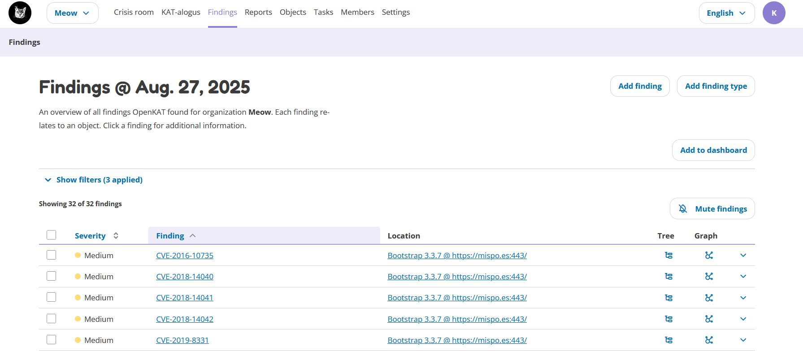
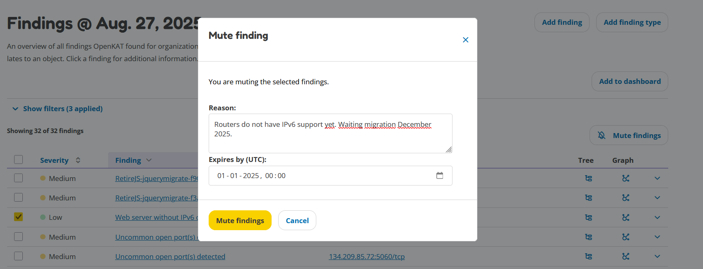

Findings
========

The findings page gives an overview of all findings found by OpenKAT.
The filter section can be used to apply various filters to show specific findings (e.g. critical findings only) and/or hosts.
The search bar can be used to search for specific findings or hosts. Clicking on a finding shows more information on this finding.
Each finding can be viewed in the tree or graph by clicking the corresponding icons behind the finding.

A finding is also an object in the data model. This simply means that the finding can also be found on the Objects page.

Muted findings
--------------
Findings can be muted until a specific date. This will prevent the finding(s) from showing up in the default view.
Using the filters you can show all muted findings, or both muted and non-muted findings.

One or more findings can be selected. The textbox at the bottom allows for a description
as to why this finding is muted (e.g. for audit purposes, or for review at a later point in time).
Below the textbox the expiry date for the selected findings can be provided.
Click the button 'Mute Findings' to mute the selected findings.

