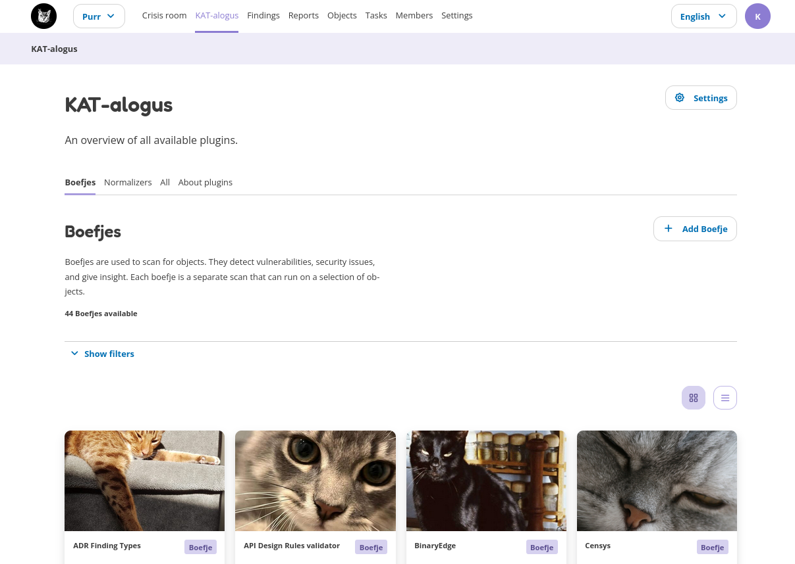
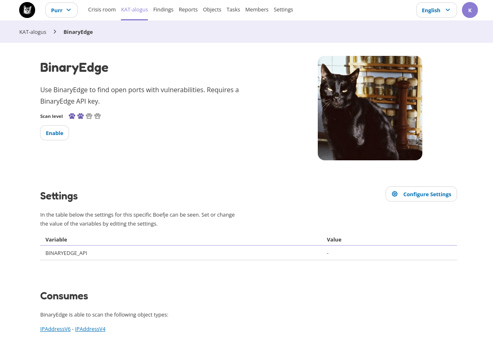

KAT-alogus
==========

The KAT-alogus (KAT catalog) is the place where you can see which plugins are available, enabled and/or disabled.
Plugins can be common security scanning tools, like nmap (checks which ports are open), or specific tools that check for a CVE vulnerability.
The KAT-alogus also contains all the Normalizers, which parse the data from the tools.
Each plugin (Boefje and Normalizer) contains more information on how it works and what is required, including the objects it can search for,
and which objects are required for the plugin to work.

Before a plugin can run the following two conditions must be met:

- The Boefje and corresponding Normalizer are enabled. Note: all Normalizers are enabled by default.
- The clearance level of your object (e.g. hostname or URL) is at least the required scan level of the enabled plugin.

New Boefjes can be added by an administrator in the web interface.

Each plugin has a details page with information about the tool, the scan level and additional settings that can be given to the plugin.
It also gives an overview on the required objects before the plugin can run ("Consumes") and which output objects are created ("Produces").
The details page also gives an overview of all associated tasks and which objects match the clearance level.

