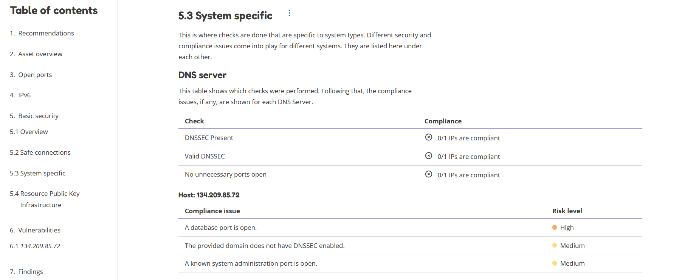

Reports
=======

OpenKAT displays all findings in the crisis room, the entry point for all current information from the system.
In addition, you can create reports where all the found information can be collected.

Kind of reports
---------------
With the Reports functionality you can create reports with a specific focus.

There are 3 different kinds of reports available:

- **Separate report:** selecting one or more reports will show the contents of each report below each other. This kind of report might be turned off by default by your administrator.
- **Aggregate report:** selecting one or more reports will show aggregated data for each selected report. This means that some results are aggregated to provide a general overview of the current compliance status of the scanned objects.
- **Multi report:** allows you to compare one organisation with another based on the organisation tags. This is only possible for aggregate reports. A multi report is very similar to an aggregate report, but shows data across multiple organisations.

All kinds of reports can be exported as PDF. The Aggregate Report can also be exported as JSON.

Report types
------------
When creating a report, you have to choose one or more report types for your report.

The table below gives an overview of the 12 reports available.
It also describes which object needs to be selected and whether the report is available as a normal and/or as an aggregate report.

.. list-table:: Report overview table
   :widths: 25 50 25 25 25 25
   :header-rows: 1

   * - Report type
     - Description
     - Input object
     - Required plugins
     - Optional plugins
     - Normal or Aggregate report
   * - DNS
     - The DNS report gives an overview of the identified DNS settings for the scanned hostnames.
     - Hostname
     - dns-records, dns-sec
     - dns-zone
     - Normal
   * - Findings
     - Shows all the finding types and their occurrences.
     - Hostname, IPAddressV4, IPAddressv6, URL
     -
     -
     - Normal
   * - IPv6
     - Check whether hostnames point to IPv6 addresses.
     - Hostname, IPAddressV4, IPAddressV6
     - dns-records
     -
     - Normal + aggregate
   * - Mail
     - System specific mail report that focusses on IP addresses and hostnames.
     - Hostname, IPAddressV4, IPAddressV6
     - dns-records
     -
     - Normal + aggregate
   * - Name server
     - Name server report checks name servers on basic security standards.
     - Hostname, IPAddressV4, IPAddressV6
     - nmap, dns-records, dns-sec
     -
     - Normal + aggregate
   * - Open ports
     - Find open ports of IP addresses.
     - Hostname, IPAddressV4, IPAddressV6
     - nmap
     - shodan, nmap-udp, nmap-ports, nmap-ip-range, masscan
     - Normal + aggregate
   * - RPKI
     - Shows whether the IP is covered by a valid RPKI ROA. For a hostname it shows the IP addresses and whether they are covered by a valid RPKI ROA.
     - Hostname, IPAddressV4, IPAddressV6
     - dns-records, rpki
     -
     - Normal + aggregate
   * - Safe connections
     - Shows whether the IPService contains safe ciphers.
     - Hostname, IPAddressV4, IPAddressV6
     - dns-records, testssl-sh-ciphers, nmap
     -
     - Normal + aggregate
   * - System
     - Combine IP addresses, hostnames and services into systems.
     - Hostname, IPAddressV4, IPAddressV6
     - dns-records, nmap
     - nmap-udp
     - Normal + aggregate
   * - TLS
     - TLS reports assess the security of data encryption and transmission protocols.
     - **IPService**
     - testssl-sh-ciphers
     -
     - Normal
   * - Vulnerability
     - Vulnerabilities found are grouped for each system.
     - Hostname, IPAddressV4, IPAddressV6
     - dns-records, nmap, webpage-analysis
     - nmap-udp, nmap-ports, shodan
     - Normal + aggregate
   * - Web system
     - Web system reports check web systems on basic security standards.
     - Hostname, IPAddressV4, IPAddressV6
     - nmap, dns-records, security_txt_downloader, testssl-sh-ciphers, ssl-version, ssl-certificates,webpage-analysis
     -
     - Normal + aggregate

Report contents
---------------
The table below gives an overview of the elements that can be found in each report type based on the required plugins:

.. list-table:: Report overview
   :widths: 25 50 25 25
   :header-rows: 1

   * - Report type
     - Normal report
     - Aggregate report
     - Multi report
   * - Standard elements
     - * Introduction
       * Asset overview (selected objects, reports, plugins)
     - * Summary overview
       * Recommendations
       * Asset overview
       * Open ports overview
       * IPv6 overview
       * Basic Security overview table (groups the systems based on types and (compliance) checks to get a general impression of the current status.)
       * Vulnerabilities
       * Appendices (Terms, selected objects, reports, plugins and used config objects)
     - * Introduction
       * Summary
       * Recommendations
       * Asset overview
       * Open port occurrences
       * IPv6 connectivity overview
       * Basic Security overview table (groups the systems based on types and (compliance) checks to get a general impression of the current status.)
       * Safe connections overview
       * System specific overview
       * RPKI overview
       * Appendices (Terms, selected objects, reports, plugins and used config objects)
   * - DNS
     - The table gives an overview of all identified DNS records for the selected hostname. This can help to identify potential misconfigurations for hostnames. The Security Measures table shows which DNS security measures are applied and/or missing.
     - The report shows per system type how many of the identified IPs/systems are compliant with the DNS checks. If in-compliant systems are identified, a compliance issue description is provided with the corresponding risk level.
     - Overview on the compliance status of various DNS checks across all systems.
   * - Findings
     - Shows an overview table with the number of findings and occurrences per risk level (critical, high, medium, low, recommendation), followed by a list of all findings. Each finding can be opened to view more details, such as a description of the finding, the possible impact, a general recommendation and the hosts where this finding was identified.
     - Gives an overview of all findings (KAT, CVE and/or custom findings).
     - Overview on the vulnerabilities checks across all systems.
   * - IPv6
     - Shows if IPv6 was detected on the scanned system.
     - The report shows per hostname if an IPv6 address was detected.
     - Overview on the IPv6 status categorised per system type.
   * - Mail
     - The table gives an overview of some security configurations that are recommended to be implemented to ensure authenticated e-mails are sent on behalf of the hostname. The compliance checks look at the presence of SPF, DKIM and DMARC, which are used to prevent spammers from sending unwanted e-mails. Each check will show whether or not the system is compliant with this security configuration. If a lack of compliance is identified, the table below will show what compliance issue was identified with what risk.
     - The report shows per system type how many of the identified IPs/systems are compliant with the e-mail checks. If in-compliant systems are identified, a compliance issue description is provided with the corresponding risk level.
     - Overview on the compliance status of various e-mail checks across all systems.
   * - Name server
     - The table gives an overview of the recommended security configurations to ensure an increased level of security for the domain name servers for the scanned domain. The compliance checks look at the presence and configuration of DNSSEC, and the open ports that are enabled. Each check will show whether or not the system is compliant with this security configuration. If a lack of compliance is identified, the table below will show what compliance issue was identified with what risk. **This requires that the hostnames of the name servers are selected!**
     - The aggregate findings of the name server report can be found under the DNS checks.
     - The aggregated data can be found under the DNS checks.
   * - Open ports
     - Shows for the identified IP addresses which ports were found to be open and thus reachable. If available the table will show the IPv4 and/or IPv6 addresses, the hostname(s) and all open ports identified on both IPv4 and IPv6 (if available). Please note that you have to manually enable IPv6 support in Dockerized environments. See the docs on how to do this.
     - The report shows the open ports for all scanned IP addresses.
     - The table gives an overview on the number of occurrences for each open port.
   * - RPKI
     - The table gives an overview of the RPKI status for the selected domain. It currently shows if RPKI is available and if the data is not expired.
     - The table gives an overview of the RPKI status grouped per system type. It currently shows if RPKI is available and if the data is not expired.
     - The table gives an overview on the number of occurrences of the RPKI status grouped per system type. It currently shows if RPKI is available and if the data is not expired.
   * - Safe connections
     - The table gives an overview of some security configurations that are recommended to be implemented to ensure safe connections (encryption). The compliance checks look at the TLS protocols and TLS Ciphers offered by the system. Each check will show whether or not the system is compliant with this security configuration. If a lack of compliance is identified, the table below will show what compliance issue was identified with what risk.
     - The report shows per system type how many of the identified IPs/systems are compliant with the safe connections checks. If in-compliant systems are identified, a compliance issue description is provided with the corresponding risk level.
     - The table shows the number of occurrences matching the compliance checks.
   * - Systems
     - The table gives an overview of which system types were identified on the system. This is performed based on the identified open ports, which can have one or more of the following labels: DICOM, DNS, Mail, Web, Other.
     - For each identified system type all checks are grouped together.
     - Overview of the compliance checks grouped per system type with the number of occurrences.
   * - TLS
     - The table shows which TLS protocol versions and TLS ciphers were identified on the system, including the status of the identified data. This means that if outdated protocols (such as SSL3) are identified, the table will show a recommendation such as ‘Phase out’.
     - The aggregate findings of the TLS report can be found under the safe connections checks.
     - This data is aggregated under the safe connections checks.
   * - Vulnerability
     - The table gives an overview of the identified CVE's on the system.
     - The table gives an overview of the identified CVE's on the system.
     - The table gives an overview of the identified CVE's on the system.
   * - Web system
     - The table gives an overview of some basic security configurations that are recommended to be implemented. These checks are performed against the scanned systems/hosts.  Each check will show whether or not the system is compliant with this security configuration. If a lack of compliance is identified, the table below will show what compliance issue was identified with what risk.
     - The results of the web server checks against all web servers are grouped together and an overview is provided how many of the web servers are compliant with each check. If in-compliant systems are identified, a compliance issue description is provided with the corresponding risk level.
     - The number of occurrences for each web check are shown.

Report flow
-----------
On the Reports page you can generate new reports and get an overview of all generated reports.
With the button 'Generate report' you get into the Report flow wizard, which can be used to choose your report, objects and plugins that are required for the report.
There are two ways to select objects. You can manually select objects, which will be static.
Or you can select a live set of objects by continuing with the selected filters.
The selected objects will then always be based on the selected filters at the time of generating the report.
And please note that enabling plugins during the report flow wizard will result in inaccurate data,
as the plugins will take some time before they have gathered and analyzed all data.
Check the Tasks page to verify that all tasks have completed.

If you need more help on generating a report, please check our step-by-step instructions :doc:`here <../getting-started/generate-report>`.

Plugins
-------
Each report has both required and suggested plugins that are used to show data in the report. These plugins are shown in the report flow.
You can still generate reports if not all required plugins are enabled, however a warning a message is
shown and the generated report will show that not all required plugins were enabled at the time of generation.

Report naming
-------------
When creating a report, two name formats are needed: one for the overall report and one for the underlying asset reports.
Every asset report consists of one input object and one report type (e.g. a DNS report for mispo.es).
The overall report contains all the asset reports and also has its own name.

Reports can be named dynamically based on their input objects and report type.
The following placeholders can be used to create dynamic report names:

.. list-table:: Name format
   :widths: 25 50 50
   :header-rows: 1

   * - Placeholder
     - (Overall) report name format
     - Asset report name format
   * - ${report_type}
     - Results in the report type of the overall report, depending on the flow that has been selected. Eg. 'Concatenated Report', 'Aggregate Report' or 'Multi Report'.
     - Results in the report type of the asset report. E.g. 'DNS Report', 'Mail Report', 'Vulnerability Report'.
   * - ${ooi}
     - If there's only one input object selected, this will show the input object. If multiple input objects have been selected, this placeholder will remain visible.
     - Always results in the input object of the asset report.
   * - ${oois_count}
     - Returns the total number of all underlying asset reports.
     - Always returns '1', since an asset report consists of 1 input object and 1 report type.

The pre-filled name formats are as follows:

- For the (overall) report: '${report_type} for ${oois_count}', which may result in, for example, 'Aggregate Report for 16 objects'
- For the asset reports: '${report_type} for ${ooi}', which will result in a different name for each asset report. E.g. 'DNS Report for mispo.es'

Besides these placeholders, it is also possible to use Python Strftime formats. For example, '%x' results in '01/01/25' and '%X' results in '07:06:05'.

Downloading and/or exporting a report
-------------------------------------
The normal and multi report can be downloaded as PDF file. The aggregate report can be exported as a PDF and also as a JSON file.
Just click the 'Download' or 'Export' button on the right.
The JSON output can be used to create a Multi-Report and compare organization sectors.

Generating a Multi Report
-------------------------
With the Multi report you can compare organisations, for example if both are similar health care institutions.
Create two organisations and make sure both organisations have data. For this tutorial they are named `CAT` and `DOG`.

#. In `CAT` generate an ‘Aggregate Report’ and export this to JSON format. Repeat this step for `DOG`.

#. Create a third organisation called `BIRD`.

#. In `BIRD`, go to Objects > Add > ‘Upload raw file’.

#. Upload both raw files (from `CAT` and `DOG`) using the mime-type openkat/report-data’. (the mime-type will be auto-prefilled if you navigate to the upload page from the report normalizer.

#. Click on ‘Reports’ and click on ‘Multi Report’.

#. Select the report data of the organisations `CAT` and `DOG` and follow the report flow steps to generate the report. If you do not see your uploaded reports please make sure you have cleared the filter first.

Troubleshooting
---------------
When you do not see one (or more) of the reports options, please check the following things:

- Do you have the required object selected? (This is either the Hostname or IPService for all reports, except the findings report.)
- Does your selected object have sufficient clearance? Generally L2 or higher is required.
