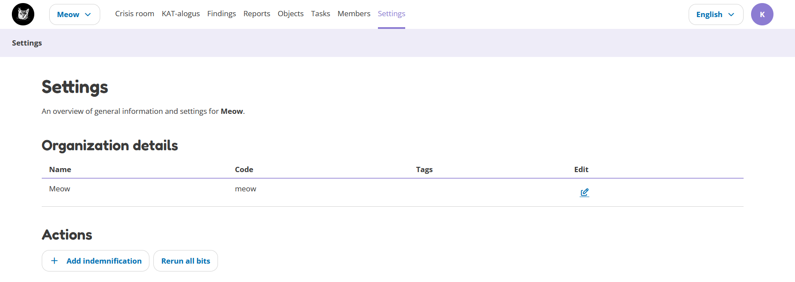

Settings
========

The Settings page shows general information and its settings. In some cases you might want to add tags to the organisation or decide to manually run all bits.
This can be done from the settings page. If you created a new organization, you can also add the indemnification on this page.

The settings that can be changed on this page:

- Change organization data
- Add indemnification
- Rerun all bits on the current dataset
- Add tags to the organization

