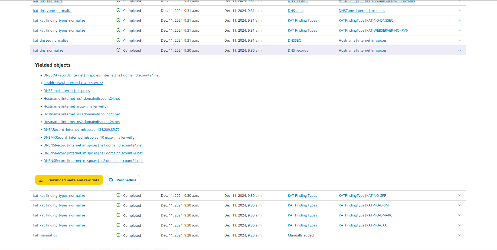

Tasks
=====

All tasks can be found on the Tasks page. A task is created for each job that needs to be performed, such as running a Boefje,
Normalizer or for generating a report. Each Boefje is performed on an object (such as a hostname, finding, DNS records, etc.) and each Normalizer on a raw file.
Tasks have a status to show if the task is completed, scheduled, queued, etc.
Each task contains meta and raw data that can be downloaded.
This is the output, error message, proof, security hashes, etc. that belongs to the boefje or normalizer.
Tasks can also be rescheduled and filtered to find specific tasks.

Tasks are organised between the Boefje and Normalizer tabs. The image below shows what the Boefje tab could look like.

The image below shows the Normalizer tasks by clicking on the Normalizer tab.

The Normalizer tab has a special functionality called 'yielded objects'.
If the Normalizer was able to extract new objects, these will be shown here.

**Example:**
  The DNS records for the hostname `mispo.es` are parsed, as seen in the image below.
  The Normalizer identifies various DNS records (A, NS, MX, SOA) and other information and creates objects for each of the identified information.
  This information is now also available to other plugins.

