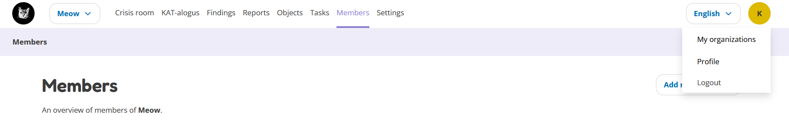
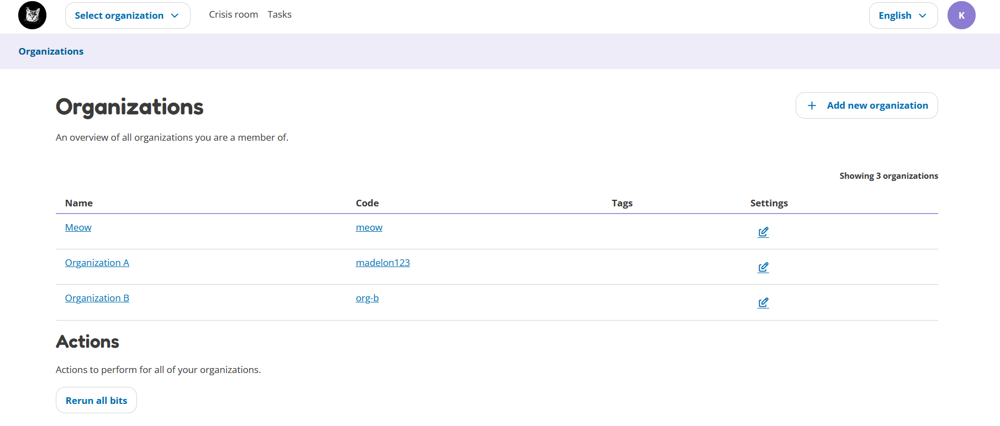
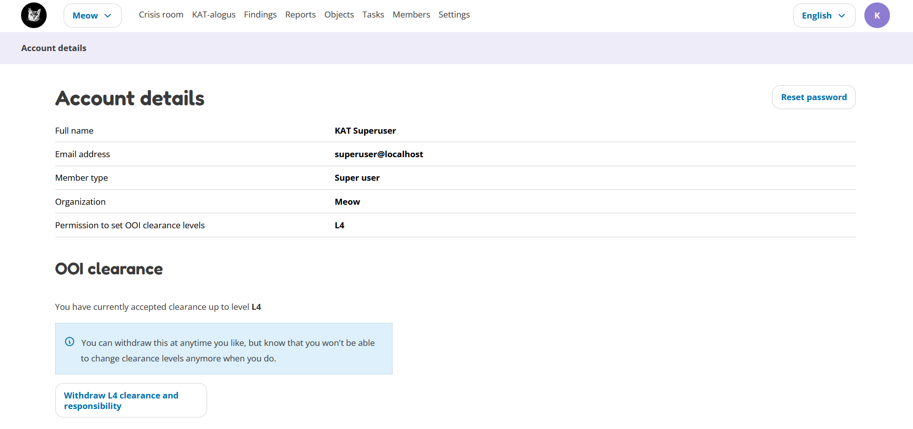

User settings
=============

Clicking on your account name in the top right corner, allows you to open the user settings options.

Here you can see three options:

- My organizations
- Profile
- Logout

My organization
---------------
This page shows you an overview of all your organizations. You can select and go to an organization, add a new organization,
rerun all bits for all organizations or change the settings of the individual organizations.
Changing the settings will lead you to the Settings page of the selected organization.

Profile
-------
On this page, you can see your account details and accept or withdraw the clearance and responsibility.

You can see your member type and the permissions granted to you to set object clearance levels.
For example: if you have been given L2, this means you can only set objects to a maximum of L2.
To actually change the clearance level of an object, you also need to accept the clearance and responsibility,
which you can do at the bottom of the profile page. See :doc:`../basic-concepts/scan-levels-and-indemnification` for more information about the meaning of these clearance levels.

