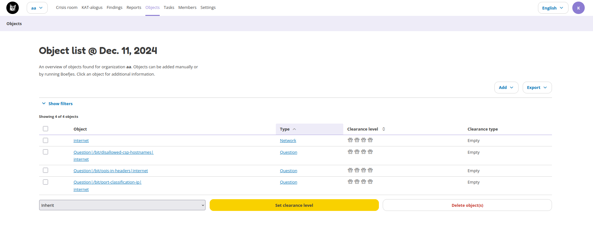
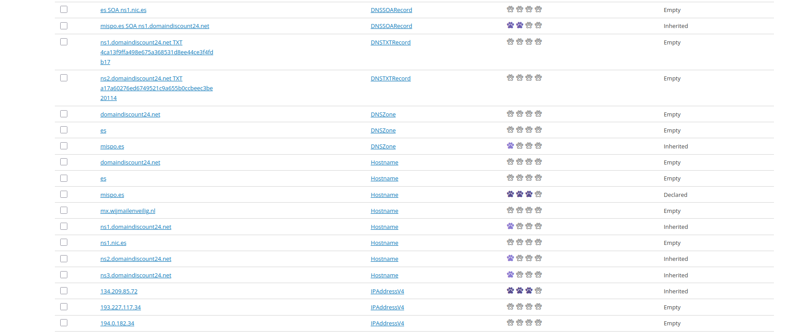
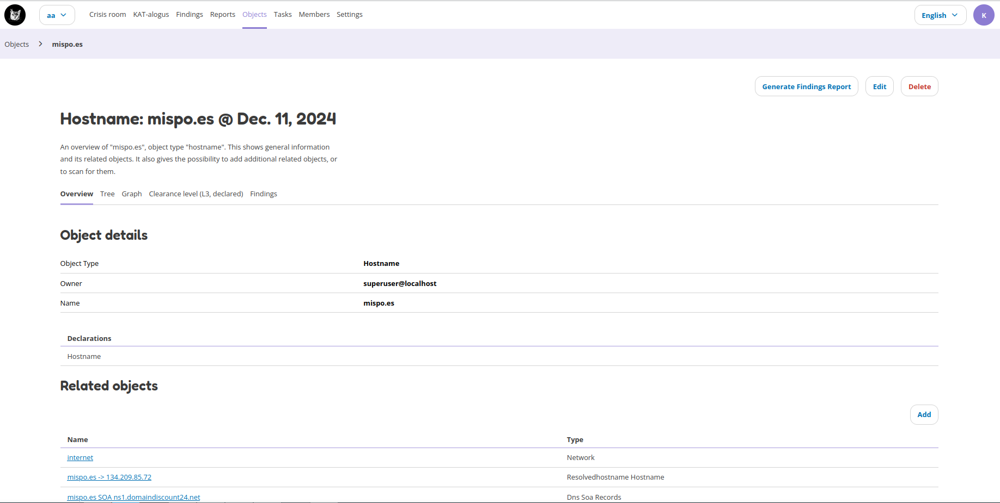

Objects
=======

The Objects page lists all the objects in Octopoes. Objects can be anything, like DNS records, hostnames, URLs, software, software versions, ports, etc. It is any piece of information that is found by the normalizers, bits and boefjes. On a new installation you'll see the following objects by default:

The table gives an overview on the following items:
- Object: this is the piece of data that was identified, such as a port, software version, hostname, etc.
- Object type: this shows how this object is labelled.
- Clearance level: this shows the clearance level of this object.
- Clearance type: this shows what kind of clearance level is set on the object. See `Object clearances` __ below for more information.

The objects can be filtered by object types, clearance levels and clearance types. The search functionality can also be used to search for specific objects, such as hostnames.

More information on objects is provided by clicking on the object. This will give an overview page with all information for the specific object. The object details page is further described below.

Object clearances
-----------------
Each object has a clearance type. The clearance type tells how the object was added to the Objects list. The following object types are available:

- Declared: declared objects were added by the user.
- Inherited: inherited objects were identified through propagation and the parsing of bits and normalizers. This means there is a relation to other object(s).
- Empty: empyth objects do not have a relation to other objects.

The objects below show different clearance types for various objects. The hostname `mispo.es` was manually added and thus is `declared`. The DNS zone is `inherited` based on the DNS zone boefje.

Object details
--------------
Object details can be found by clicking on an object on the Objects page. Object details provide data on that specific object and how it relates to other objects. The following detail tabs are available:

- Overview: the overview tab gives object details, it's declaration, related objects (objects that are somehow related), tasks that ran on this object, findings that are applicable to this object and a list of boefjes that can scan this object.
- Tree: the tree tab shows how all objects are related to this object. The point of view will be from the specific object. Thus the view for a hostname will be slightly different than the tree view for an IP address. Filters can be applied to the tree view.
- Graph: the graph tab visually shows how the objects are connected using lines. The graph is interactive, meaning you can click on objects in the graph. Filters can be applied to the graph view.
- Clearance level: the clearance level can be changed on the clearance level tab. This tab also shows the clearance type (declared, inherited, empty) and the inheritance tree for the object.
- Findings: the findings tab shows all findings that are linked to this object. Different objects have different findings, meaning that the Findings tab for a hostname is likely different from the findings tab for an IP address.

