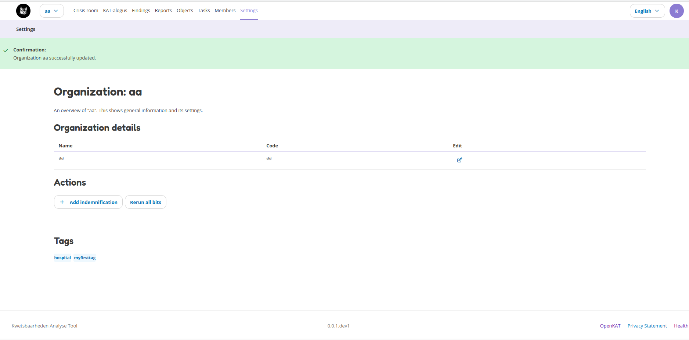

Settings
========

The Settings page shows general information and its settings. In some cases you might want to add tags to the organisation or decide to manually run all bits. This can be done from the settings page. If you created a new organization, you can also add the indemnification on this page.

* Organization data
* Indemnification
* Rerun all bits on the current dataset
* Tags

