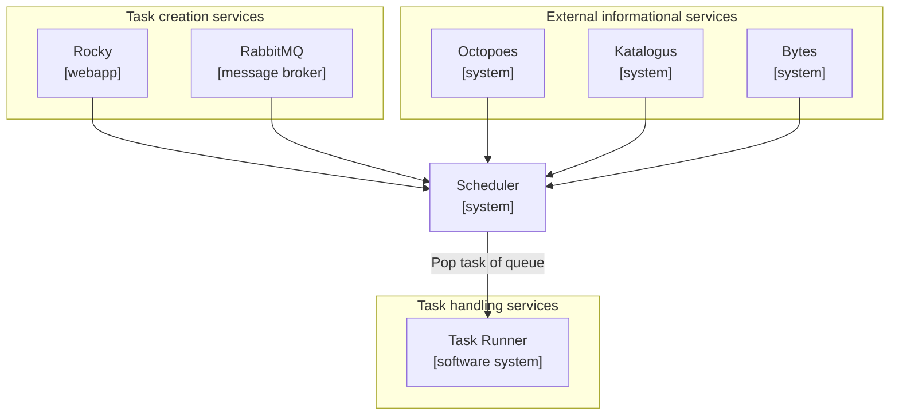
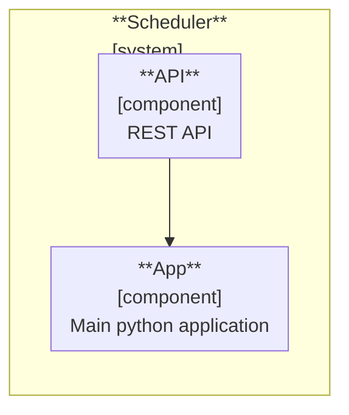
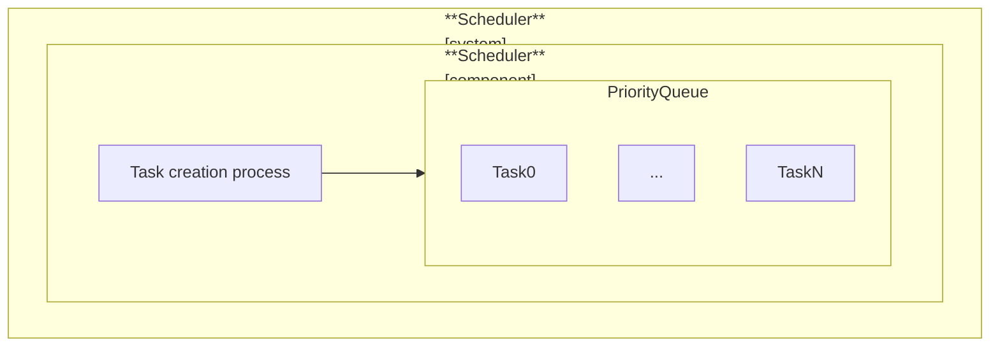
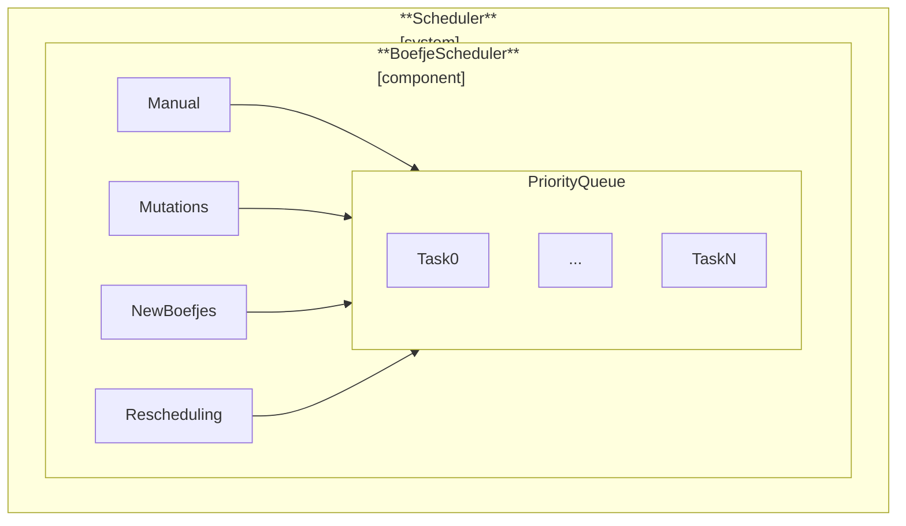
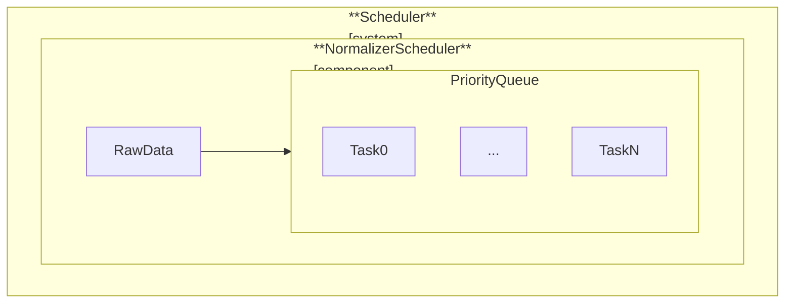
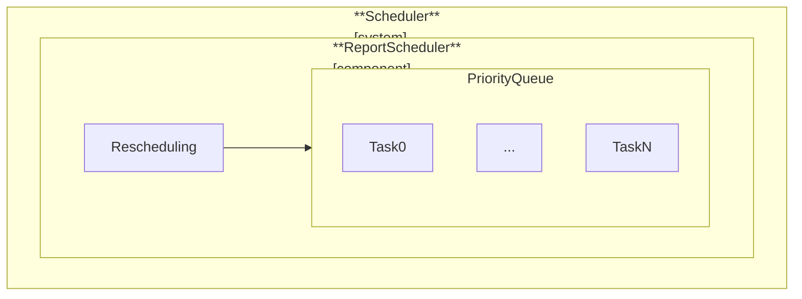

# Scheduler Architecture

## Purpose

The _scheduler_ is tasked with populating and maintaining a priority queues of
tasks, and can be popped off through HTTP API calls. The scheduler is
designed to be extensible, such that you're able to create your own rules for
the population, scheduling, and prioritization of tasks.

In the implementation of the scheduler within OpenKAT the scheduler is tasked
with scheduling and populating the priority queues of `boefje`, `normalizer` and
`report` tasks.

In this document we will outline how the scheduler operates within KAT, how
internal systems function and how external services use it.

## Architecture / Design

In order to get a better overview of how the scheduler is implemented we will
be using the [C4 model](https://c4model.com/) to give an overview of the
scheduler system with their respective level of abstraction.

### C2 Container level

First we'll review how the `Scheduler` system interacts and sits in between its
external services. In this overview arrows from external services indicate how
and why those services communicate with the scheduler. The `Scheduler` system
combines data from the `Octopoes`, `Katalogus`, `Bytes` and `RabbitMQ` systems.

External services used and for what purpose:

- RabbitMQ; messaging queues to notify the scheduler of scan level changes
  and the creation of raw files from bytes

- Rocky; interfaces with the scheduler through its rest api

- Octopoes; retrieval of ooi information

- Katalogus; retrieval of plugin and organization information

- Bytes; retrieval of raw file information



### C3 Component level

When we take a closer look at the `scheduler` system itself we can identify
several components. The `App` directs the creation and maintenance
of several schedulers. And the `API` that is responsible for interfacing with
the `Scheduler` system.



Typically in a OpenKAT installation 3 scheduler will be created

1. _boefje scheduler_
2. _normalizer scheduler_
3. _report scheduler_

Each scheduler type implements it's own priority queue, and can implement it's
own processes of populating, and prioritization of its tasks. Interaction with
the scheduler and access to the internals of the `App` can be achieved by
interfacing with the `Server`. Which implements a HTTP REST API interface.

## Dataflows

Within a KAT implementation of the scheduler we can identify several dataflows
of how tasks are created and pushed onto the priority queue. In the following
section we review how different dataflows, from the `boefjes`, the
`normalizers`, `report` schedulers are implemented within the `Scheduler`
system.

First let's explore the base classes from which the individual schedulers are
derived.

### `Scheduler`

#### `PriorityQueue`

Every implementation of a `Scheduler` contains a `PriorityQueue` that is
responsible for maintaining a queue of tasks for `Task Runners` to pick up and
process. A `Scheduler` is responsible for creating `Task` objects and pushing
them onto the queue.



The `PriorityQueue` derives its state from the state of the `Task` objects that
are persisted in the database. In other words, the current state of the
`PriorityQueue` are the `Task` objects with the status of `QUEUED`.

#### `Task`

A `Task` object contains the following fields:

| Field          | Description                                                   |
| -------------- | ------------------------------------------------------------- |
| `scheduler_id` | The id of the scheduler for which this task is created        |
| `schedule_id`  | Optional, the id of the `Schedule` that created the task      |
| `priority`     | The priority of the task                                      |
| `organisation` | The organisation for which the task is created                |
| `status`       | The status of the task                                        |
| `type`         | The type of the task                                          |
| `data`         | A JSON object containing the task data                        |
| `hash`         | A unique hash generated by specific fields from the task data |

Important to note is the `data` field contains the object that a `Task Runner`
will use to execute the task. This field is a JSON field that allows any object
to be persisted. It's schema is enforced by which scheduler its task is pushed
on. For a `BoefjeScheduler` only `BoefjeTask` objects are allowed to be
pushed. This is the same for the other schedulers.

By doing this, it allows the scheduler to wrap whatever object within a `Task`,
and as a result we're able to create and extend more types of schedulers that
are not specifically bound to a type.

A json representation of a `Task` object, for example a `BoefjeTask` object
as the `data` field:

```json
{
  "scheduler_id": "1",
  "schedule_id": "1",
  "priority": 1,
  "organisation": "openkat-corp",
  "status": "PENDING",
  "type": "boefje",
  "data": {
    "ooi": "internet",
    "boefje": {
      "id": "dns-zone",
      "scan_level": 1
    }
  },
  "hash": "a1b2c3d4e5f6g7h8i9j0"
}
```

A `Task` is a one-time execution of a task and is a unique instance of task that
is present in the `data` object. This means that you will encounter several
instances of the same task. We generate a unique hash for each task by hashing
specific fields from the `data` object. This hash is used to identify the task
within the `PriorityQueue` and is used to check if the same task is already on
the queue.

This approach ensures that the historical record of each task's execution is
distinct, providing a clear and isolated view of each instance of the task's
lifecycle. This strategy enables maintaining accurate and unambiguous
monitoring and logging of task executions over time. Additionally it enables us
an overview and insights of what tasks have been created in the past and what
tasks are currently running. You might know this overview from Rocky as the
task list.

To keep track of the status of this task throughout the system we update its
`status`

- When a `Task` has been created by the scheduler it will get the status of
  `PENDING` (1) meaning a task has been created but it hasn't been queued yet.

- When the `Task` is pushed onto the queue it will get the status of `QUEUED` (2).

- When the `Task Runner` picks up the task by popping the `Task`
  from the queue the status will be updated to `DISPATCHED` (3).

- The `Task Runner` is now able to start executing the `Task` and the status
  will be updated to `RUNNING` (4) by the `Task Runner`.

- Whenever the task has been completed, the 'Task Runner' will update the
  status by either setting the status to `COMPLETED`, `FAILED` or `CANCELLED`.
  (5)

#### `Schedule`

When a `Task` is created for a `Scheduler` it can be defined whether or not
that `Scheduler` can create `Schedule` objects for its `Task` objects. A
`Schedule` object is a way to define when a `Task` should be executed
automatically on a recurring schedule by the `Scheduler`.

A `Schedule` will use the _'blueprint'_ that is defined in its `data` field (this
is the same as the `data` field of a `Task`) to generate a `Task` object to be
pushed on the queue of a `Scheduler`.

A `Schedule` object contains the following fields:

| Field          | Description                                                                                                        |
| -------------- | ------------------------------------------------------------------------------------------------------------------ |
| `scheduler_id` | The id of the scheduler that created the schedule                                                                  |
| `schedule`     | A cron expression that defines when the task should be executed, this is used to update the value of `deadline_at` |
| `deadline_at`  | A timestamp that defines when the task should be executed                                                          |
| `data`         | A JSON object containing data for the schedule (this is the same as the `data` field in the `Task` object)         |
| `hash`         | A unique hash generated by specific fields from the schedule data                                                  |

A `Scheduler` can be extended by a process that checks if the `deadline_at`
of a `Schedule` has passed, and if so, creates a `Task` object for the
`Scheduler` to push onto the queue.

Typically when the `Task` object is pushed onto the queue, the new
`deadline_at` value of the `Schedule` is calculated using the cron expression
defined in the `schedule` field. Refer to the specific `Scheduler` for more
information on how this is implemented.

### `BoefjeScheduler`

#### Design

A `BoefjeScheduler` is tasked with creating tasks that are able to be picked
up and processed by the "Boefje Runner". The `BoefjeScheduler` creates a
`BoefjeTask` to the specification that the "Boefje Runner" can interpret.

The scheduler wraps this `BoefjeTask` within a `Task`, this is done such that we
can push the task on the queue and add extra information to this `Task`, like
its priority, its status, and its type. We uniquely identify a task that is
contained within the `Task` by its hash.

For example with a `BoefjeTask` we unique identify a task by hashing the values
of: the ooi, the boefje id, and the organization id. So for a `Task` we know
what specific `BoefjeTask` it contains by this hash.

Before a `BoefjeTask` and pushed on the queue we will check the following:

- `has_boefje_permission_to_run()`

  - is boefje enabled
  - are scan levels between boefje and ooi correct

- `has_boefje_task_grace_period_passed()`

  - has the grace period passed according to the datastore (`TaskStore`)?
  - has the grace period passed according to Bytes?

- `has_boefje_task_stalled()`

  - is the task status still `DISPATCHED` for longer than the grace-period?

- `has_boefje_task_started_running()`

  - is task still running according to the datastore (`TaskStore`)?
  - is task still running according to Bytes?

- `is_item_on_queue_by_hash()`

  - check if the same task is already on the priority queue using the `hash`

#### Processes



In order to create a `BoefjeTask` and trigger the dataflow we described above
we have 3 different processes running in threads within a `BoefjeScheduler`
that can create boefje tasks. Namely:

| Process                 | Description                                                                                        |
| ----------------------- | -------------------------------------------------------------------------------------------------- |
| `process_mutations`     | scan profile mutations received from RabbitMQ indicating that the scan level of an OOI has changed |
| `process_new_boefjes`   | enabling of boefjes will result in gathering of OOI's on which the boefje can be used              |
| `process_rescheduling ` | rescheduling of prior tasks                                                                        |

Additionally, a boefje task creation can be triggered by a manual scan job that
is created by the user in Rocky.

##### 1. Scan profile mutations

When a scan level is increased on an OOI
(`schedulers.boefje.process_mutations`) a message is pushed
on the RabbitMQ `{organization_id}__scan_profile_mutations` queue. The scheduler
continuously checks if new messages are posted on the queue. The resulting tasks
from this process will get the second highest priority of 2 on the queue.

The dataflow is as follows:

- When scan level mutation occurred, the `Scheduler` system will get the scan
  profile mutation from the `RabbitMQ` system.

- For the associated OOI of this scan profile mutation, the `Scheduler` system
  will get the enabled boefjes for this OOI. (`ooi * boefjes = tasks`)

- For each enabled boefje, a `BoefjeTask` will be created and added to the
  `PriorityQueue` of the `BoefjeScheduler`. A `BoefjeTask` is an object with
  the correct specification for the task runner to execute a boefje.

- The `BoefjeScheduler` will then create a `Task` and push it to the
  queue. The `PrioritizedItem` will contain the created `BoefjeTask`.

- A `Schedule` is created, or updated for the `Task` (`post_push()`).

##### 2. Enabling of boefjes

When a plugin of type `boefje` is enabled or disabled in Rocky. The dataflow is
triggered when the plugin cache of an organisation is flushed.

The dataflow is as follows:

- The plugin cache of the organisation will be flushed at a specified interval.

- Due to the flushing of the cache we get a new list of enabled boefjes for
  an organisation.
  (`connectors.services.katalogus._flush_organisations_boefje_type_cache()`)

- New `BoefjeTask` tasks will be created for enabled boefjes and on which type
  of ooi it can be used.

- The `BoefjeScheduler` will then create a `Task` and push it to the queue. The
  `Task` will contain the created `BoefjeTask`.

- A `Schedule` is created, or updated for the `Task` (`post_push()`).

##### 3. Rescheduling of prior tasks

In order to re-run tasks that have been executed in the past we reference
`Schedule` objects whose `deadline_at` has passed. The `BoefjeScheduler` will
create a `BoefjeTask` for the `Task` that is associated with the `Schedule`.

The dataflow is as follows:

- From the database we get the `Schedule` objects whose `deadline_at` has passed.

- For each `Schedule` we create a new `Task` containing a `BoefjeTask`

- The `BoefjeScheduler` will push it to the queue.

- The `Schedule` is updated for the `Task` (`post_push()`).

##### 4. Manual scan job

Scan jobs created by the user in Rocky (`server.push_queue`), will
get the highest priority of 1. Note, that this will circumvent all the checks
that are present in the `BoefjeScheduler`.

The dataflow is as follows:

- Rocky will create a `BoefjeTask` that will be pushed directly to the
  specified queue.

- The `BoefjeScheduler` will then create a `Task` and push it to the
  queue. The `Task` will contain the created `BoefjeTask`.

- A `Schedule` is created, or updated for the `Task` (`post_push()`).

### `NormalizerScheduler`

#### Design

The `NormalizerScheduler` is tasked with creating tasks that are able to be
picked up and processed by a normalizer task runner. The scheduler creates a
`NormalizerTask` to the specification that the task runner can interpret,
namely the instance of a `NormalizerTask`.

Before `NormalizerTask` is wrapped by a `Task`, and pushed to the
queue we will check the following:

- `has_normalizer_permission_to_run()`

  - is the normalizer enabled

- `has_normalizer_task_started_running()`

  - is task still running according to the datastore (`TaskStore`)?

- `is_item_on_queue_by_hash()`

  - check if the same task is already on the priority queue using the `hash`

#### Processes



The following processes within a `NormalizerScheduler` will create a
`NormalizerTask` tasks:

1. A raw file is created in Bytes

##### 1. Raw file creation in Bytes

When a raw file is created (`schedulers.normalizer.process_raw_data`)

- The `NormalizerScheduler` retrieves raw files that have been created in Bytes
  from a message queue.

- For every mime type of the raw file, the `NormalizerScheduler` will retrieve
  the enabled normalizers for this mime type.

- For every enabled normalizer, a `NormalizerTask` will be created and added to
  the `PriorityQueue` of the `NormalizerScheduler`.

### `ReportScheduler`

#### Design

The `ReportScheduler` is tasked with creating report tasks that are able to be
picked up and processed by the report task runner.

#### Processes



The `ReportScheduler` will create a `ReportTask` for the `Task` that is
associated with a `Schedule` object.

1. Manual creation of `Schedule` for `ReportTask`
2. Rescheduling of `ReportTask` based on `Schedule` objects

##### 1. Manual creation of `Schedule` for `ReportTask`

A user can create a "Report Recipe" within Rocky, and define a recurrence
schedule of this report to be executed. A `Schedule` is created for this
"Report Recipe" and posted to the `Scheduler` API. The `ReportScheduler` will
continuously check for `Schedule` object whose `deadline_at` has passed.

##### 2. Rescheduling of `ReportTask` based on `Schedule` objects

The `ReportScheduler` will create a `ReportTask` for the `Task` that is
associated with a `Schedule` object. The `ReportScheduler` will continuously
check for `Schedule` objects whose `deadline_at` has passed and will push the
`ReportTask` tasks to the queue.

## Project structure

```
.
├── docs/                           # additional documentation
├── scheduler/                      # scheduler python module
│   ├── clients/                    # external service clients
│   │   ├── amqp/                   # amqp clients
│   │   ├── http/                   # http api clients
│   │   ├── __init__.py
│   │   ├── connector.py
│   │   └── errors.py
│   ├── config/                     # application settings configuration
│   ├── context/                    # shared application context
│   ├── models/                     # internal model definitions
│   ├── schedulers/                 # schedulers
│   │   ├── queue/                  # priority queue implementation
│   │   ├── rankers/                # rankers for tasks
│   │   ├── schedulers/
│   │   │   ├── __init__.py
│   │   │   ├── boefje.py           # boefje scheduler implementation
│   │   │   ├── normalizer.py       # normalizer scheduler implementation
│   │   │   └── report.py           # report scheduler implementation
│   │   ├── __init__.py
│   │   └── scheduler.py            # abstract base class for schedulers
│   ├── storage/                    # data abstraction layer
│   ├── server/                     # http rest api server
│   ├── utils/                      # common utility functions
│   ├── __init__.py
│   ├── __main__.py
│   ├── app.py                      # openkat scheduler app implementation
│   └── version.py                  # version information
└─── tests/                        # test suite
```

The following describes the main components of the scheduler application:

- `App` - The main application class, which is responsible for starting the
  schedulers. It also contains the server, which is responsible for handling
  the rest api requests. The `App` implements multiple `Scheduler` instances.
  The `run()` method starts the schedulers, the listeners, the monitors, and
  the server in threads. The `run()` method is the main thread of the
  application.

- `Scheduler` - And implementation of a `Scheduler` class is responsible for
  populating the queue with tasks. Contains a `PriorityQueue`. The `run()`
  method starts executes threads and listeners, which fill up the queue with
  tasks.

- `PriorityQueue` - The queue class, which is responsible for storing the
  tasks.

- `Server` - The server class, which is responsible for handling the HTTP
  requests.
