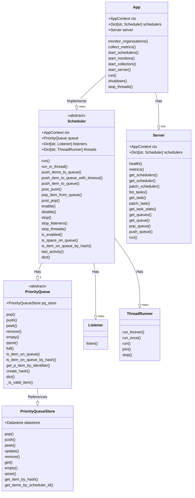
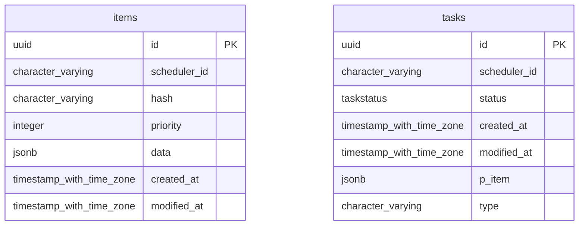

# Scheduler Architecture

## Purpose

The _scheduler_ is tasked with populating and maintaining a priority queue of
items that are ranked, and can be popped off through HTTP API calls.
The scheduler is designed to be extensible, such that you're able to create
your own rules for the population, and prioritization of tasks.

The _scheduler_ implements a priority queue for prioritization of tasks to be
performed by the worker(s). In the implementation of the scheduler within KAT
the scheduler is tasked with populating the priority queue with 'boefje' and
'normalizer' tasks. Additionally the scheduler is responsible for maintaining
and updating its internal priority queue.

A priority queue is used, in as such, that it allows us to determine what tasks
should be picked up first, or more regularly. Because of the use of a priority
queue we can differentiate between tasks that are to be executed first, e.g.
tasks created by the user get precedence over tasks that are created by the
internal rescheduling processes within the scheduler.

Calculations in order to determine the priority of a task are performed by the
`ranker`. The `ranker` can leverage information from multiple (external)
sources, called `connectors`.

In this document we will outline how the scheduler operates within KAT, how
internal systems function and how external services use it.

## Architecture / Design

In order to get a better overview of how the scheduler is implemented we will
be using the [C4 model](https://c4model.com/) to give an overview of the
scheduler system with their respective level of abstraction.

### C2 Container level

First we'll review how the `Scheduler` system interacts and sits in between its
external services. In this overview arrows from external services indicate how
and why those services communicate with the scheduler. The `Scheduler` system
combines data from the `Octopoes`, `Katalogus`, `Bytes` and `RabbitMQ` systems.


- Octopoes

- RabbitMQ

- Katalogus

- Bytes

### C3 Component level

### C3 Component level:

When we take a closer look at the `scheduler` system itself we can identify
several components. The 'Scheduler App' directs the creation and maintenance
of a multitude of schedulers. Typically in a KAT installation 2 scheduler will
be created per organisation: a _boefje scheduler_ and a _normalizer scheduler_.


Each scheduler type implements it's own priority queue, and can implement it's own
way of populating, and prioritization of its queue. The associated queues of an
individual scheduler is persisted in a SQL database.

Interaction with the scheduler and access to the internals of the 'Scheduler
App' can be accessed by the `Server` which implements a HTTP REST API interface.

## Dataflows

Within a KAT implementation of the scheduler we can identify several dataflows
of how tasks are created and pushed onto the priority queue. In the following
section we review how different dataflows, from the `boefjes` and the
`normalizers` schedulers are implemented within the `Scheduler` system.

### `BoefjeScheduler`

#### Design

First, we wil use the `BoefjeScheduler` as an example. A `BoefjeScheduler` is
tasked with creating tasks that are able to be picked up and processed by a
'Task Runner'. The scheduler creates a `BoefjeTask` to the specification that
the 'Task Runner' can interpret, namely in this instance of a `BoefjeTask`.


The scheduler wraps this `BoefjeTask` within a `PrioritizedItem` (`p_item`),
this is done such that we can push the task on the queue and add extra
information to this `PrioritizedItem`, like its priority. We uniquely identify
a task that is contained within the `PrioritizedItem` by its hash.


By doing this, it allows the scheduler to wrap whatever object within a
`PrioritizedItem`, and as a result we're able to create and extend more types
of schedulers that are not specifically bound to a type. Additionally this
allows us to persist its items to a database and makes it so that the queue can
be interchanged with a different technology if so desired.

And we want to uniquely identify a task because we want to make sure that the
same tasks are not being pushed on the queue (de-duplication), or that they are
being rescheduled too quickly (grace-period). For example with a `BoefjeTask`
we unique identify a task by hashing the values of: the ooi, the boefje id, and
the organization id. So for a `PrioritizedItem` we know what specific
`BoefjeTask` it contains by this hash.

Before a `BoefjeTask` is wrapped by a `PrioritizedItem`, and pushed on the queue
we will check the following:

- `is_task_allowed_to_run()`

  - is boefje enabled
  - are scan levels between boefje and ooi correct

- `is_task_running()`

  - is task still running according to the datastore (`TaskStore`)?
  - is task still running according to Bytes?

- `has_grace_period_passed()`

  - has the grace period passed according to the datastore (`TaskStore`)?
  - has the grace period passed according to Bytes?

- `is_task_stalled()`

  - is task status still `DISPATCHED` for longer than the grace-period?

- `is_item_on_queue_by_hash()`

  - check if the same task is already on the priority queue

Important to note is that when a `BoefjeTask` is created and pushed onto the
queue as a `PrioritizedItem` a new unique `TaskRun` is generated.[^1] This
ensures that each task has its own dedicated `TaskRun` throughout its entire
lifecycle. This approach maintains a distinct record for each task, providing
an accurate and independent history of task statuses. This means that each
execution of a `BoefjeTask`, regardless of whether it's the same task being
repeated in the future, is tracked independently with its own unique `TaskRun`.

This approach ensures that the historical record of each task's execution is
distinct, providing a clear and isolated view of each instance of the task's
lifecycle. This strategy enables maintaining accurate and unambiguous
monitoring and logging of task executions over time. Additionally it enables us
an overview and insights of what tasks have been created in the past and what
tasks are currently running. You might know this overview from Rocky as the
task list.


Whenever a task is created in the scheduler it flows through the system, to
keep track of the status of this task throughout the system we update its
`TaskRun` reference.

- When a `BoefjeTask` has been created by the scheduler it is packaged within
  its `PrioritizedItem` and it will get the status of `PENDING` (1) meaning a
  task has been created but it hasn't been queued yet.

- When the `PrioritizedItem` is pushed onto the queue the `TaskRun` will get a
  status update and will get the status of `QUEUED` (2).

- When the 'Task Runner' picks up the task by popping the `PrioritizedItem`
  from the queue the `TaskRun` status will be updated to `DISPATCHED` (3).

- The 'Task Runner' is now able to start executing the `BoefjeTask` that was
  contained in the `PrioritizedItem` and the status of the `TaskRun` will be
  updated to `RUNNING` (4).

- Whenever the task has been completed the 'Task Runner' will update the
  `TaskRun` status by either setting the status to `COMPLETED`, `FAILED` or
  `CANCELLED`. (5)

#### Processes

In order to create a `BoefjeTask` and trigger the dataflow we described above
we have 4 different processes within a `BoefjeScheduler` that can create boefje
tasks. Namely:

1. scan profile mutations
2. enabling of boefjes
3. rescheduling of prior tasks
4. manual scan job


##### 1. Scan profile mutations


When a scan level is increased on an OOI
(`schedulers.boefje.push_tasks_for_scan_profile_mutations`) a message is pushed
on the RabbitMQ `{organization_id}__scan_profile_mutations` queue. The scheduler
continuously check if new messages are posted on the queue. The resulting tasks
from this process will get the second highest priority of 2 on the queue.

The dataflow is as follows:

- When scan level mutation occurred, the `Scheduler` system will get the scan
  profile mutation from the `RabbitMQ` system.

- For the associated OOI of this scan profile mutation, the `Scheduler` system
  will get the enabled boefjes for this OOI. (`tasks = ooi * boefjes`)

- For each enabled boefje, a `BoefjeTask` will be created and added to the
  `PriorityQueue` of the `BoefjeScheduler`. A `BoefjeTask` is an object with
  the correct specification for the task runner to execute a boefje.

- The `BoefjeScheduler` will then create a `PrioritizedItem` and push it to the
  queue. The `PrioritizedItem` will contain the created `BoefjeTask`.

- A `TaskRun` reference to the task is created to keep track of the status
  of the task (`post_push`).

##### 2. Enabling of boefjes


When a plugin of type `boefje` is enabled or disabled in Rocky. The dataflow is
triggered when the plugin cache of an organisation is flushed.

The dataflow is as follows:

- The plugin cache of the organisation will be flushed at a specified interval.

- Due to the flushing of the cache we get a new list of enabled boefjes for
  an organisation.
  (`connectors.services.katalogus._flush_organisations_boefje_type_cache()`)

- New `BoefjeTask` tasks will be created for enabled boefjes and on which type
  of ooi it can be used.

- The `BoefjeScheduler` will then create a `PrioritizedItem` and push it to the
  queue. The `PrioritizedItem` will contain the created `BoefjeTask`.

- A `TaskRun` reference to the task is created to keep track of the status
  of the task (`post_push`).

##### 3. Rescheduling of prior tasks


In order to re-run tasks that have been executed in the past we try to create
new tasks on ooi's. We continuously get a batch of random ooi's from octopoes
(`schedulers.boefje.push_tasks_for_random_objects`). The `BoefjeTask` tasks
from these these ooi's (`tasks = ooi * boefjes`) will get the priority that has
been calculated by the ranker.

At the moment a task will get the priority of 3, when 7 days have gone by (e.g.
how longer it _hasn't_ executed again, the higher the priority it will get).
For everything before those 7 days it will scale the priority appropriately.

The dataflow is as follows:

- From Octopoes we get `n` random ooi's (`get_random_objects`)

- For each OOI, the `Scheduler` will get the enabled boefjes for this OOI.
  (`tasks = ooi * boefjes`)

- For each enabled boefje, a `BoefjeTask` will be created and added to the
  `PriorityQueue` of the `BoefjeScheduler`.

- The `BoefjeScheduler` will then create a `PrioritizedItem` and push it to the
  queue. The `PrioritizedItem` will contain the created `BoefjeTask`.

- A `TaskRun` reference to the task is created to keep track of the status
  of the task (`post_push`).

##### 4. Manual scan job


Scan jobs created by the user in Rocky (`server.push_queue`), will
get the highest priority of 1. Note, that this will circumvent all the checks
that are present in the `BoefjeScheduler`.

The dataflow is as follows:

- Rocky will create a `BoefjeTask` that will be pushed directly to the
  specified queue.

- The `BoefjeScheduler` will then create a `PrioritizedItem` and push it to the
  queue. The `PrioritizedItem` will contain the created `BoefjeTask`.

- A `TaskRun` reference to the task is created to keep track of the status
  of the task (`post_push`).

### `NormalizerScheduler`

#### Design

The `NormalizerScheduler` is tasked with creating tasks that are able to be
picked up and processed by a 'Task Runner'. The scheduler creates a
`NormalizerTask` to the specification that the 'Task Runner' can interpret,
namely the instance of a `NormalizerTask`.

The of queueing and processing a `NormalizerTask` task is the same as for
the `BoefjeScheduler`. Reference that section for a more in-depth explanation.

Before `NormalizerTask` is wrapped by a `PrioritizedItem`, and pushed to the
queue we will check the following:

- `is_task_allowed_to_run()`

  - is the normalizer enabled

- `is_task_running()`

  - is task still running according to the datastore (`TaskStore`)?

#### Processes

The following processes within a `NormalizerScheduler` will create a
`NormalizerTask` tasks:

1. A raw file is created in Bytes

##### 1. Raw file creation in Bytes

When a raw file is created (`schedulers.normalizer.create_tasks_for_raw_data`)

- The `NormalizerScheduler` retrieves raw files that have been created in Bytes
  from a message queue.

- For every mime type of the raw file, the `NormalizerScheduler` will retrieve
  the enabled normalizers for this mime type. (`create_tasks_for_raw_data()`)

- For every enabled normalizer, a `NormalizerTask` will be created and added to
  the `PriorityQueue` of the `NormalizerScheduler`.

## Class Diagram

The following diagram we can explore the code level of the scheduler
application, and its class structure.

The following describes the main components of the scheduler application:

- `App` - The main application class, which is responsible for starting the
  schedulers. It also contains the server, which is responsible for handling
  the rest api requests. The `App` implements multiple `Scheduler` instances.
  The `run()` method starts the schedulers, the listeners, the monitors, and
  the server in threads. The `run()` method is the main thread of the
  application.

- `Scheduler` - And implementation of a `Scheduler` class is responsible for
  populating the queue with tasks. Contains a `PriorityQueue`. The `run()`
  method starts executes threads and listeners, which fill up the queue with
  tasks.

- `PriorityQueue` - The queue class, which is responsible for storing the
  tasks.

- `Server` - The server class, which is responsible for handling the HTTP
  requests.



## Database Entity Relationship Diagram



## Project structure

```
$ tree -L 3 --dirsfirst
.
├── docs/                           # additional documentation
├── scheduler/                      # scheduler python module
│   ├── config                      # application settings configuration
│   ├── connectors                  # external service connectors
│   │   ├── listeners               # channel/socket listeners
│   │   ├── services                # rest api connectors
│   │   └── __init__.py
│   ├── context/                    # shared application context
│   ├── models/                     # internal model definitions
│   ├── queues/                     # priority queue
│   ├── rankers/                    # priority/score calculations
│   ├── storage/                    # data abstraction layer
│   ├── schedulers/                 # schedulers
│   ├── server/                     # http rest api server
│   ├── utils/                      # common utility functions
│   ├── __init__.py
│   ├── __main__.py
│   ├── app.py                      # kat scheduler app implementation
│   └── version.py                  # version information
└─── tests/
    ├── factories/
    ├── integration/
    ├── mocks/
    ├── scripts/
    ├── simulation/
    ├── unit/
    ├── utils/
    └── __init__.py
```

[^1]:
    As of writing a `TaskRun` is known within the scheduler as a `Task`. In the
    future the naming of this model will change to accurate describe its role
    and functionality.
