# Scheduler Architecture

## Purpose

The _scheduler_ is tasked with populating and maintaining a priority queue of
items that are ranked, and can be popped off through HTTP API calls.
The scheduler is designed to be extensible, such that you're able to create
your own rules for the population, and prioritization of tasks.

The _scheduler_ implements a priority queue for prioritization of tasks to be
performed by the worker(s). In the implementation of the scheduler within KAT
the scheduler is tasked with populating the priority queue with 'boefje' and
'normalizer' tasks. Additionally the scheduler is responsible for maintaining
and updating its internal priority queue.

A priority queue is used, in as such, that it allows us to determine what tasks
should be picked up first, or more regularly. Because of the use of a priority
queue we can differentiate between tasks that are to be executed first, e.g.
tasks created by the user get precedence over tasks that are created by the
internal rescheduling processes within the scheduler.

Calculations in order to determine the priority of a task is performed by the
`ranker` that leverages information from multiple (external) sources,
called `connectors`.

In this document we will outline how the scheduler operates within KAT, how
iternal systems function and how external services use it.

## Architecture / Design

In order to get a better overview of how the scheduler is implemented we will
be using the [C4 model](https://c4model.com/) to give an overview of the
scheduler system with their respective level of abstraction.

### C2 Container level:

First we'll review how the `Scheduler` system interacts and sits in between its
external services. In this overview arrows from external services indicate how
and why those services communicate with the scheduler. The `Scheduler` system
combines data from the `Octopoes`, `Katalogus`, `Bytes` and `RabbitMQ` systems.

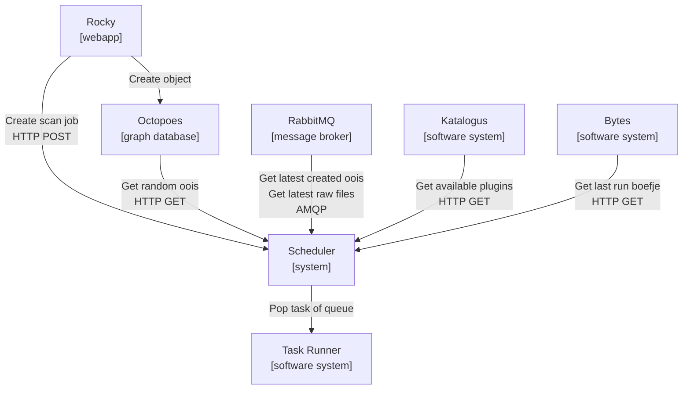

### C3 Component level:

When we take a closer look at the `scheduler` system itself we can identify
several components. The 'Scheduler App' directs the creation and maintenance
of a multitude of schedulers. Typically in a KAT installation, 2 schedulers
will be created per organisation: a boefje scheduler and a normalizer scheduler.

Each scheduler can implement it's own way of populating, and prioritization of
its queue. The associated queues of an individual scheduler is persisted in
a SQL database table.

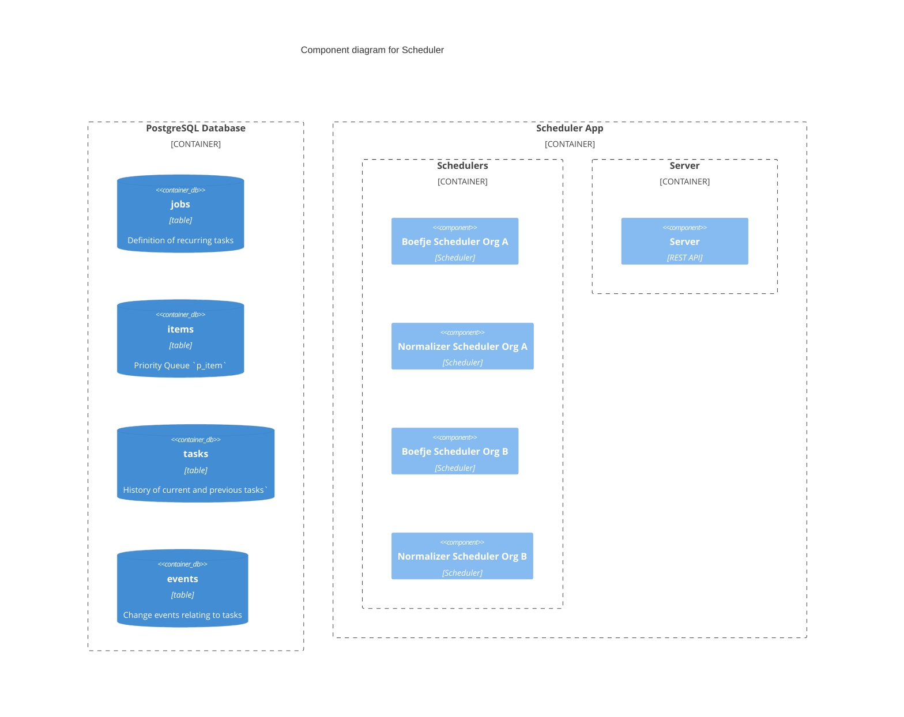

**Boefje Scheduler**

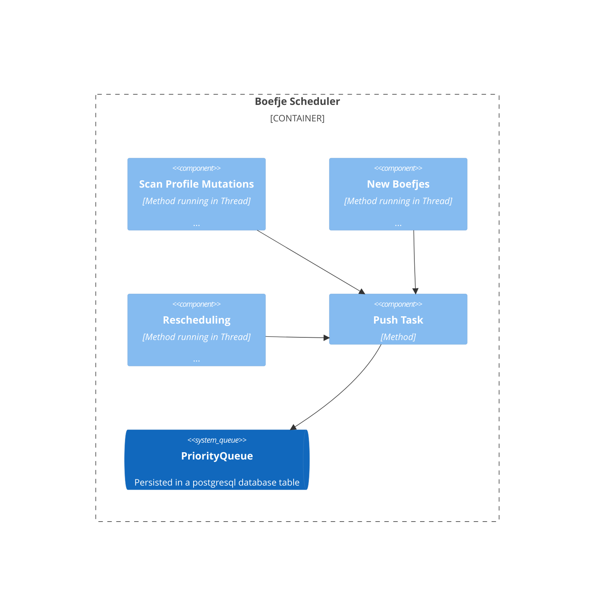

**Normalizer Scheduler**

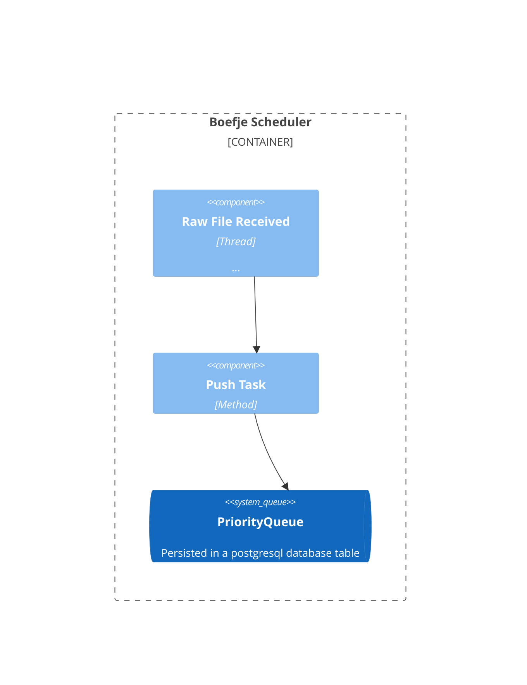

A more complete overview of the different components within the scheduler app:

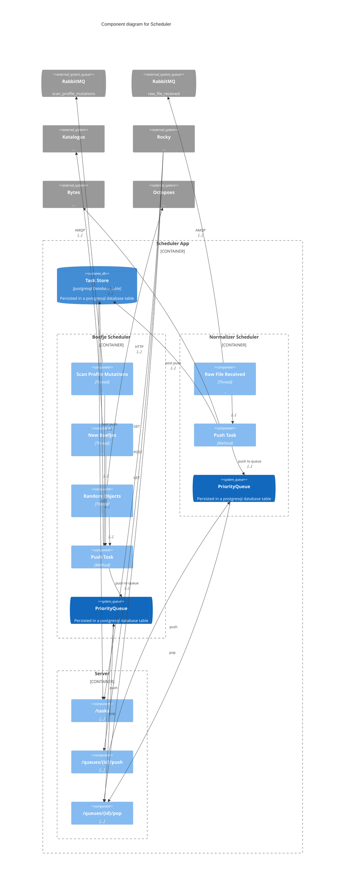

## Dataflows

Following we review how different dataflows, from the `boefjes` and the
`normalizers` are implemented within the `Scheduler` system. The following
events within a KAT installation will trigger dataflows in the `Scheduler`.
With the current implementation of the scheduler we identify the creation of
two different type of tasks, `boefje` and `normalizer` tasks.

A graphical representation of task creation dataflows:

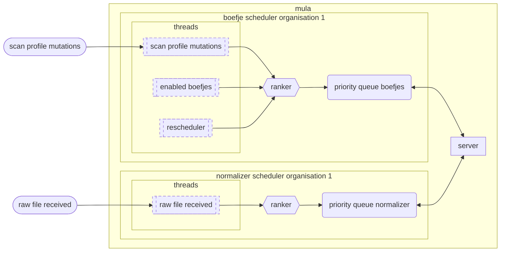

### Boefje scheduler

For a `boefje` scheduler the following events will trigger a dataflow procedure
to be executed and subsequently the creation of a `boefje` task:

1. **scan profile mutation**: the scan profile level of an ooi increased
2. **enabled boefje**: a boefje has been enabled
3. **rescheduling**: a prior task has been rescheduled
4. **scan initiated**: from the webapp rocky a scan has been initiated

**1. Scan profile mutation**

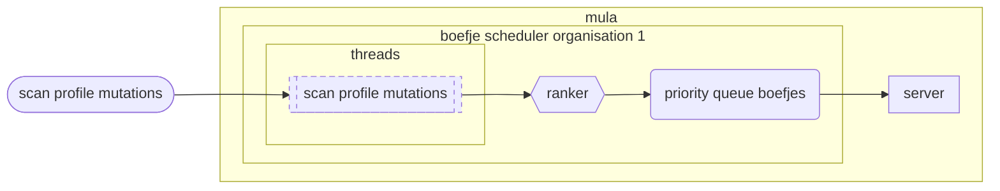

When a scan level is increased on an OOI
(`schedulers.boefje.push_tasks_for_scan_profile_mutations`) the following will
happen:

- When scan level mutation occurs, the `Scheduler` system will get the
  scan profile mutation from the `RabbitMQ` system.

- For the associated OOI of this scan profile mutation, the `Scheduler`
  system will fetch the enabled boefjes for this OOI. (`tasks = ooi * boefjes`)

- For each enabled boefje, a `BoefjeTask` will be created and added to the
  `PriorityQueue` of the `BoefjeScheduler` as a 'PrioritizedItem`.
A `BoefjeTask` is an object with the correct specification for the task
  runner to execute a boefje.

- Each task will be checked if it is:

  - `is_allowed_to_run()`

  - `is_task_running()`

  - `has_grace_period_passed()`

  - `is_item_on_queue_by_hash()`

- The `BoefjeScheduler` will then create a `PrioritizedItem` and pushes it to
  the queue. The `PrioritizedItem` will contain the created `BoefjeTask` within
  a data field.

- The `BoefjeTask` will be added to the database (`post_push()`). And serves
  as a log of the current and prior tasks that have been queued/executed,
  and can be queried through the API.

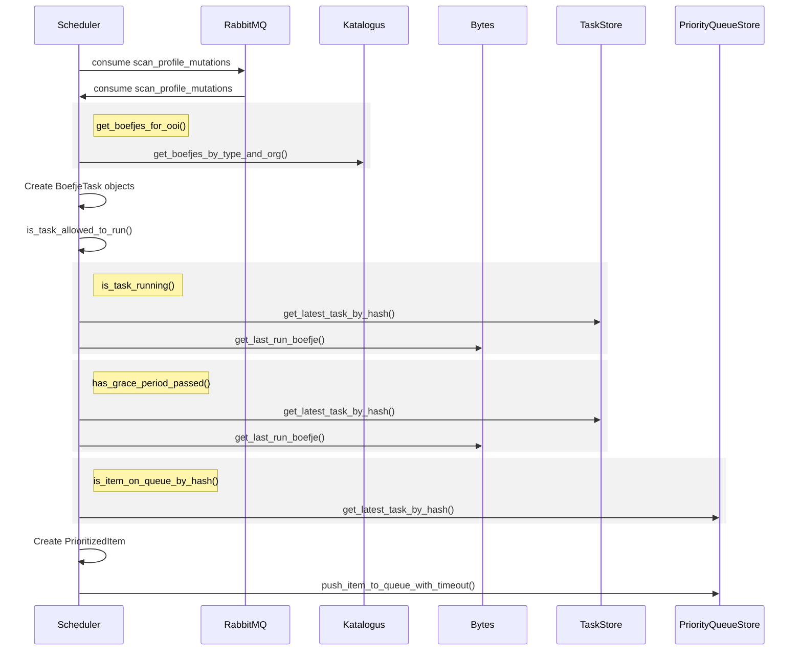

**2. Enabled Boefjes**

When a plugin of type `boefje` is enabled or disabled in the Katalogus. The
scheduler will take notice of it by referencing its internal cache of all
the available plugins of an organisation. This will happen after:

- The cache of the organisation is flushed at a specified interval.

- Due to the flushing of the cache we get a new list of enabled boefjes for
  an organisation will be created.
  (`connectors.services.katalogus._flush_organisations_boefje_type_cache()`)

- New tasks will be created for enabled boefjes.

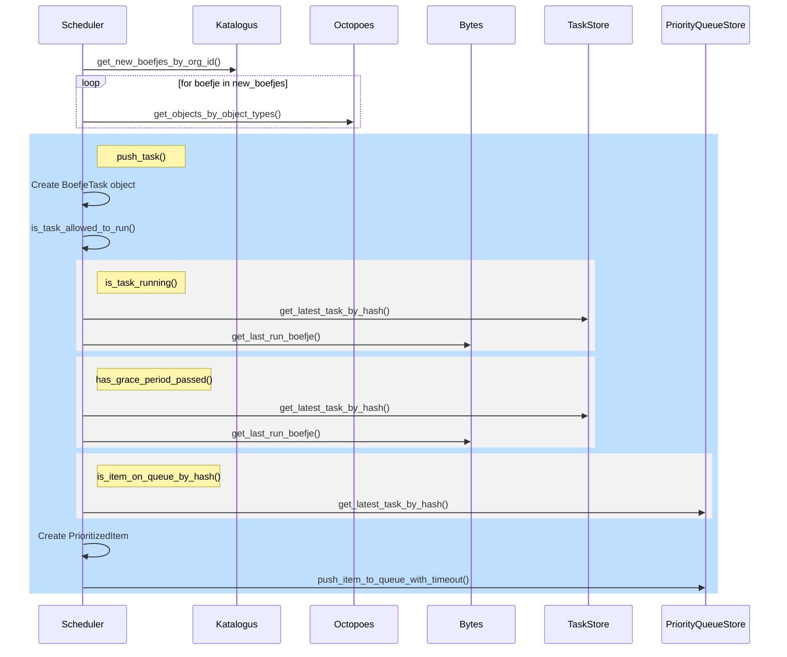

**3. Rescheduling**

For every `Task` that has been created within the scheduler a `Job` is created
for it. A `Job` contains the blueprint of an executed `Task` and is wrapped
within a `PrioritizedItem` so that it can be pushed onto the queue. A `Job` has
a 1:m relation to executed tasks.

These `Job` models allow us to keep track of tasks that need to be
rescheduled and executed at another time in the future. Either by calculation
(calculation of a new deadline), or by specification (adding a cron expression).

The scheduler continuously checks for jobs where their deadline has passed:

- Get all jobs for which the deadline has passed
- Evaluate job (are we able to run the job, for instance a boefje scheduler: is
  the ooi available, is boefje available, are scan levels correct)
- Calculate priority, and push to queue
- Calculate and set deadline (using information about the results of the task)
  for the job on signal job of finished

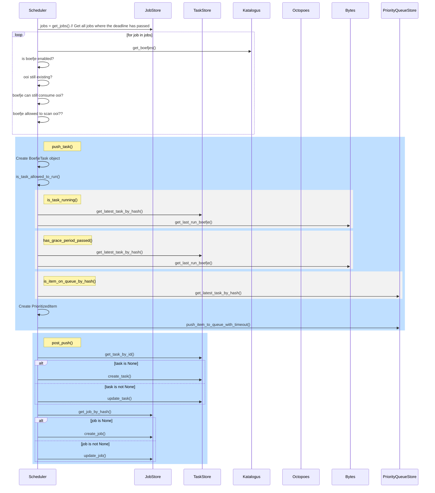

**4. Scan initiated**

Scan jobs created by the user in Rocky (`server.push_queue`), these tasks will
get the highest priority of 1. Note, that this will circumvent all the checks
that are present in

- Rocky will create a `BoefjeTask` that will be pushed directly to the
  specified queue.

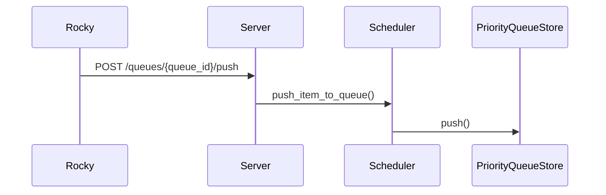

### Normalizer Scheduler

For a `normalizer` task the following events will trigger a dataflow procedure

1. **raw file received**: bytes creates a signal on the message queue that
   it created a raw file.

\*_ 1. Raw file received_

When a raw file is created (`schedulers.normalizer.create_tasks_for_raw_data`)

- The `NormalizerScheduler` retrieves raw files that have been created in
  Bytes from a message queue.

- For every mime type of the raw file, the `NormalizerScheduler` will
  retrieve the enabled normalizers for this mime type.
  (`create_tasks_for_raw_data()`)

- For every enabled normalizer, a `NormalizerTask` will be created and added
  to the `PriorityQueue` of the `NormalizerScheduler`.

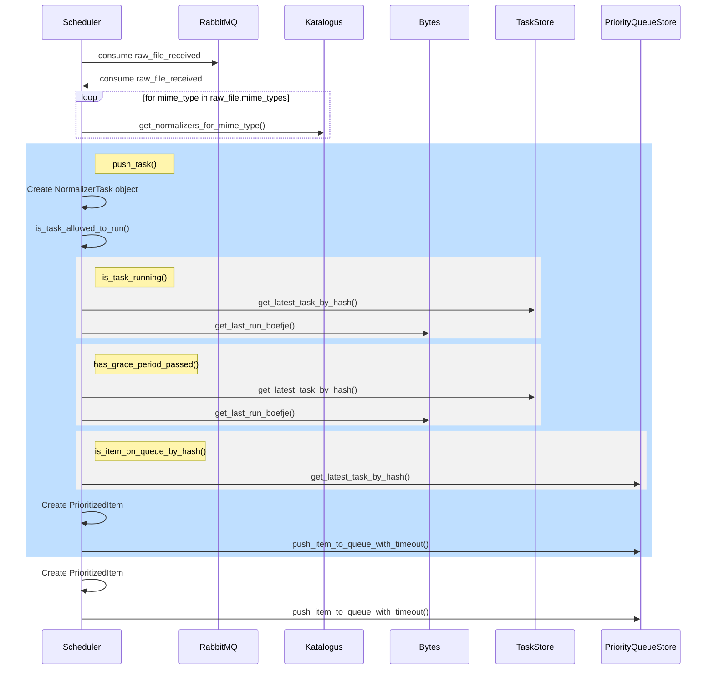

The following describes the main components of the scheduler application:

- `App` - The main application class, which is responsible for starting the
  schedulers. It also contains the server, which is responsible for handling
  the rest api requests. The `App` implements multiple `Scheduler` instances.
  The `run()` method starts the schedulers, the listeners, the monitors, and
  the server in threads. The `run()` method is the main thread of the
  application.

- `Scheduler` - And implementation of a `Scheduler` class is responsible for
  populating the queue with tasks. Contains has a `PriorityQueue` and a
  `Ranker`. The `run()` method starts executes threads and listeners, which
  fill up the queue with tasks.

- `PriorityQueue` - The queue class, which is responsible for storing the
  tasks.

- `Ranker` - The ranker class, which is responsible for ranking the tasks,
  and can be called from the `Scheduler` class in order to rank the tasks.

- `Server` - The server class, which is responsible for handling the HTTP
  requests.
