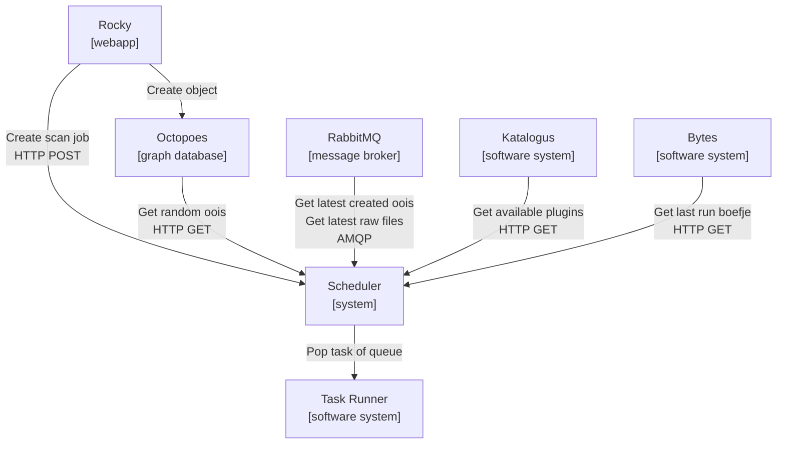
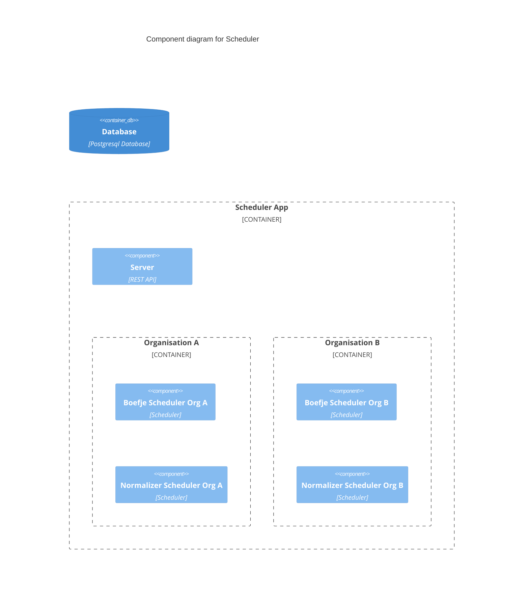
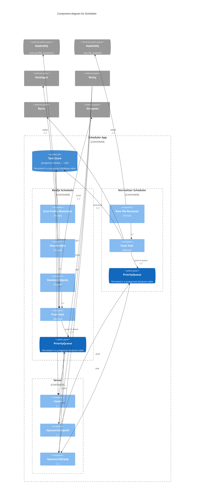
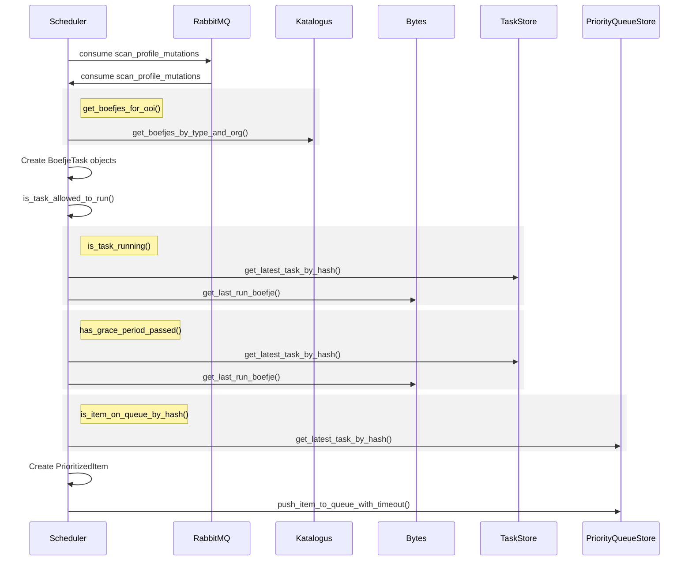
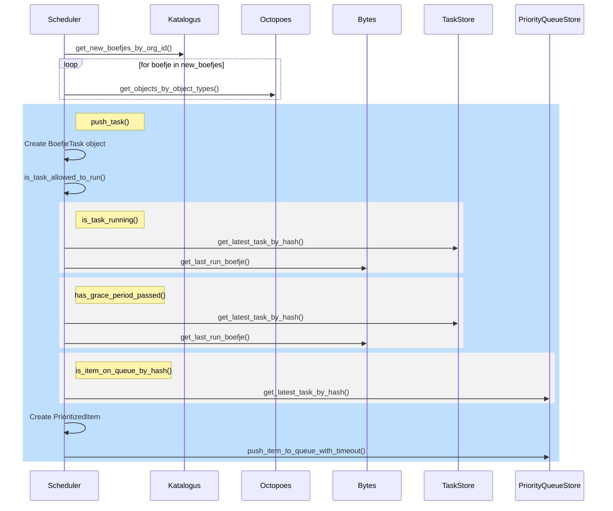
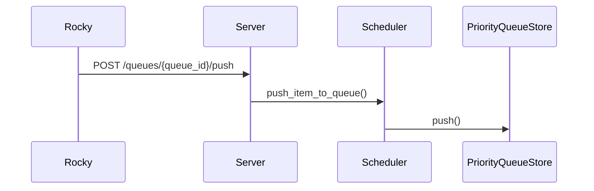
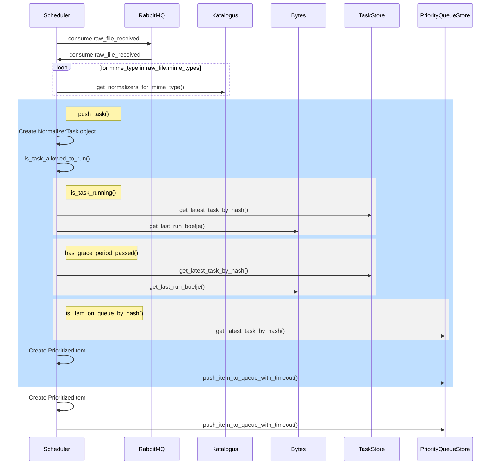
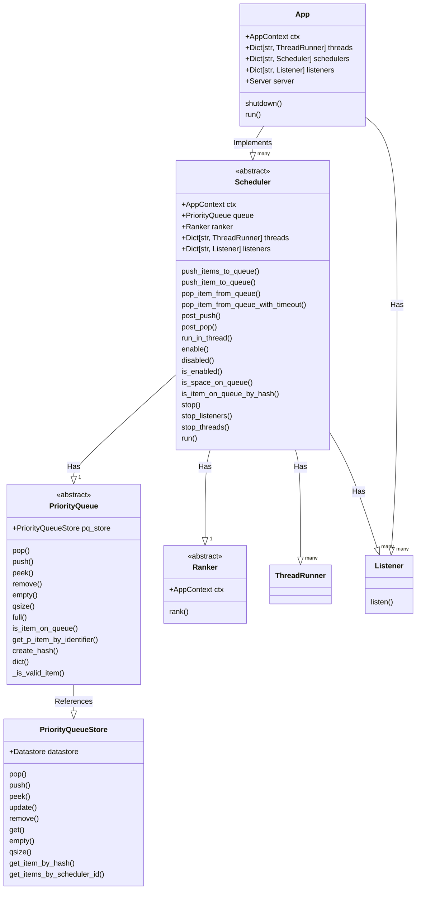

# Scheduler Architecture

## Purpose

The *scheduler* is tasked with populating and maintaining a priority queue of
items that are ranked, and can be popped off through HTTP API calls.
The scheduler is designed to be extensible, such that you're able to create
your own rules for the population, and prioritization of tasks.

The *scheduler* implements a priority queue for prioritization of tasks to be
performed by the worker(s). In the implementation of the scheduler within KAT
the scheduler is tasked with populating the priority queue with 'boefje' and
'normalizer' tasks. Additionally the scheduler is responsible for maintaining
and updating its internal priority queue.

A priority queue is used, in as such, that it allows us to determine what tasks
should be picked up first, or more regularly. Because of the use of a priority
queue we can differentiate between tasks that are to be executed first, e.g.
tasks created by the user get precedence over jobs that are created by the
internal rescheduling processes within the scheduler.

Calculations in order to determine the priority of a task is performed by the
`ranker` that leverages information from multiple (external) sources,
called `connectors`.

In this document we will outline how the scheduler operates within KAT, how
iternal systems function and how external services use it.

### Architecture / Design

In order to get a better overview of how the scheduler is implemented we will
be using the [C4 model](https://c4model.com/) to give an overview of the
scheduler system with their respective level of abstraction.

#### C2 Container level:

First we'll review how the `Scheduler` system interacts and sits in between its
external services. In this overview arrows from external services indicate how
and why those services communicate with the scheduler. The `Scheduler` system
combines data from the `Octopoes`, `Katalogus`, `Bytes` and `RabbitMQ` systems.



When we take a closer look at the `scheduler` system itself we can identify
several components. The 'Scheduler App' directs the creation and maintenance
of a multitude of schedulers. Typically in a KAT installation 2 scheduler will
be created per organisation: a boefje scheduler and a normalizer scheduler.

Each scheduler can implement it's own way of populating, and prioritization of
its queue. The associated queues of a individual scheduler is persisted in
a SQL database.

#### C3 Component level:

...



A more complete overview of the different components within the scheduler:



#### Dataflows

Following we review how different dataflows, from the `boefjes` and the
`normalizers` are implemented within the `Scheduler` system. The following
events within a KAT installation will trigger dataflows in the `Scheduler`.
With the current implementation of the scheduler we identify the creation of
two different type of jobs, `boefje` and `normalizer` jobs.

A graphical representation of task creation dataflows:


##### Boefje scheduler

For a `boefje` scheduler the following events will trigger a dataflow procedure
to be executed and subsequently the creation of a `boefje` task.:

1. scan level mutation of an ooi (object or object-of-interest)
2. new and/or enabled boefje
3. rescheduling of ooi's and associated boefjes
4. scan job creation from rocky

**1. Scan level mutation**

When a scan level is increased on an OOI
(`schedulers.boefje.push_tasks_for_scan_profile_mutations`), this will get the
priority of 2.

* When scan level mutation occurred, the `Scheduler` system will get the
  scan profile mutation from the `RabbitMQ` system.

* For the associated OOI of this scan profile mutation, the `Scheduler`
  system will get the enabled boefjes for this OOI. (`tasks = ooi * boefjes`)

* For each enabled boefje, a `BoefjeTask` will be created and added to the
 `PriorityQueue` of the `BoefjeScheduler`. A `BoefjeTask` is an object
 with the correct specification for the task runner to execute a boefje.

* Each task will be checked if it is:

    * `is_allowed_to_run()`

    * `is_task_running()`

    * `has_grace_period_passed()`

    * `is_item_on_queue_by_hash()`

* The `BoefjeScheduler` will then create a `PrioritizedItem` and push it to
  the queue. The `PrioritizedItem` will contain the created `BoefjeTask`.
  Additionally the `BoefjeTask` will be added to the database
  (`post_push()`). And serves as a log of the tasks that have been
  queued/executed, and can be queried through the API.



**2. New Boefjes**

When a plugin of type `boefje` is enabled or disabled in Rocky. This is
triggered when the plugin cache of an organisation is flushed.

* The cache of the organisation will be flushed at a specified interval.

* Due to the flushing of the cache we get a new list of enabled boefjes for
  an organisation.
  (`connectors.services.katalogus._flush_organisations_boefje_type_cache()`)

* New tasks will be created for enabled boefjes.



2. Rescheduling of oois (`schedulers.boefje.push_tasks_for_random_objects`). In
   order to fill up the queue and to enforce that we reschedule tasks. We
   continuously get a batch of random ooi's from octopoes
   (`get_random_objects`). The tasks of from these ooi's (`tasks = ooi * boefjes`)
   will get the priority that has been calculated by the ranker. At the moment
   a task will get the priority of 3, when 7 days have gone by (e.g. how longer
   it hasn't been running the higher the priority it will get). For everything
   before those 7 days it will scale the priority appropriately.

    * From Octopoes we get `n` random ooi's (`get_random_objects`)

    * For each OOI, the `Scheduler` will get the enabled boefjes for this OOI.
      (`tasks = ooi * boefjes`)

    * For each enabled boefje, a `BoefjeTask` will be created and added to the
     `PriorityQueue` of the `BoefjeScheduler`.

    * Each task will be checked if it is:

        * `is_allowed_to_run()`

        * `is_task_running()`

        * `has_grace_period_passed()`

        * `is_item_on_queue_by_hash()`

    * The `BoefjeScheduler` will then create a `PrioritizedItem` and push it to
      the queue. The `PrioritizedItem` will contain the created `BoefjeTask`.
      Additionally the `BoefjeTask` will be added to the database
      (`post_push()`). And serves as a log of the tasks that have been
      queued/executed, and can be queried through the API.

    ```mermaid
    sequenceDiagram
    participant Scheduler

    participant Octopoes
    participant Bytes
    participant TaskStore
    participant PriorityQueueStore

    Scheduler->>Octopoes: get_random_objects()

    loop for ooi in random_oois
        Scheduler->>Octopoes: get_boefjes_for_ooi()
    end

    rect rgb(191, 223, 255)
    note right of Scheduler: push_task(boefje, ooi)
        Scheduler->>Scheduler: Create BoefjeTask object
        Scheduler->>Scheduler: is_task_allowed_to_run()

        rect rgb(242, 242, 242)
        note right of Scheduler: is_task_running()
            Scheduler->>TaskStore: get_latest_task_by_hash()
            Scheduler->>Bytes: get_last_run_boefje()
        end

        rect rgb(242, 242, 242)
        note right of Scheduler: has_grace_period_passed()
            Scheduler->>TaskStore: get_latest_task_by_hash()
            Scheduler->>Bytes: get_last_run_boefje()
        end

        rect rgb(242, 242, 242)
        note right of Scheduler: is_item_on_queue_by_hash()
            Scheduler->>PriorityQueueStore: get_latest_task_by_hash()
        end

        Scheduler->>Scheduler: Create PrioritizedItem
        Scheduler->>PriorityQueueStore: push_item_to_queue_with_timeout()
    end
    ```

3. Scan jobs created by the user in Rocky (`server.push_queue`), these tasks
   will get the highest priority of 1. Note, that this will circumvent all
   the checks that are present in

   * Rocky will create a `BoefjeTask` that will be pushed directly to the
     specified queue.




##### Creation of normalizer jobs

For a `normalizer` job the following events will trigger a dataflow procedure

1. When a raw file is created (`schedulers.normalizer.create_tasks_for_raw_data`)

    * The `NormalizerScheduler` retrieves raw files that have been created in
      Bytes from a message queue.

    * For every mime type of the raw file, the `NormalizerScheduler` will
      retrieve the enabled normalizers for this mime type.
      (`create_tasks_for_raw_data()`)

    * For every enabled normalizer, a `NormalizerTask` will be created and
      added to the `PriorityQueue` of the `NormalizerScheduler`.



#### C4 Code level (Condensed class diagram)

The following diagram we can explore the code level of the scheduler
application, and its class structure.



The following describes the main components of the scheduler application:

* `App` - The main application class, which is responsible for starting the
  schedulers. It also contains the server, which is responsible for handling
  the rest api requests. The `App` implements multiple `Scheduler` instances.
  The `run()` method starts the schedulers, the listeners, the monitors, and
  the server in threads. The `run()` method is the main thread of the
  application.

* `Scheduler` - And implementation of a `Scheduler` class is responsible for
  populating the queue with tasks. Contains has a `PriorityQueue` and a
  `Ranker`. The `run()` method starts executes threads and listeners, which
  fill up the queue with tasks.

* `PriorityQueue` - The queue class, which is responsible for storing the
  tasks.

* `Ranker` - The ranker class, which is responsible for ranking the tasks,
  and can be called from the `Scheduler` class in order to rank the tasks.

* `Server` - The server class, which is responsible for handling the HTTP
  requests.
