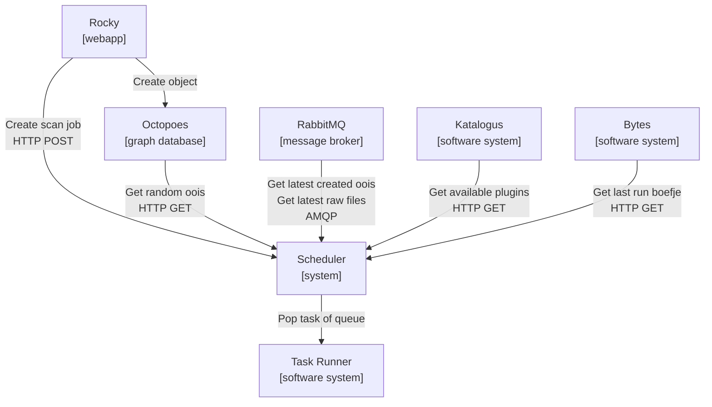
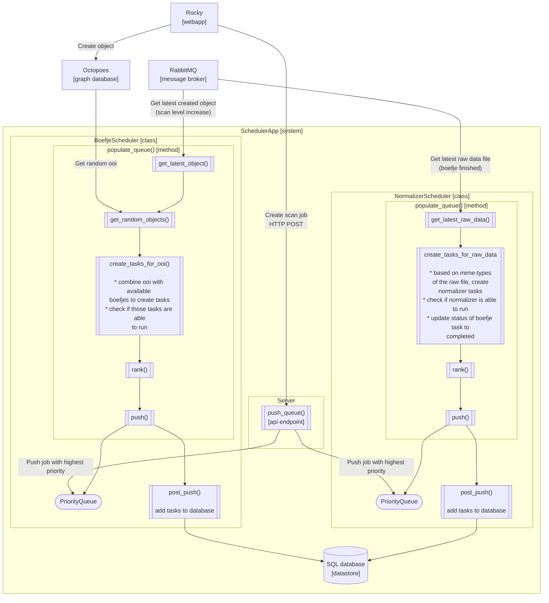
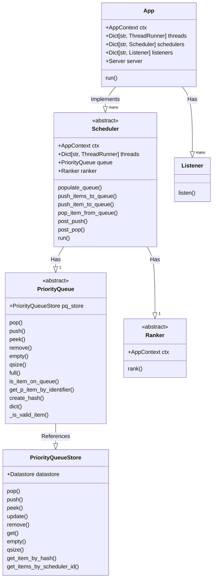

# Design scheduler

## Purpose

The *scheduler* is tasked with populating and maintaining a priority queue of
items that are ranked, and can be popped off (through api calls).
The scheduler is designed to be extensible, such that you're able to create
your own rules for the population, and prioritization of tasks.

The *scheduler* implements a priority queue for prioritization of tasks to be
performed by the worker(s). In the implementation of the scheduler within KAT
the scheduler is tasked with populating the priority queue with 'boefje' and
'normalizer' tasks. The scheduler is responsible for maintaining and updating
its internal priority queue.

A priority queue is used, in as such, that it allows us to determine what jobs
should be checked first, or more regularly. Because of the use of a priority
queue we can differentiate between jobs that are to be executed first, e.g.
jobs created by the user get precedence over jobs that are created by the
internal rescheduling processes within the scheduler.

Calculations in order to determine the priority of a job is performed by logic
that can/will leverage information from multiple (external) sources, called
`connectors`.

In this document we will outline what the scheduler does in the setup within
KAT and how it is used.

### Architecture / Design

In order to get a better overview of how the scheduler is implemented we will
be using the [C4 model](https://c4model.com/) to give an overview of the
scheduler system with their respective level of abstraction.

#### C2 Container level:

First we'll review how the `Scheduler` system interacts with its external
services.

* The `Scheduler` system combines data from the `Octopoes`, `Katalogus`,
`Bytes` and `RabbitMQ` systems. With these data it determines what tasks should
be created and run.

* The `Scheduler` system implements multiple `schedulers` per organisation.

#### C3 Component level:

Following we review how different dataflows, from the `boefjes` and the
`normalizers` are implemented within the `Scheduler` system. The following
events within a KAT installation will trigger dataflows in the `Scheduler`:

* When a plugin is enabled or disabled (`monitor_organisations`)

* When an organisation is created or deleted (`monitor_organisations`)

* When a scan level is increased (`get_latest_object`)

* When a raw file is created (`get_latest_raw_data`)

When any of these events occur, it will trigger a dataflow procedure to be
executed in the `Scheduler`.

* The `Scheduler` system implements multiple `schedulers`, one per
  organisation.

* A `Scheduler` implements methods for popping items of the queue and pushing
  off the queue. After the calls to the `pop` and `push` methods a `post_pop()`
  and `post_push` method will be called. This will be used to update the tasks
  in the database.

* The `BoefjeScheduler` implementation of the `populate_queue()` method will:

  - Continuously get the latest scan level changes of ooi's from a message
    queue that was sent by octopoes (`get_latest_objects()`). The tasks
    created from these ooi's (`tasks = ooi * boefjes`) from this queue will
    get the priority of 2.

  - To fill up the queue, and to enforce that we reschedule tasks we get
    random ooi's from octopoes (`get_random_objects`). The tasks of from these
    ooi's (`tasks = ooi * boefjes`) will get the priority that has been
    calculated by the ranker. At the moment a task will get the priority of 3,
    when 7 days have gone by (e.g. how longer it hasn't been checked the
    higher the priority it will get). For everything that hasn't been check
    before the 7 days it will scale the priority appropriately.

  - In order for a  created tasks from `get_latest_objects()` and
    `get_random_objects()` to be elligible for execution, the task adhere to
    the following (`create_tasks_for_ooi()`):

    * Should not have run within the 'grace period', meaning a task should not
      be scheduled again within the last 24 hours (can be configured).

    * Should not schedule a task when the task is still being processed.

    * Should schedule tasks with an enabled boefje.

* The `NormalizerScheduler` implementation of the `populate_queue()` method
  will:

  - Continuously get the latest raw data files from the message
    queue that was sent by the bytes (`get_latest_raw_data()`), for boefjes
    that are done processing.

  - When a raw file has been received the task from the `BoefjeScheduler` is
    updated as `completed`.

  - For every mime-type of the raw file a task is created
    (`create_tasks_for_raw_data()`) with its associated normalizers.

  - At the moment the tasks are given a unix time-stamp that is used as its
    priority to simulate a FIFO queue.

* The `Server` exposes REST API endpoints to interact and interface with the
`Scheduler` system.

#### C4 Code level (Condensed class diagram)

The following diagram we can explore the code level of the scheduler
application, and its class structure.

The following describes the main components of the scheduler application:

* `App` - The main application class, which is responsible for starting the
  schedulers. It also contains the server, which is responsible for handling
  the rest api requests. The `App` implements multiple `Scheduler` instances.
  The `run()` method starts the schedulers, the listeners, the monitors, and
  the server in threads. The `run()` method is the main thread of the
  application.

* `Scheduler` - And implementation of a `Scheduler` class is responsible for
  populating the queue with tasks. Contains has a `PriorityQueue` and a
  `Ranker`. The `run()` method starts the `populate_queue()` method, which
  fill up the queue with tasks. The `run()` method is run in a thread.

* `PriorityQueue` - The queue class, which is responsible for storing the
  tasks.

* `Ranker` - The ranker class, which is responsible for ranking the tasks,
  and can be called from the `Scheduler` class in order to rank the tasks.

* `Server` - The server class, which is responsible for handling the HTTP
  requests.
