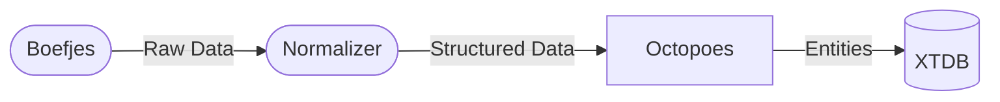
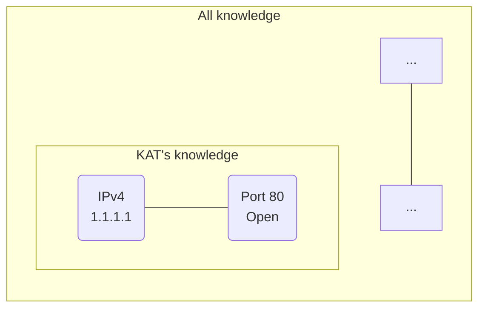

Services


Dataflow



OWA vs CWA


System that tracks orders
```mermaid
graph LR
    subgraph ["DB Table"]
      direction LR
      A("Order 1")
      B("Order 2")
      C("...")
      D("Order 30")
      
      Orders --- A
      Orders --- B
      Orders --- C
      Orders --- D
    end
```
