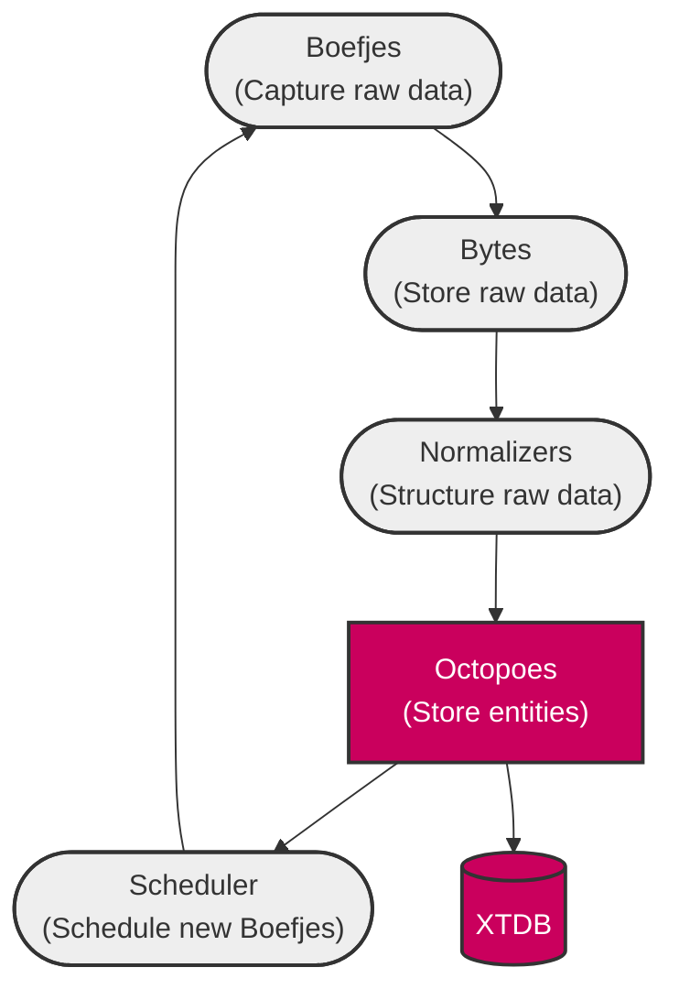
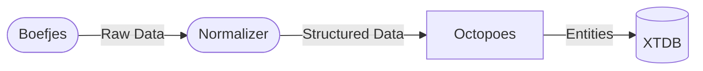
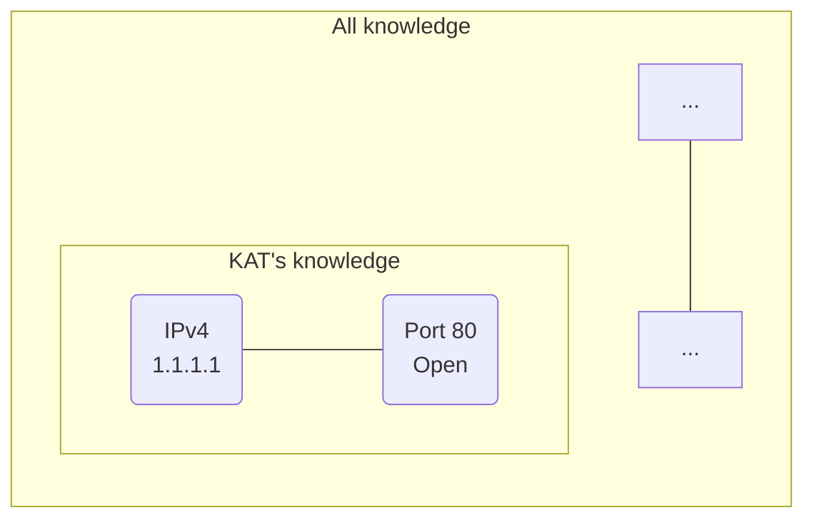
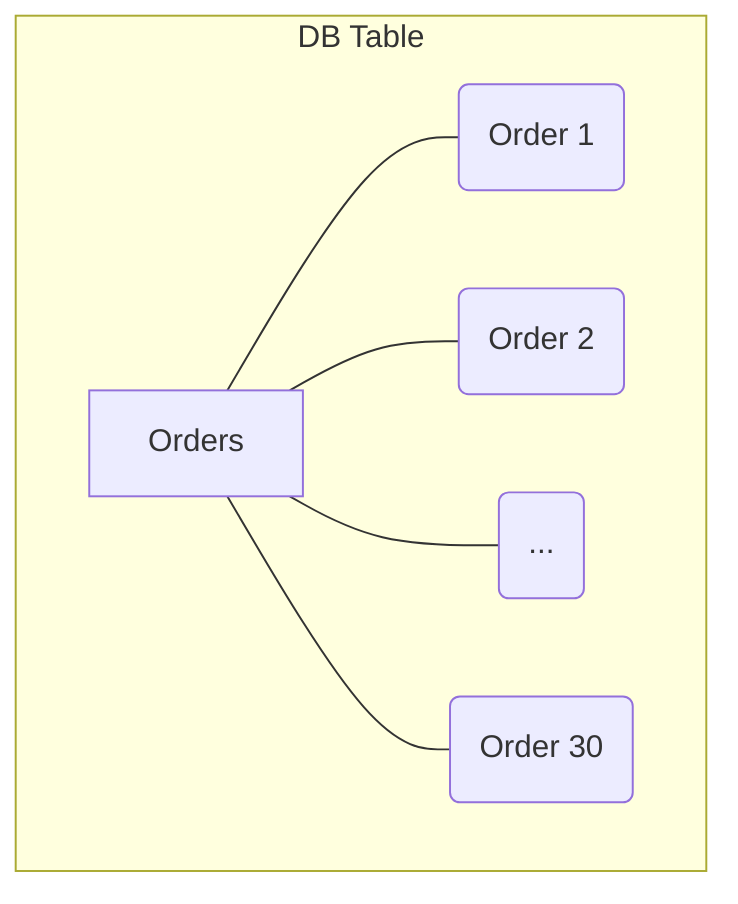
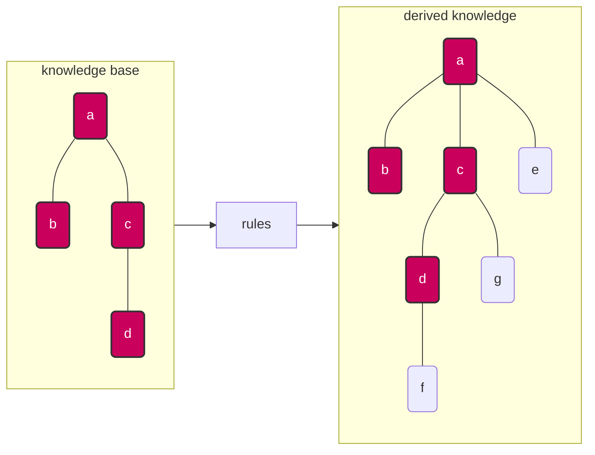

## Services

```mermaid

graph TD

	  A(["Boefjes \n (Capture raw data)"])
	  B(["Bytes \n (Store raw data)"])
    C(["Normalizers \n (Structure raw data)"])
    D["Octopoes \n (Store entities)"]
    E(["Scheduler \n (Schedule new Boefjes)"])
    F[(XTDB)]

	  A --> B
    B --> C
    C --> D
    D --> E
    E --> A
    D --> F

    classDef highlight fill:#ca005d,color:white,stroke:#333,stroke-width:2px;
    classDef processor fill:#eee,stroke:#333,stroke-width:2px;
    class D,F highlight
    class A,B,C,E processor

```

## Dataflow

```mermaid
graph LR

	  A(["Boefjes"])
    B(["Normalizer"])
    C["Octopoes"]
    D[(XTDB)]

    A -- Raw Data --> B
    B -- Structured Data --> C
    C -- Entities --> D

```

## OWA vs CWA

```mermaid
graph LR

    subgraph all ["All knowledge"]
        C["..."]
        D["..."]
        C --- D
        subgraph kat ["KAT's knowledge"]
            direction LR
            A("IPv4 \n1.1.1.1")
            B("Port 80 \nOpen")

            A --- B
        end
    end
```

## System that tracks orders

```mermaid
graph LR
    subgraph db ["DB Table"]
      direction LR
      A("Order 1")
      B("Order 2")
      C("...")
      D("Order 30")
      
      Orders --- A
      Orders --- B
      Orders --- C
      Orders --- D
    end
```

## Knowledge base, rules and derived knowledge

```mermaid

flowchart LR
    
    subgraph kb [knowledge base]
        a1("a")
        b1("b")
        c1("c")
        d1("d")
        
        a1 --- b1
        a1 --- c1
        c1 --- d1
    end
   
   subgraph dk [derived knowledge]
        a2("a")
        b2("b")
        c2("c")
        d2("d")
        e2("e")
        f2("f")
        g2("g")
        
        a2 --- b2
        a2 --- c2
        c2 --- d2
        a2 --- e2
        d2 --- f2
        c2 --- g2
    end
    
    kb --> rules --> dk
   
    classDef base fill:#ca005d,color:white,stroke:#333,stroke-width:2px;
    classDef derived fill:#eee,stroke:#333,stroke-width:2px;
    class a1,b1,c1,d1,a2,b2,c2,d2 base
    class e,f,g derived
```
