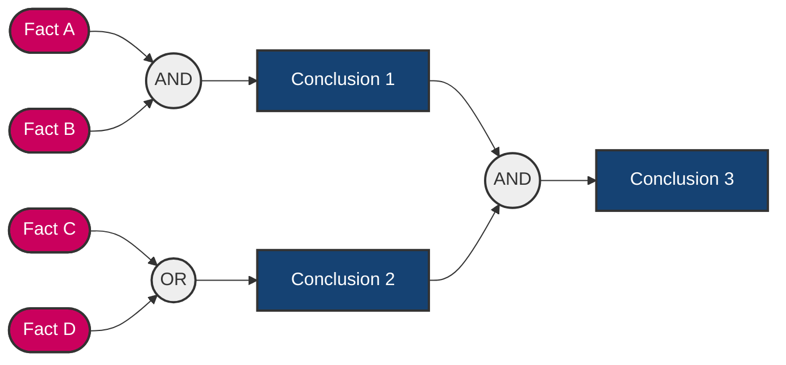
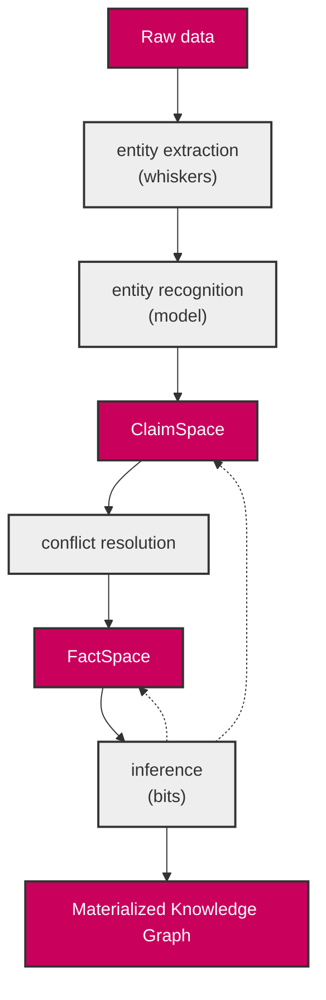
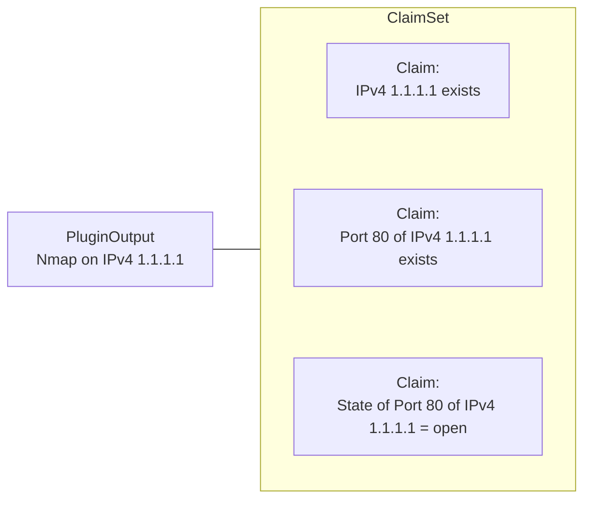
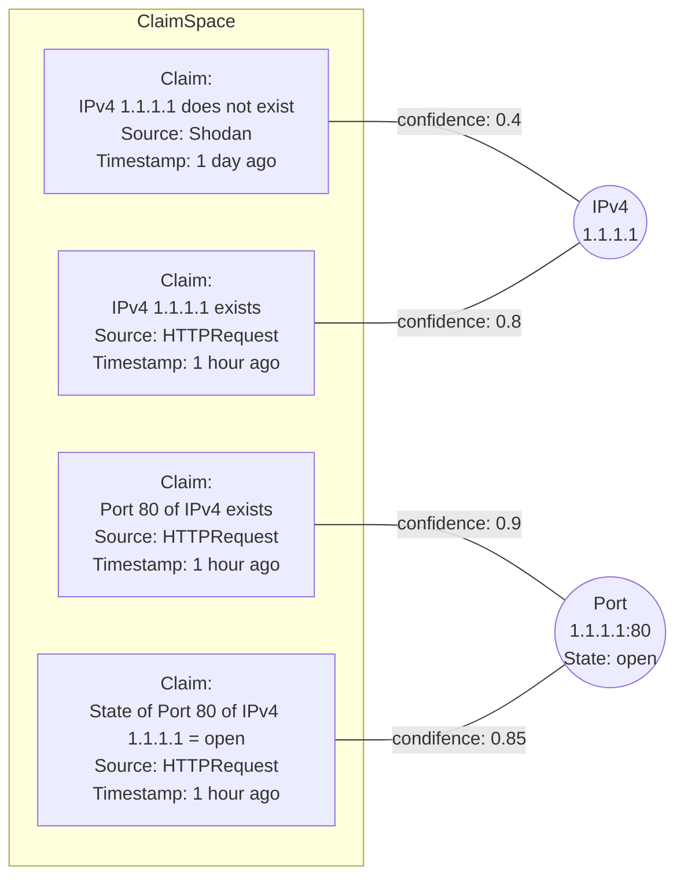

## Services

## Dataflow

## OWA vs CWA

## System that tracks orders

## Simple rule

## Logic chaining

## Knowledge base, rules and derived knowledge

## ClaimSpace

## Factspace
The stage where claims are consolidated into (assumed) facts.

