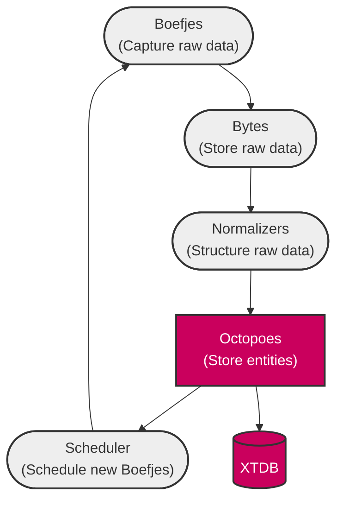
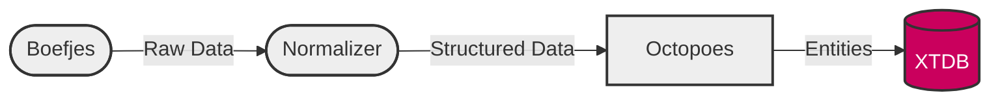

Services

```mermaid

graph TD

	  A(["Boefjes \n (Capture raw data)"])
	  B(["Bytes \n (Store raw data)"])
    C(["Normalizers \n (Structure raw data)"])
    D["Octopoes \n (Store entities)"]
    E(["Scheduler \n (Schedule new Boefjes)"])
    F[(XTDB)]

	  A --> B
    B --> C
    C --> D
    D --> E
    E --> A
    D --> F

    classDef highlight fill:#ca005d,color:white,stroke:#333,stroke-width:2px;
    classDef processor fill:#eee,stroke:#333,stroke-width:2px;
    class D,F highlight
    class A,B,C,E processor

```

Dataflow

```mermaid
graph LR

	A(["Boefjes"])
    B(["Normalizer"])
    C["Octopoes"]
    D[(XTDB)]

	A -- Raw Data --> B
    B -- Structured Data --> C
    C -- Entities --> D

    classDef highlight fill:#ca005d,color:white,stroke:#333,stroke-width:2px;
    classDef processor fill:#eee,stroke:#333,stroke-width:2px;
    class D,F highlight
    class A,B,C,E processor
```
