# Octopoes v3

Octopoes is KAT's bitemporal knowledge graph platform. Currently, v2 is in production while it does its job well, the v2 architecture is not tolerant enough to support some desired features. From the learnings of the past year with Octopoes v1, this documents describes the workings of the proposed v3 architecture.

## TL;DR

- Break up data into atomic units to:
  - Enable consolidation strategies
  - Enable withdrawal of sources (en-/disabling normalizers and bits)
  - Enable modification of source OOI by bit
- Append-only, versioned OOI schema, for backwards compatibility
- GraphQL API based on schema of requested point in time
- Regular, event-driven consolidation of graph of "now"
- On-demand consolidation of graph of any point in valid-time
- Hash OOI primary keys
- Hydrated OOI representation for OOIs with foreign key in primary key

For Octopoes v3.5: incremental consolidation of relational bits by differential or timely dataflow. More research required.

## Core concepts

### Schema

Octopoes is the knowledge graph _platform_ which is configurable with a schema of the intended application domain. Each entity in the domain is also called an **OOI (Object of Interest)** and the schema is therefore also called the **OOI schema**. The OOI schema describes:

- the set of entity classes (OOI classes)
- the hierarchy of OOI classes (ontology/taxonomy)
- the attributes of each OOI class:
  - primitives: these are mutable key->value pairs which contain values that describe the state of the object.
  - foreign keys: these are pointers to the composite primary key of another object. This describes a relationship.
  - natural keys / composite primary key: the minimum set of primitives and foreign keys of an object that makes it, by definition, unique and different from other objects from the same class

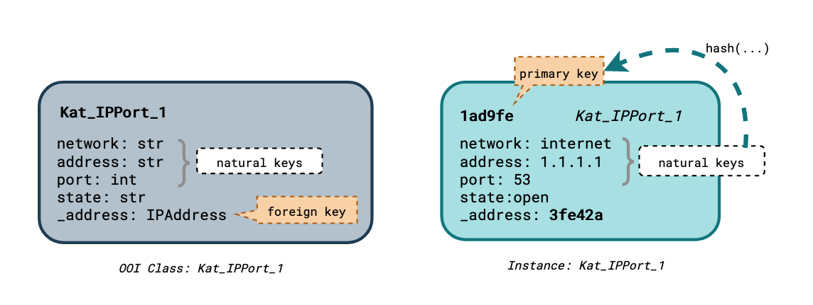

OOI classes are disambiguated by 3 properties:

- `module`: the module name
- `name`: the class name
- `version`: the version of the class

The OOI schema will be append-only: Octopoes will only accept new OOI class definitions, not in-place updates of existing OOI classes.

### Processing stages

OOI Data in KAT passes several stages in the processing pipeline:

1. Whiskers (normalizers) yield structured data (JSON) from any data source
2. The structured data is validated against the schema and entities (class instances) are identified
3. Data is stored in atomic form in the graph: entity state is stored per origin. This allows storage of conflicting information about an OOI
4. Conflicting atomic data is resolved and merged into the consolidated knowledge graph
5. Business rules are applied on consolidated objects and derived knowledge is stored as atomic data

Steps 4 and 5 are performed cyclicly until all knowledge is derived. When all processing is done, the graph is considered **_consolidated_** .

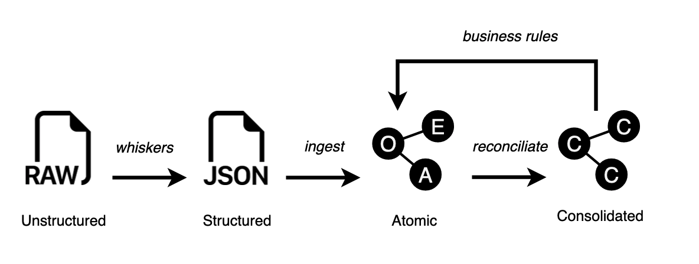
_O=Origin, E=Atomic Entity, A=Atomic Attribute, C=Consolidated Object_

### Atomic data points

Atomic data points are the Octopoes' smallest units of data: entities and attributes. Each output set of a normalizer or bit, will be stored as atomic datapoints in the graph per origin. This allows granular and incremental consolidation of the graph.

_Example:_

- Origin X reports entity A, with attribute B having value C
- Origin Y reports entity A, with attribute B having value D

This is stored as following in the graph:

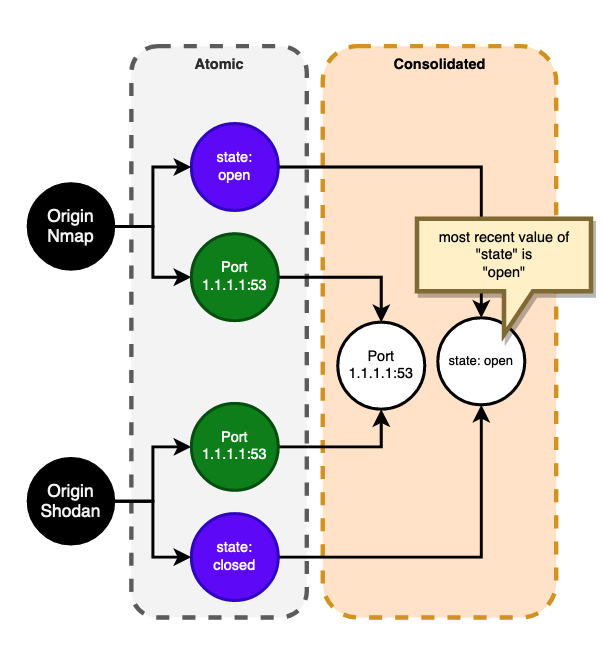

Above, the entity `Port 1.1.1.1:53` is mentioned by one or more origins. It therefore exists in the consolidated graph. Its attribute `state` has conflicting origins. Origin `Nmap` declares the value `open`, Origin Shodan declares the value `closed`. Octopoes, for now, will resolve this conflict by taking the most recent value. In the future, more complex strategies might be implemented (perhaps considering the confidence level of the origin, etc).

Storing data in atomic form also enables tracking the origin of each data point. This is required to be able to revoke data points from a source when needed (en-/disabling normalizers and business rules). When a source and its atomic data points, is revoked, the graph is reconsolidated with the remaining atomic data points:

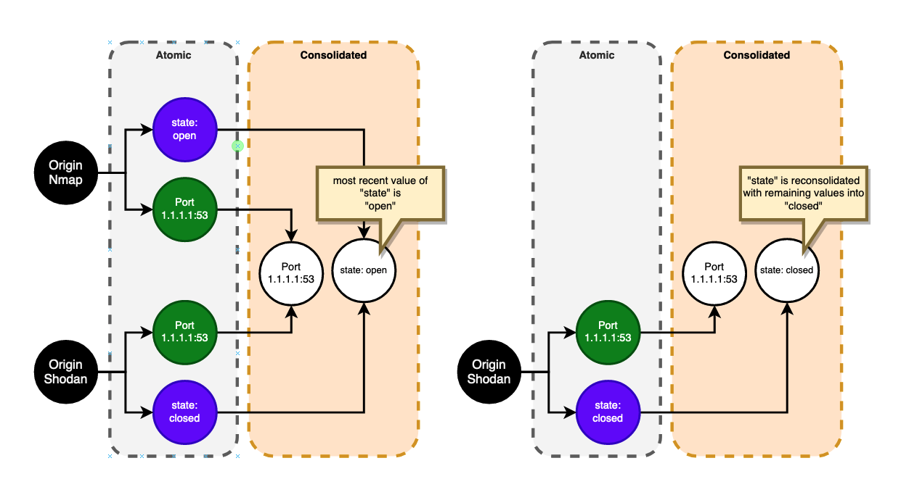

### Origins

An **origin** is a source of OOI data. Each OOI must be referenced by at least one origin to exist in the knowledge-graph. Origins exist in 2 types:

- Observation, which is uniquely identified by the triple `(source-ooi, boefje, normalizer)`
- Inference, which is uniquely identified by the combination of `(source-ooi, bit)`

When boefjes and normalizers are repeated over time, the output dataset of the corresponding origin is overwritten with new information. Information by the previous iteration of the origin is dereferenced and removed in the subsequent consolidated graph. In Octopoes v3 this mechanism is not changed. For more information see the [Octopoes v1 documentation](https://github.com/minvws/nl-kat-octopoes/blob/develop/README.md#origin).

### Bitemporality and consolidation

[Bitemporality](https://docs.xtdb.com/concepts/bitemporality/) in Octopoes means that knowledge is stored in two time-axes: valid-time and transaction-time.

- Valid-time is the intrinsic time of the knowledge, the time at which the knowledge is true.
- Transaction-time is the time at which the knowledge is stored in the graph. Transaction-time is read-only and **_mutation always happens at the current transaction-time_**.

Consolidation of the graph is applied asynchronously and after ingestion of atomic data. Intermediate consolidation states will be committed into the valid-time axis. This means that the graph is NOT always considered consolidated. Instead, Octopoes will persist pairs of `valid-time` and `transaction-time` at which the graph is consolidated. At these consolidated states, the graph is queryable. At any other `valid-time`/`transaction-time` combinations, the graph is not consolidated and not queryable.

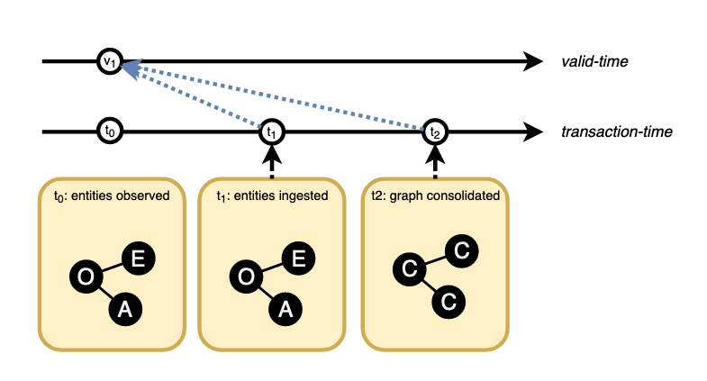
_In this example timestamp (v<sub>1</sub>, t<sub>2</sub>) is consolidated and queryable_

By default, Octopoes will regularly consolidate the state of the graph of the 'now' in a series of consolidations.
Additionally, Octopoes can re-consolidate the graph of any valid-time. Results of such re-consolidations are stored in the graph at the valid-time of the re-consolidation, but with the transaction-time now.

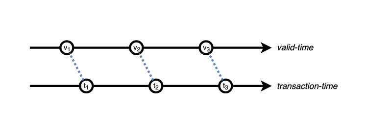
_The default consolidations of the "now"_

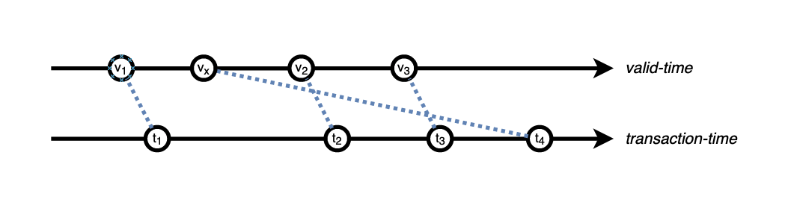
_A re-consolidation of a past graph state_

## GraphQL

Octopoes v3 will provide a GraphQL endpoint which is generated from the OOI schema of the requested point in time.

Example query:
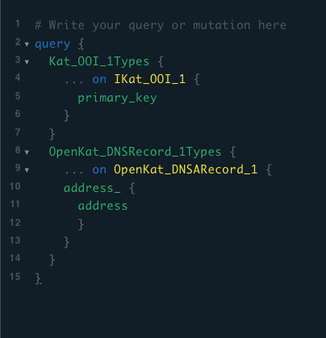

## Events flow

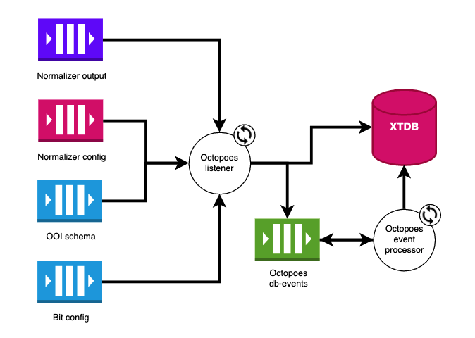

## Application states

To avoid race conditions, the Octopoes main thread can be in one of the following execution states:

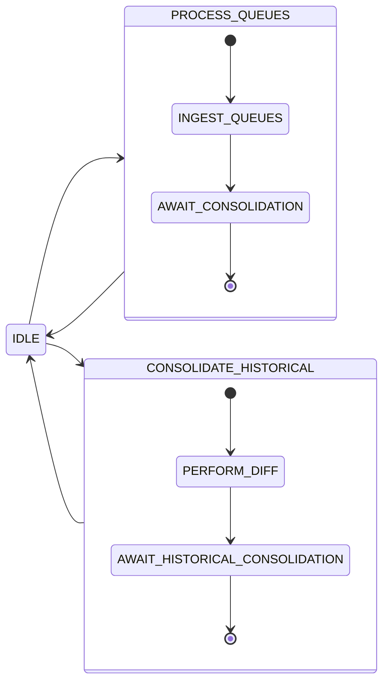

## Processing queues sequence

The `PROCESS_QUEUES` procedure follows the following (abstracted) sequence:

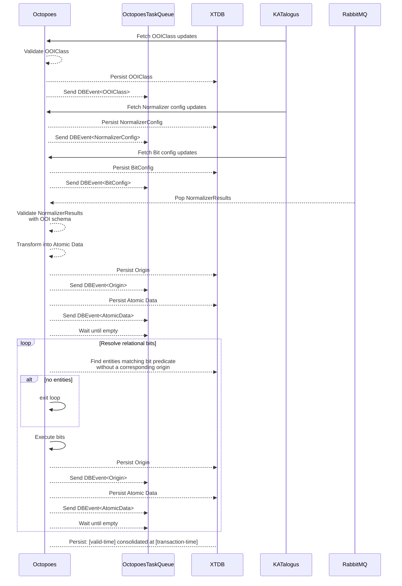

## Processing historical consolidation

**_WIP FROM HERE!!!_**

## Architectural considerations

There are a few trade-offs that were made in the design of Octopoes v3.

### Bitemporality, append-only

Bitemporality and with it, immutability on the transaction-time axis, is one most important features of Octopoes. It allows a complete historical view of the graph to answer questions like: "What was known at time X (transaction-time) about time Y (valid-time)". This is a very powerful feature, but it also comes with the caveat that the schema must be completely backwards compatible, in order to be able to understand the graph at any point in time. The other drawback is that Octopoes/KAT might become bulkier over time, as the schema is growing and growing.

### Consolidation

Basically, a consolidated graph is a derivative of the base-tables. The base-tables are known at each valid-time, transaction-time combination. The base-tables comprise:

- The OOI schema
- Which atomic data was yielded by the origins
- Which origins were active at the time
- Which business rules were active at the time

So, technically, it's possible to consolidate each valid-time, transaction-time combination. However, each update of the base-tables in the past, would possibly require re-consolidation of each valid-time after the update. Basically computing a complete alternative timeline. With model updates and corresponding normalizers, this would be too expensive.

Therefore, Octopoes will persist pairs of `valid-time` and `transaction-time` at which the graph is consolidated. Which by default be a consolidation of the 'now' and historical consolidations are executed on demand only. Consolidations are always done with the transaction time 'now', making it impossible to consolidate a past transaction-time.

### Foreign keys in natural key

Initially, it was considered to only allow primitive attribute types in the natural key (e.g. str, int). This would make all OOI's inherently simpler to reason about, since at it's core the OOI could exist without dependencies to other objects. It actually would remove the dependency graph of OOIs completely. This design would simplify:

- The GUI for creating OOIs. Only render primitives, no dependencies
- Hydration, the JSON representation of the object for programmatic access. No need to resolve foreign keys.

However, this design would create a massive duplication of data. For example, storing the whole HTTP request for each received HTTP header, instead of using a foreign key, to represent the http request. So, it is decided to allow foreign keys in the natural key.

# Glossary of terms in an Octopoes and KAT context

#### bitemporal knowledge graph

The abstract model at the foundation of Octopoes, which in turn is the foundation of KAT.
[A graph](<https://en.wikipedia.org/wiki/Graph_(abstract_data_type)>) is a way of representing information in a network of individual nodes that are linked through edges.
Mathematically speaking, Octopoes is a _directed cyclic graph_. It does not have an explicit root node.

Bitemporality occurs when the state of the graph is represented in two axes of time:

**valid-time:** the time at which a piece of objective, factual state of knowledge is true. In the Octopoes context, this usually refers to the observations made by a Boefje.
**transaction-time:** the time at which the above valid-time is recorded by an observer. In other words: the moment at which Octopoes becomes _aware_ that some knowledge is true.

#### atomic entity

An [instance of an OOI class](#ooi-instance), with only its [natural keys](#natural-key).

#### atomic attribute

The value of an object attribute (both primitive and foreign; natural and non-natural) as recorded by an [origin](#origin).

#### consolidated entity

An atomic entity, with all non-natural keys having been [consolidated](#consolidation).

#### consolidated attribute

The value of an object attribute (both primitive and foreign; natural and non-natural) that has been [consolidated](#consolidation).

#### conflict resolution (or: reconciliation)

When multiple [origins](#origin) have conflicting observations about the state of non-natural attributes, Octopoes will determine which observation to accept and record in the graph.

_Note: this is currently naively implemented by always taking the most recent observation, but more complex strategies will be considered in the future._

**Example:**
If Shodan considers a certain `IPPort` to have `state: "open"`, and Nmap considers it to have `state: "closed"`, Octopoes will reconcile the `IPPort` to have the `state` value of whichever observation was the most recent.

#### consolidation

The state of a graph, entity, or attribute after doing [conflict resolution](#conflict-resolution), and running all relational and non-relational [bits](#bits).

#### primary key (or: composite of natural keys)

The unique identifier of an [OOI instance](#ooi-instance).
It is, by definition, a composite of the natural keys that define a unique instance of an object. It is a form of content-addressing.
We generate this primary key through `hash(concatenate(all natural key values, {class_module}_{class_name}_{class_version}))`. The class identifier is included to prevent accidental collisions between objects of different classes which share the same natural keys.

It should be semantically impossible for an [OOI class definition](#ooi-class) to have the same natural key values while referring to a different real-world entity.

**Example:**
The natural keys of an `IPPort` class are made up of Network, Address, and Port.

There is no thinkable scenario where there exists two `IPPort` object instances, with the same Network, Address, and Port, that refer to two distinct real-world entities.
Thus, it can be concluded that this is an appropriate natural key composite.

_Academic note: it would be ideal if someone came up with a mathematical proof that, for each primary key (e.g. composite of natural keys) of an OOI, proves that it is impossible to find a duplicate that refers to a different real-world entity._

#### primitive

A key->value pair that does not resolve to a different object (i.e. non-relational; not a foreign key).

#### natural key

An immutable key->value pair that, when combined with the other natural keys of an OOI, defines a unique instance of the OOI class. (This is an attribute of an OOI.)

This key->value pair does not change, as it is part of the definition of an object.

A natural key may be a foreign key or a primitive.

See [primary key](#primary-key) for more information.

#### non-natural key

A mutable key->value pair that describes the state of an OOI. These are not necessarily unique to a specific instance of the OOI class. (This is an attribute of an OOI.)

A non-natural key may be a foreign key or a primitive.

**Example:**
An `IPPort` may have `state: "closed"` or `state: "open"`. These may change over time and are not necessarily unique nor part of the definition of an OOI.

#### hash

The hashing function used for deriving primary keys in Octopoes is NOT cryptographically strong.
It is very fast, while making accidental collisions extremely improbable.

#### hydration

The process of generating a JSON-representation of an OOI instance, where natural key attributes which are foreign keys, are replaced by nested objects. This makes it easier to access the actual, current values of an object in the code.

This may be done immediately after creating an object (eager loading), or postponed until the attributes are actually queried (lazy loading).

**Example:**

```
class IPPort
 address: ab3ef1
 port: 80
 state: "open"
```

becomes:

```
class IPPort
 address: {
     address: 1.1.1.1,
     network: {
          name: internet
     }
 }
 port: 80
 state: "open"
```

#### differential and timely dataflow

Two state-of-the-art, academic research topics, which are intended for efficiently performing computations on large amounts of data and maintaining the computations as the data change.

[Timely dataflow](https://timelydataflow.github.io/timely-dataflow/)
[Differential dataflow](https://timelydataflow.github.io/differential-dataflow/)

### OOI schema

An abstract representation of the hierarchy and relationships between abstract [OOI classes](#ooi-class).

#### OOI instance (or: OOI entity)

The actual, "real-world" instance of an [OOI object class](#ooi-class). In other words, an instance has actual attribute values such as `127.0.0.1` and `"open"`).

#### OOI class

An abstract representation of a type of object, according to the data definition language (DDL). In other words, a class has abstract attribute values such as `address` and `state`.

#### origin

A source of knowledge, such as a Boefje (observation) or Bit (inference).

#### normalizer (or: "whisker")

A piece of code that generates structured data (that can be used in Octopoes) from unstructured data (e.g. the raw output of a Boefje).
These will output atomics.

#### bits (or: business rules)

A "business rule" that draws conclusions (i.e. _infers_) from [consolidated entities](#consolidated-entity).
These will output atomics.

These may be relational, in which case they depend on the state of multiple object entities, or non-relational, in which case they only depend on the state of a single entity.

Non-relational bits are computationally cheap to execute, whereas relational bits may be computationally very expensive
