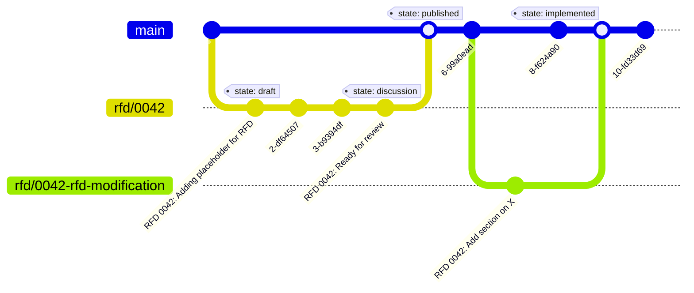

# RFD 0001: Requests For Discussion

## Introduction

At the basis of this proposal is the idea that RFDs are a way to propose and
discuss changes to the project. They are a way to document the design and
implementation of a feature or architectural decisions, and to solicit feedback.
An RFD is designed to allow for discussion of rough ideas, and additionally the
documents become a permanent record for more established ones.

Depending on the state of the RFD they may be quickly iterated on in a branch,
discussed actively as part of a pull request to be merged, or commented upon
after having been published. The level of depth of an RFD depends on the topic
and urgency of the RFD. Some can be used as documentation of the current
knowledge on a topic, while others may be more urgent and require less rigor.

This proposal aims to facilitate better decision-making. By documenting ideas,
requirements, and subsequent discussions, decisions become more informed and
data-driven. The RFD process enhances communication and collaboration by
providing a clear, structured format for capturing and sharing information.

Documenting RFDs in plain text files ensures they are easily searchable and can
be tracked over time. The self-documenting nature of RFDs clarifies the
reasoning behind architectural design choices, helping to maintain transparency
and continuity throughout the project.

## Proposal

### Design

#### When to use an RFD

An RFD should be used when a change is proposed that is non-trivial. This could
be a new feature, a change to the architecture, or a change to the process. The
RFD should be used to document the proposal and to solicit feedback from the
team. Dependent on the project the RFD process can be used for different types
of changes. Some examples for this project include:

- ...
- ...
- ...

#### Overview of the RFD process

Here you can view a Git diagram of a typical RFD process, from creation to
implementation. It follows the process described in the section [How to start
the RFD process](#how-to-start-the-rfd-process).



#### How to start the RFD process

1.  Reserve an RFD number

    Check the repository for the next available RFD number.

2.  Create branch for your RFD

    Create a branch named after the RFD number you wish to reserve. The branch
    name should be in the format `rfd/{number}`. If less than 4 digits,
    pad with zeros. Before creating the branch, check if the branch already
    exists.

    ```bash
    # -r list remote branches
    # -l list branches with optional pattern
    git branch -rl "*0042"
    ```

    If you see a branch there but the corresponding number isn't present in
    the `rfd` directory, it is possible that the RFD is in the process of
    being created. If you are unsure, ask your team.

    When everything checks out, create the branch.

    ```bash
    # git checkout -b rfd/{number}
    git checkout -b rfd/0042
    ```

3.  Create a placeholder RFD file in the `rfd` directory.

    This file should contain the meta data and a brief description of the RFD.
    The file should be named after the RFD number you reserved. The status of
    the RFD should be `draft`.

    These RFD files should be stored in a repository either in a directory or
    into a separate repository. Within a directory or repository the files
    should be named after the RFD number and title. Example:

    ```bash
    # touch rfd/{rfd-number}-{title}.md
    touch rfd/0042-question-of-life.md
    ```

    Create the RFD file using the prototype file:

    ```bash
    cp rfd/prototypes/prototype.md rfd/0042-question-of-life.md
    ```

4.  Open a Draft Pull Request

    Open a Draft Pull Request and set the title of the PR to:
    `RFD {number}: {title}` Within the document add the pull request link to the
    `discussion:` meta data.

5.  Push your RFD branch remotely:

    ```bash
    git add rfd/0042-question-of-life.md
    git commit -m "RFD 0042: Adding placeholder for RFD"
    git push origin rfd/0042
    ```

6.  Work on your RFD branch.

    You're now ready to work on your RFD in the branch you created.

    ```bash
    git checkout rfd/0042
    ```

    Work on your RFD and commit your changes. Iterate on your RFD for it to be
    ready for feedback and discussion with others. See the section on how to
    structure an RFD for more information [link](#how-to-structure-an-rfd).

7.  Ready for review

    When you're ready to receive feedback on your RFD, update the state of your
    RFD to `discussion` and push your changes remotely.

    ```bash
    git commit -am "RFD 0042: Add RFD for <title>"
    git push origin rfd/0042
    ```

    Update your Pull Request and change its state from _draft_ to _ready for
    review_.

8.  Discuss the RFD on the Pull Request

    The discussion should be had on the pull request. The RFD should be updated
    with the feedback and changes that are made to the RFD.

9.  Merge the Pull Request

    When the RFD is ready, and after discussion and feedback have been
    addressed, the PR can be merged into the main branch. The state should then
    be updated to `published`.

    Discussion can still continue on published RFDs. The discussion link in the
    RFD's `discussion:` metadata should point to the original PR.

    If a discussion post-merge requires a larger discussion on its own, a new
    issue should be created. In the issue title reflect the RFD number. Example:
    "RFD 0042: Add section on X" and be sure to link back to the original PR in
    the issue description.

10. Making changes to an RFD

    After an RFD has been merged, there is still the possibility to make
    changes. Create a new pull request with the changes you like to make.
    Similar in concept to a feature branch, each logically independent change
    to an RFD is placed into a separate branch named after the RFD number and
    the focus of the change (e.g. `rfd/0042-rfd-modification`). Once the branch
    is ready for review open a pull request to merge the branch into the main
    branch.

11. Implementing an RFD

    Once and RFD is implemented, namely when the rfd has evolved into an
    explanation on how the system works, the status should be updated to
    `implemented`. The state is essentially no different from published, but it
    signifies ideas that have been fully developed.

#### How to structure an RFD

At the base of the RFD is a markdown file. The contents of the file should
resemble the following structure:

##### Title

The title of the RFD should be in the format `RFD {number}: {title}`. The title
should be a simple and clear synopsis of the RFD.

##### Meta data

Template:

```markdown
---
authors: { author1 } <{ email }>, { author2 } ({ github username })
state: { draft|discussion|published|implemented|abandoned }
discussion: { link to PR discussion }
labels: { comma, separated, list }
---

# RFD {number}: {title}

## Introduction

{ Introduction to the RFD }

## Proposal

{ The proposal section should contain the main content of the RFD. This is
where the idea is explained in detail. }

## Footnotes

{ Footnotes should be used to provide references to external sources or to
provide additional information. }
```

Example:

```markdown
---
authors: Alice <mail@example.com>, Bob (@bob)
state: draft
discussion: http://github.com/nl-kat-coordination/rfd/pull/1
labels: process, feature
---

# RFD 0001: Request For Discussion

## Introduction

This RFD proposes the implementation of a Request For Discussion process.

## Proposal

The proposal is to implement a Request For Discussion process.[^1]

## Footnotes

[^1]: [Source: XYZ](http://example.com)
```

The status of the RFD should be one of the following:

1. `draft` - The work is not yet ready for discussion, the RFD is a
   placeholder. The draft state signifies that work iterations are being done
   quickly on the RFD in its branch in order to advance the RFD to the
   discussion state.

2. `discussion` - The RFD is under active discussion should be in the
   discussion state. At this point a discussion is being had for the RFD in a
   Pull Request. The discussion state should be used when an idea is being
   actively discussed

3. `published` - Once (or if) discussion has converged and the Pull Request is
   ready to be merged, it should be updated to the published state before
   merge. Note that just because something is in the published state does not
   mean that it cannot be updated and corrected.

4. `implemented` - Once an idea has been entirely implemented, it should be in
   the implemented state. Comments on ideas in the implemented state should
   generally be raised as issues — but if the comment represents a call for a
   significant divergence from or extension to committed functionality, a new
   RFD may be called for.

5. `abandoned` - Finally, if an idea is found to be non-viable (that is,
   deliberately never implemented) or if an RFD should be otherwise indicated
   that it should be ignored, it can be moved into the abandoned state.

##### Content

Generally the contain of the RFD would consist of the following sections:

1. **Introduction** - A brief introduction to the RFD and the context
   in which it is being proposed.

2. **Proposal** - The proposal section should contain the main content of the
   RFD. This is where the idea is explained in detail.

   Your proposal ideally should include the following points. However, use
   your best judgment to determine what is most relevant and necessary for
   your specific proposal:

   - **Objective and goals:** clearly state the goal or problem that the
     proposal aims to address.

   - **Scope:** Define the boundaries of the proposal, what is in scope and
     what is out of scope.

   - **Multiple viable options:** Present various options to address the
     issue, including the benefits and drawbacks of each option.

   - **Reasoning and Data**: Provide detailed reasoning for the proposed
     options, supported by data and references wherever possible.

   - **Future Considerations**: Outline any future work or considerations that
     might be relevant once the proposal is implemented.

3. **Footnotes** - Footnotes should be used to provide references to external
   sources or to provide additional information.

We can leverage the Github flavored markdown for writing the contents of the RFD.
Refer to the [Github Docs](https://docs.github.com/en/enterprise-cloud@latest/get-started/writing-on-github/basic-writing-and-formatting-syntax)
for more information on the markdown syntax.

##### Diagrams

You're encouraged to include diagrams in the RFD. Diagrams can be used to
illustrate the proposed changes or to provide additional context. Typically we
would use [Mermaid](https://mermaid-js.github.io/mermaid/#/) for diagrams.


##### Assets

If the RFD requires additional assets, such as images or diagrams, these can
be stored in the separate directory `rfd/assets` within the repository.

When naming assets, the name should be the RFD number and the name of the asset.
Example:

```bash
# rfd/assets/{rfd-number}-{title}.{extension}
rfd/assets/0042-question-of-life.png
```

##### Footnotes

Footnotes should be used to provide references to external sources or to provide
additional information. We can leverage the markdown syntax for footnotes.[^11]

```markdown
## Proposal

Text with a footnote.[^1]

## Footnotes

[^1]: [Source: XYZ](http://example.com)
```

### Inspiration

The structure and process of the RFD is inspired by the following implementations:

- Oxide RFD process[^1][^2]
- IETF RFC process[^3][^4][^5]
- Golang proposal process[^6]
- Joyent RFD process[^7]
- Rust RFC process[^8][^9]
- Kubernetes proposal process[^10]

### Tooling

To facilitate the RFD process, the following tooling could be implemented:

- Scripts to automate the creation of RFD files

- Github actions

  - State change, e.g from `draft` to `discussion` creates a PR with the
    discussion link in the RFD file

  - To automate the updating of the README file

  - To automate the updating of the RFD file with the PR link

## Footnotes

[^1]: [Oxide - RFD 1 Requests for Discussion](https://oxide.computer/blog/rfd-1-requests-for-discussion)
[^2]: [Oxide - Requests for Discussion](https://rfd.shared.oxide.computer/rfd/0001)
[^3]: [IETF - About RFCs](https://www.ietf.org/process/rfcs/)
[^4]: [IETF - RFC 3](https://tools.ietf.org/html/rfc3)
[^5]: [Wikipedia - Request For Comments](https://en.wikipedia.org/wiki/Request_for_Comments)
[^6]: [Go Proposal Process](https://github.com/golang/proposal)
[^7]: [Joyent RFD Process](https://github.com/TritonDataCenter/rfd)
[^8]: [Rust RFC Process Github](https://github.com/rust-lang/rfcs)
[^9]: [Rust RFC Process](https://rust-lang.github.io/rfcs/0002-rfc-process.html)
[^10]: [Kubernetes Proposal Process](https://github.com/kubernetes/enhancements/blob/master/keps/sig-architecture/0000-kep-process/README.md)
[^11]: [Github Docs - Basic writing and formatting syntax: Footnotes](https://docs.github.com/en/enterprise-cloud@latest/get-started/writing-on-github/getting-started-with-writing-and-formatting-on-github/basic-writing-and-formatting-syntax#footnotes)
