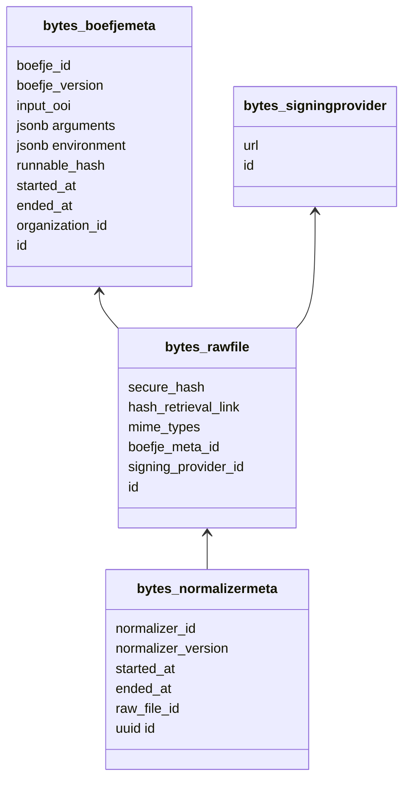
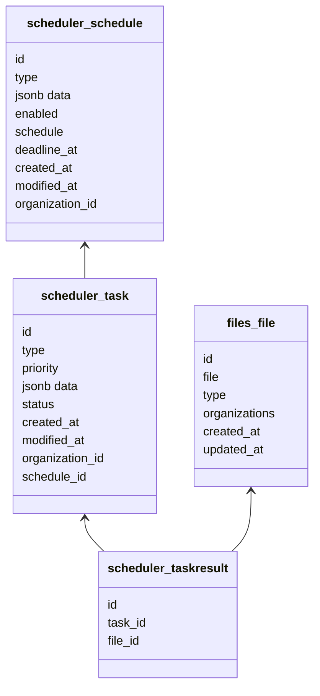
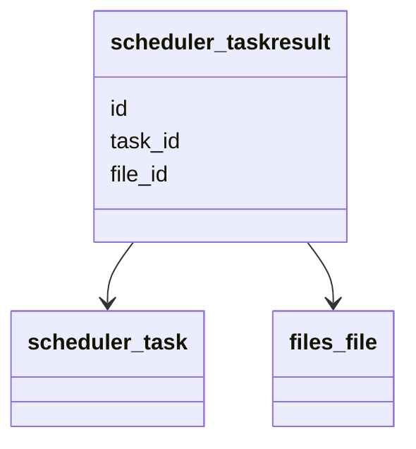
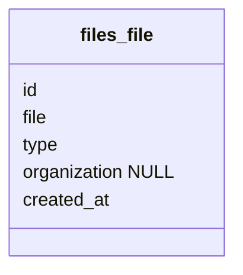
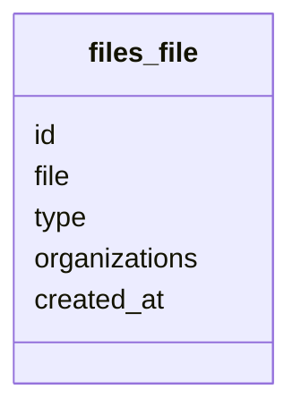
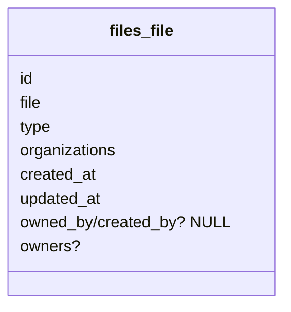

# RFD 0005: Raw Storage

## Introduction

In light of RFD 0004 (OpenKAT 2.0), one of the components we should revise is our raw data storage. In OpenKAT V1, that
is handled by the service _Bytes_. The functionality added here is fairly straightforward:

- Save BoefjeMeta data in a PostgreSQL database
- Save NormalizerMeta data in a PostgreSQL database
- Save RawMeta data in a PostgreSQL database
- Save raw (optionally: encrypted) files that relate to the RawMeta on disk
- Optionally, timestamp all the raw files using an external timestamping service

The database schema is as follows:

However, with V2 coming up, these models would live next to the generic Task model that handles our task management,
and has the same data in its `data` field. This is typically a better approach to storing tasks because:

- You don't have to create database models to introduce a new type of task, or be limited to specific input and output
  definitions.
- Logic around task handling, status, scheduling, etc. can be reused
- Tasks are bound to a specific point in time. Schema changes on a task-specific model would give a wrong
  representation of the past if input or output specifications change in the model. A generic JSON field is not
  subject to this.

Some drawbacks are:

- To filter on task-specific fields, we'd have to query the JSON
- It is not possible (or easy at least) to build a hierarchy of tasks, where a RawFile always point to a Boefje task
  en a Normalizer task always points to a RawFile.

But the second point actually limits the power of the RawFile field, as we cannot reuse it for raw files not created
through a boefje easily, which is an issue in V1 as we have to create a "fake" BoefjeMeta for each RawFile we introduce.

The core model, RawFile, cannot be replaced by the Task model.
Nevertheless, without the need to attach it to the Normalizer/Boefje Meta models,
the RawFile can be used more generically.
At the same time, we still need to be able to trace which RawFiles actually were created during which Task.

Moreover, we've had the request to support different kind of storage systems,
leading to a custom implementation of an S3Storage backend.
As we plan to move these DB models into Django, there are several third party libraries that could handle both these storage backends.
This might come at the cost of full control of timestamping logic.

## Proposal

The core of this proposal is to:

1. Drop the BoefjeMeta and NormalizerMeta models.
2. Tie a new Files model in a `files` app to Tasks optionally, by introducing an intermediate model: TaskResult.
3. Replace our custom File logic with a FileField, and configure S3 optionally using 'django-storages'.
4. Save Files on disk with a more useful directory (partitioning) structure:
   `"raw_files" / {date} / {plugin_id | "reports" | ... | "data" } / {file_name}`
5. Relate files to organizations through a many-to-many relationship
6. Postpone a new timestamping to version 2.1 or 2.2.

See the proposed model below:

### Functional Requirements (FR)

1. The backend should support both a local storage directory and S3 (compatible) object storage.
2. Users should be able to find the Files that were the result of a Task.
3. It should be easy to find Files by name, date, organization and perhaps type.
4. We should be able to easily normalize user-provided Files.
5. It should be possible to normalize Files not tied to a particular organization to solve duplication issues.

### Extensibility (Potential Future Requirements)

1. We probably want to know from whom Files uploaded through the UI came from.
2. It could be the case that we need to delete data for a whole organization.
3. We might have to consider archival functionality in the future, (re)moving data older than X years.
4. Perhaps we have to delete all raw files for a specific plugin.
5. We might want to be able to do full-text search on Files.

### Considerations of File Handling Libraries (FR 1)

Django supports file storage through its [File Storage API](https://docs.djangoproject.com/en/5.2/ref/files/storage/).
The API is used for static files and [user provided content](https://docs.djangoproject.com/en/5.2/ref/settings/#std-setting-MEDIA_ROOT) that needs to be stored.
This means that a solution that implements this core API would work nicely with Django,
and it is likely that there are many third-party implementations for different storage backends already.

For local storage and S3 our options are:

- [Django Storages](https://github.com/jschneier/django-storages)
- [django-s3-storage](https://github.com/etianen/django-s3-storage)
- A custom implementation of an S3 storage backend.

In terms of popularity and their last release dates, Django Storages is a clear winner between the two libraries.
Because we do not have a clear use-case for implementing our own backend,
and it is not difficult to switch to our own File Storage API implementation if we do not have to move the data,
Django Storages seems to be the best choice for now.

### Relational Diagram for File (FR 2)

To make sure a new File model is extensible and intuitive to use, it should be modeled around generic file storage.
Hence, the model should not require the creation of other models such as Task, as not all files will be found by tasks.
Nevertheless, it should be possible for files created by tasks to be linked back to their task.

This leaves us with three options:

1. An optional `task_id` foreign key field on the File model.
2. A `raw_files` field on the Task model.
3. An intermediate model such as `TaskResult` with two foreign keys: a `file_id` field and a `task_id` field.

Option 1 would violate the idea that Files should not be modeled around Tasks slightly.
Option 2 would mean we are joining Files and Tasks through an array-field. This is usually bad practice and a
scenario where the direction of the relationship needs to be flipped around and turned into a foreign key.
Option 3 would not touch the Task and File models, but as this construct is used for many-to-many fields as well
it might suggest that Files can be linked to multiple Tasks. As this is not the case, a `OneToOneField` could be
used to overcome this ambiguity. Also using a nullable task_id can lead to questions such as: is `NULL` "not found in
a task", or "we don’t know yet"?

In terms of performance, queries that require the task data to be linked to a File would perform best with Option 1,
as this has one join instead of two (Option 3). Joins over arrays generally do not perform well, so Option 2 would
not be a good choice from a performance perspective either.

In terms of extensibility, a TaskResult model is the only place we would be able to store information on the task a
file has been found in that does not belong in the Task model. Some examples might be:

- Confidence/Trusted: info about if we consider the File to be trustworthy. Perhaps a feature needed for future
  "untrusted" boefjes.
- Related to the previous point: perhaps some raw files found by tasks would need manual approval before being used
  or available in the interface.
- Perhaps some Files should not be able to be exported through the UI
- Found By: information on which specific runner found the File

All in all, Option 3 might be the safest solution:

### Additional File Model Enhancements (FR 3,4,5 & Ex 1,2,3)

Functional requirements 3 is achieved by providing additional fields to the File model:

In particular, having a nullable organization field means we can use Files for multiple organizations in the
future (FR 5). However, we might want to tie Files to a list of organizations. In that case we should implement
this as a many-to-many:

The `type` field can be used for our standard normalizer flow, where users could add a type indicating it contains
`nmap` output (to be discussed in a later RFD) to trigger the nmap normalizers on the file for uploaded files as well (FR 4).

To argue that this model is extensible, consider the following iteration where we suggested several fields that
enhance the model and support extensibility concern 1:

Here we either link a file to a nullable `owner` or allow files to be owned by multiple users.

To easily delete data for a whole organization or over a time range (Ex 2, 3 and 4), we do not have to adjust the
database model. But we do need to consider that we also need to delete the files from the object storage.
A good practice is to let the directory structure reflect both common access patterns as well as deletion patterns.
In this case, some of these structures could be:

1. `"raw_files" / {Organization.id | "NO_ORG" } / {date} / {file_name}`
2. - For generic raw files: `"raw_files" / {date} / {file_name}`
   - For raw files of an organization: `"raw_files" / {Organization.id} / {date} / {file_name}`
3. - Both options from 1 or 2, but with an intermediate directory that can be used for the type of data:
     `...org_path / {date} / {plugin_id | "reports" | ... | "data" } / {file_name}`
4. - Same as option 3 but the intermediate directory lives one level higher:
   - `...org_path / {plugin_id | "reports" | ... | "data" } / {date} / {file_name}`

Using `"NO_ORG"` or another placeholder makes sure all similar data lives in the same directory layer.
This makes it easier to search or manipulate data using patterns such as `rm -rf */1970-10-10/*`
(to delete all data for a particular date). Hence, option 1 is probably the better solution here over option 2.

For easier access to different types of data, such as specific plugins, reports, or miscellaneous types, it is
probably a good idea to add one extra layer to group the same kind of data together. This directory could live below
either the date or the organization. Because we believe the more common access pattern is to look at recent data or
to archive old data, it is probably better to have it live below the date directory. It also makes more sense to not
see old, disabled plugins always in the hierarchy as you are going through recent data. Finally, when investigating
issues it is more likely that users know the date (range) the issues happened than knowing which plugins or reports
were ran. With the date as the first "filter" layer, seeing for which plugins or reports data is available is also a
useful indicator, instead of figuring out which data is available for a particular date by going plugin/report
subdirectories. Therefore, option 3 will be chosen over option 4, and is currently the best candidate.

### Update after discussion

Since we decided that the many-to-many field to `Organization` is a good idea,
the top directory cannot refer to the organization anymore.
Hence, the `...org_path` from option 3 will be replaced with `"raw_files"`:

`" "raw_files" / {date} / {plugin_id | "reports" | ... | "data" } / {file_name}`

### Full-Text Search (Ex 5)

Full text search should not be implemented by a relational database such as PostgreSQL or in S3,
as they are not made for this use-case. As [this post](https://hackernoon.com/an-overview-of-sql-antipatterns)
mentions, If we need full-text search in the future, we could consider other technologies such as ElasticSearch.
